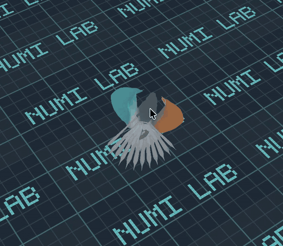
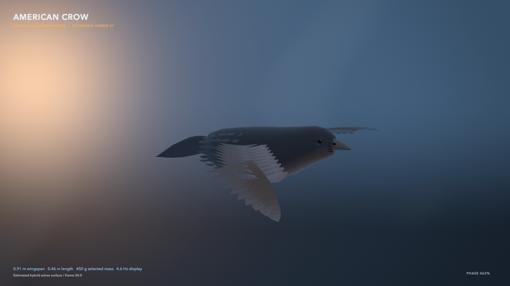
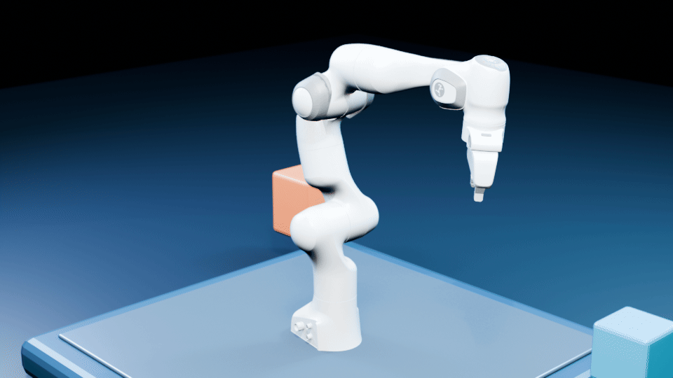
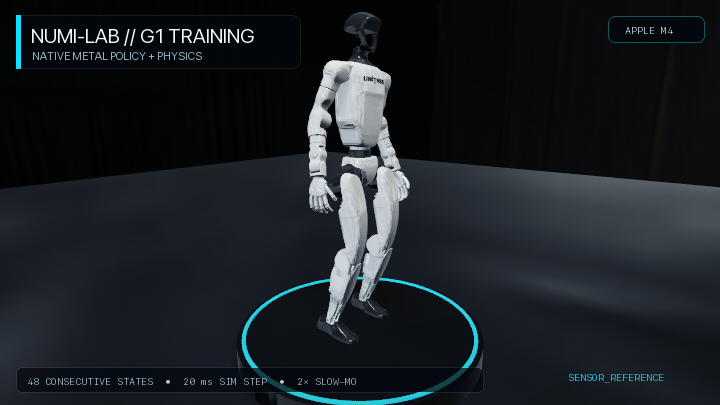
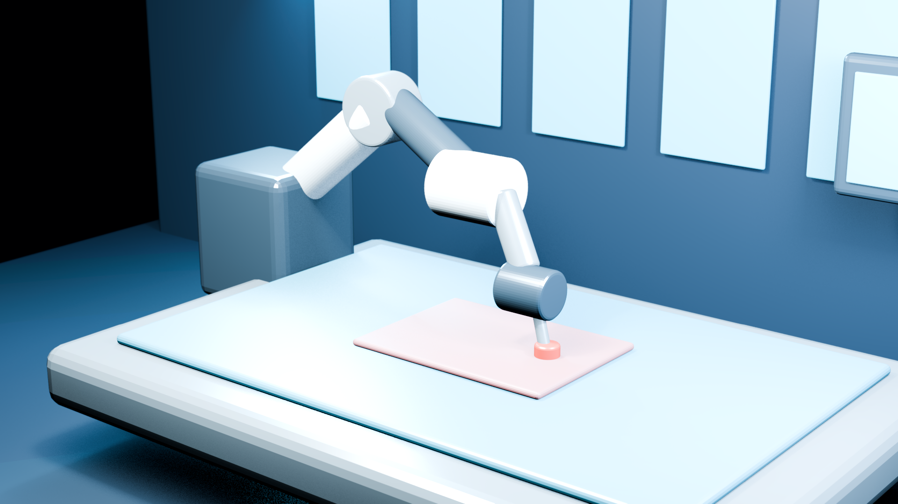

<div align="center">

# Numi Lab

**An Apple-native physics and robotics research laboratory.**

`C++23` · `Metal` · `Objective-C++` · `Swift` · `MLX`


</div>

Numi Lab compiles robots, worlds, tasks, policies, contact, sensing, and
presentation into one native Apple-Silicon execution path. Swift schedules
rollouts; MLX is confined to learning. The simulator—not a renderer or a
Python loop—decides the next physical state.

This is research infrastructure, not a robot product, a safety claim, or
evidence of real-world transfer.

## Showcase

<table>
  <tr>
    <td width="50%" valign="top">
      
      <strong>Dove · prescribed measured-surface replay</strong><br />
      A native Numi Lab presentation of the BirdFlow Deetjen surface replay. It is prescribed-motion CFD evidence, not a trained controller or a real-bird free-flight claim.
    </td>
    <td width="50%" valign="top">
      
      <strong>Dove · orbit inspection</strong><br />
      A second camera view of the same evidence class, retained to inspect the wing/body state rather than conceal it with a single hero angle.
    </td>
  </tr>
  <tr>
    <td width="50%" valign="top">
      
      <strong>American crow · estimated-hybrid reference</strong><br />
      This is a visual/morphometric research input—not a Numi flight replay. No crow policy has cleared the tracked, zero-physical-failure promotion gate, so no crow flight GIF is shown.
    </td>
    <td width="50%" valign="top">
      
      <strong>Franka · native exploration</strong><br />
      Accepted simulator states rendered through Numi Lab's presentation path.
    </td>
  </tr>
  <tr>
    <td width="50%" valign="top">
      
      <strong>G1 · native rollout</strong><br />
      A shared-simulator qualification workload, not the platform's product boundary.
    </td>
    <td width="50%" valign="top">
      
      <strong>dVRK PSM · authored workcell</strong><br />
      Offline presentation evidence; it does not claim native execution, clinical validity, or hardware operation.
    </td>
  </tr>
</table>

Media source revisions, hashes, duration, and claim boundaries live in
[showcase media provenance](docs/SHOWCASE_MEDIA.md). Long-form results remain
in the linked research records rather than in this showcase.

## What runs in the shared path

- Articulated rigid-body dynamics, terrain, coupled contact, Coulomb friction,
  rods, deformables, tactile fields, and transactional failure isolation.
- Compiled `WorldPack`, `TaskPack`, `InteractionPack`, and `PolicyPack`
  contracts with deterministic replay and explicit fingerprints.
- Device-resident reset, randomization, observation, reward, termination,
  policy inference, rollout capture, RGB-D, normals, identities, motion, and
  tactile sensing.
- Native Metal worlds scheduled by Swift; MLX actor/critic optimization is an
  explicit learning boundary rather than the production stepping path.

The production contact solver is `temporalCone`: an exact-cone Metal solver
with temporal refresh. `qualityNewton` is a slower comparison mode, not the
throughput rollout path. See [Metal execution and TemporalCone](docs/METAL_WORLD.md).

## Evidence discipline

- A native rollout, a render, a GIF, a numerical validation, and real-robot
  transfer are distinct evidence classes.
- Visual media is rendered from accepted state and retains its task, model,
  and provenance label.
- A policy advances only through its task's specified held-out gate; failed or
  rejected candidates remain recorded but do not become showcase media.
- The dove replay is separate from the trainable dove hybrid. The crow remains
  an estimated hybrid until its published qualification gate is met.

## Start here

```sh
cmake -S . -B build -G Ninja -DCMAKE_BUILD_TYPE=Release
cmake --build build --parallel

./tools/numi doctor
./tools/numi context
```

On Apple Silicon, use the focused runtime and task checks appropriate to the
component you changed. The self-describing CLI discovers workspace capabilities
through `.numi/commands`; see the [Numi CLI contract](docs/NUMI_CLI.md).

## Read the research record

- [Platform direction](docs/PLATFORM_DIRECTION.md)
- [World authoring and pack contracts](docs/WORLD_ENGINE.md)
- [Numerical methods and evidence rules](docs/NUMERICS.md)
- [Visual presentation](docs/VISUAL_PLATFORM.md)
- [BirdFlow dove hybrid](docs/BIRDFLOW_DOVE_HYBRID.md)
- [American-crow standing-to-flight qualification](docs/NUMI_CROW_STANDING_TO_FLIGHT_QUALIFICATION.md)
- [American-crow hybrid boundary](docs/BIRDFLOW_AMERICAN_CROW_HYBRID.md)
- [Foundation-policy execution on Apple Silicon](docs/FOUNDATION_POLICIES.md)
- [Third-party notices](THIRD_PARTY_NOTICES.md)

Copyright © 2026 Numan Thabit. All rights reserved. Third-party components
remain subject to their respective copyrights and licenses.
