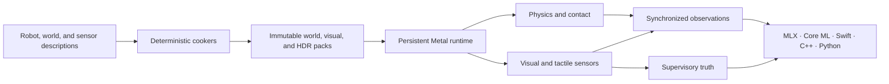
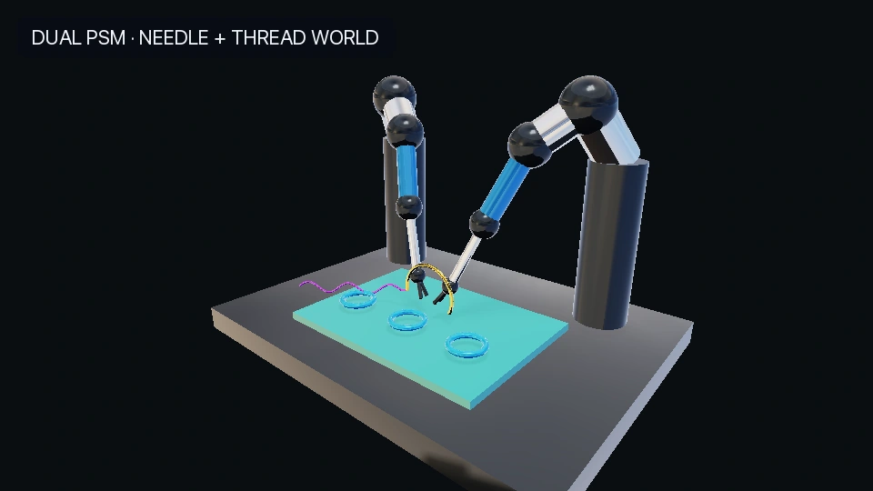

<div align="center">

<h1>MetalRobo</h1>

<p><strong>Metal-native robotics simulation, sensing, and MLX policy infrastructure for Apple Silicon</strong></p>

<p><code>C++23</code> · <code>Metal 4</code> · <code>MLX</code> · <code>Model I/O</code> · <code>Core ML-ready</code></p>


<p><sub>
MetalRobo <code>sensor_reference</code> render on Apple M4 using the
<a href="https://github.com/unitreerobotics/unitree_ros/tree/aa0f5c68b5aba347bad409e71b6430407da758d7/robots/g1_description">official Unitree G1 visual geometry</a>.
Robot geometry is upstream-authored; the presentation stage and lighting are MetalRobo-authored.
</sub></p>

</div>

MetalRobo turns authored robots, worlds, and sensors into immutable runtime
packs, advances them in persistent Metal memory, and exposes synchronized
observations to MLX, Core ML, Swift, C++, and Python. The runtime does not link
or call an external physics engine.

> One authoritative state drives physics, contact, vision, tactile sensing,
> supervisory truth, and policy observations.

## What is implemented

| System | Current capability |
| --- | --- |
| **Dynamics and contact** | Rigid and articulated dynamics, fixed and floating roots, revolute and prismatic joints, deterministic broadphase/manifolds, Coulomb contact, joint limits, and transactional state publication. |
| **Persistent Metal execution** | Batched worlds, fixed-capacity device graphs, private GPU resources, deterministic resets, and MLX execution through the active Metal command encoder. |
| **Visual Presentation V3** | Direct USD/USDZ/GLB cooking, native textures, glTF metallic-roughness PBR, HDR image-based lighting, shadows, global or rolling shutter, and fast/reference sensor profiles. |
| **Policy-ready sensing** | Scene-linear RGB, metric depth, normals, semantic/instance/link identities, motion, validity, calibration, tactile depth, solver wrench, and center of pressure. |
| **Perception and data plane** | Replaceable perception providers, separate deployable and privileged streams, synchronized policy assembly, deterministic visual episodes, and a LeRobot v3 exporter. |
| **Reference robots** | Franka manipulation, the pinned 29-DoF Unitree G1, and a dVRK-style PSM research model with physical insertion and independent jaws. |

## The renderer is a sensor


These four panels are read from the same `sensor_reference` frame. RGB remains
scene-linear in the policy path; tone mapping is applied only to the preview.
Depth is metric, identities stay integer-typed, and every output shares the
same camera, timestamp, physics state, and immutable provenance.

Two profiles use the same assets, materials, lighting, truth buffers, and
perception contract:

- `sensor_fast` uses GPU-resident compute visibility, shadow atlases, native
  texture sampling, and banded shutter integration for online observations.
- `sensor_reference` uses Metal ray queries, direct shadow rays, and per-row
  exposure timing for deterministic high-fidelity rerendering.

`metalrobo_visual_cook` writes sectioned, content-addressed packs from GLB,
glTF, USD, USDA, USDC, or USDZ. `metalrobo_environment_cook` converts HDR/EXR
sources into diffuse irradiance, a prefiltered GGX cubemap, and a split-sum
BRDF LUT. Runtime geometry and texture payloads load into private Metal heaps;
there is no collision-derived presentation path.

## Architecture



C++ owns model compilation and public contracts. Metal owns batched execution
and sensor generation. MLX consumes the same device-resident buffers for
policy work without inserting a CPU fallback or a second command-buffer
timeline.

## Robots and research worlds

| Robot | MetalRobo integration |
| --- | --- |
| **Franka** | Fixed-base manipulation, pick-and-place world family, fixed and wrist cameras, tactile fingertip atlases, and deterministic replay. |
| **Unitree G1** | COM-consistent floating-base 29-DoF model with pinned topology, inertials, limits, collision geometry, IMU frames, and named locomotion presets. |
| **Surgical PSM** | Fixed-base serial research model with a true prismatic insertion axis, independent jaws, mixed articulated/rigid contact, needle and thread infrastructure, and multi-PSM composition. |



The surgical scene is an authored MetalRobo research presentation. It is not a
clinical simulator and makes no biomechanical, procedural, safety, or
real-hardware transfer claim.

## Quick start

MetalRobo currently targets Apple Silicon, macOS 26 / Metal 4, and the Xcode
toolchain. The build requires CMake 3.28 or newer, Ninja, SQLite3, and LibXml2.

```sh
cmake -S . -B build -G Ninja -DCMAKE_BUILD_TYPE=Release
cmake --build build --parallel
```

Run focused product probes:

```sh
./build/bin/metalrobo_visual_platform_probe
./build/bin/metalrobo_tactile_check
./build/bin/metalrobo_g1_model_probe
./build/bin/metalrobo_surgical_psm_probe
```

Cook authored presentation resources:

```sh
./build/bin/metalrobo_visual_cook scene.usdz scene.mrvpack \
  --license NOASSERTION --provenance authored-source

./build/bin/metalrobo_environment_cook studio.exr studio.mrenv \
  --face-size 512 --source-color-space auto
```

Build the MLX extension after the native engine:

```sh
cd python
python3 -m pip install -e .
python3 probes/mlx_world_probe.py
```

The Python package pins `mlx>=0.32,<0.33`. Its custom primitive allocates
through MLX and encodes into MLX's active Metal command encoder; it has no
NumPy, ctypes, or CPU simulation fallback.

## Repository map

| Path | Purpose |
| --- | --- |
| [`include/metalrobo`](include/metalrobo) | Public C++ and shared CPU/Metal contracts. |
| [`src/core`](src/core) | Models, compilers, world families, contact, observation, and episode logic. |
| [`src/metal`](src/metal) | Physics, collision, solvers, rendering, IBL, tactile, and sensor kernels. |
| [`src/apple`](src/apple) | Model I/O, Core Image, Metal I/O, and Apple-native asset/environment cooking. |
| [`python`](python) | Nanobind extension, MLX execution, perception adapters, episode streams, and training interfaces. |
| [`schemas`](schemas) | Persisted world, visual, sensor, perception, and episode contracts. |
| [`apps`](apps) | Focused probes, cookers, examples, and benchmarks. |

## Documentation

- [Architecture](docs/ARCHITECTURE.md)
- [Persistent Metal execution](docs/METAL_WORLD.md)
- [World authoring and packs](docs/WORLD_ENGINE.md)
- [Visual simulation and perception](docs/VISUAL_PLATFORM.md)
- [Geometry-native tactile sensing](docs/TACTILE_GEOMETRY_BRIDGE.md)
- [Python and MLX](python/README.md)
- [Numerical contract](docs/NUMERICS.md)
- [Validation record](docs/VALIDATION.md)
- [Detailed capability ledger](docs/ENGINE_CAPABILITY_LEDGER.md)

MetalRobo is a pre-release research platform. It supplies simulation,
perception, and policy-training infrastructure; it does not ship or train a
particular vision or policy model. Robot sources, adaptations, and required
upstream notices are recorded in
[`THIRD_PARTY_NOTICES.md`](THIRD_PARTY_NOTICES.md). README render provenance is
recorded in [`docs/media/README.md`](docs/media/README.md).
