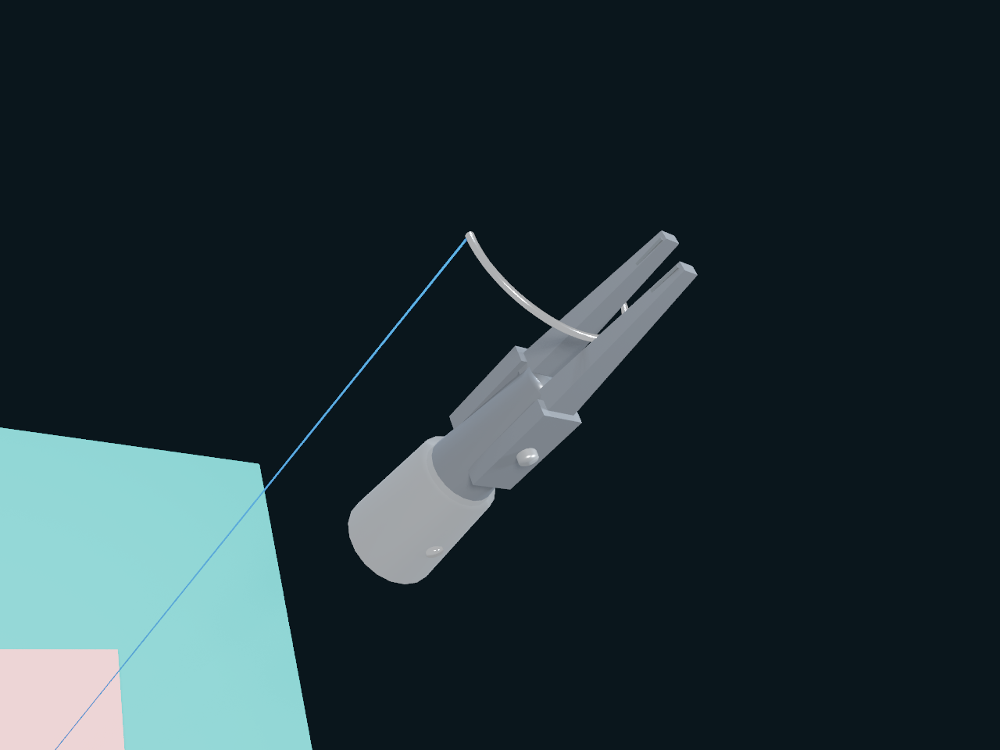

# Matter

Matter is Numi Lab's Apple-native variational solver for coupled FEM, MPM,
mixed fields, internal material variables, and every contact involving a Matter
continuum. The `coupled` branch has one GPU-resident nonlinear authority rather
than sequenced deformable, pressure, transport, contact, and rigid-response
solvers.

The environment-wide Newton unknown is

\[
x=(v_{FEM},\pi,T,p_f,\phi,a,v_{MPM},\Delta v_{rigid}),
\]

and restarted matrix-free FGMRES is the sole linear convergence owner. IPC's
squared-distance logarithmic barrier contributes primal gradients and PSD
Hessian actions directly; per-node timestep ratios keep cross-rate contact the
gradient and Hessian of one environment action. No contact multipliers,
Delassus rows, or post-contact correction solve remain.
Matter ABI v21 explicitly identifies the tapered needle-tip capsule that may
drive tissue puncture; generic shaft or swage capsules cannot mutate topology.
Matter ABI v20 exposes only controls that own live work: Newton/FGMRES
budgets, bounded field-smoother passes, residual tolerances, and a minimum
contact-separation ratio relative to the authored contact slop. Both contact
line search and final Metal acceptance read that ratio. Relative correction is
finite certificate telemetry; the assembled residual is the convergence
authority.
The right preconditioner uses the componentwise diagonal of those same PSD IPC
blocks in its FEM and MPM fine and translation-mode mechanics approximations;
it does not assemble a second contact matrix or introduce another iteration
owner.
MetalWorld keeps sole ownership of ABA and generalized coordinates while its
borrowed coupled-candidate callback supplies kinematics, mass action,
inverse-mass preconditioning, and accepted publication.

Matter Language supports explicit state updates, authored implicit residuals,
specialized multiplicative von Mises and Drucker-Prager return maps, and
`average|max|sum` remesh-transfer policies. Active sparse MPM grid velocity is
part of the same Krylov vector as FEM and rigid increments. Its private Krylov
and basis arenas reserve only the cooked quadratic-support bound rather than
the full authored grid; APIC, deformation, and material state publish only
after global candidate acceptance.

Topology mutation is transactional. Cohesive separation, erosion, edge
split/collapse, 2–3/3–2 flips, and vertex smoothing rebuild derived incidence,
surface contact, and preconditioner structures on Metal. Cavity-wide material
transfer follows each state's average/max/sum policy, and the rebuilt nodal
state is corrected to its pre-remesh momentum and volume-integrated fields
before certification. Conservation and element-quality failures reject the
environment. Private arenas grow
geometrically only between completed submissions through a borrowed
command-buffer migration. Migration rebases every active tetrahedron and
cohesive-face reference into the expanded global arenas before rebuilding
incidence; shaders never allocate.

The hot path uses one borrowed MetalWorld command buffer, private authoritative
state, deterministic sparse ordering, SIMD32 reductions, and no internal
commit, wait, or CPU counter read.

## Curved surgical-needle tissue passage

The dual-PSM surgical probe now drives the authored 26 mm half-circle needle
about its actual 8.28 mm curvature centre at a 20 mm/s terminal speed. Matter
admits entry from accepted tapered-tip contact, then extends a connected
diameter-scale tract only when the sharp point reaches the live frontier. A
rotating tip follows its swept endpoint velocity rather than the finite
collider chord, and midpoint-tangent chords bound accumulated path drift.
The terminal taper and its adjacent widening segment both remain live tissue
contact geometry; the physically swaged 250 mm monofilament is carried by the
DER constraints rather than prescribed along the needle orbit.

On Apple M4, the current 0.77 mm porcine-jejunum coupon qualification reached
190.3 um of clearance beyond the *deformed* distal surface after 884 62.5 us
microsteps. It retained all 3,456 tetrahedra with zero removed tissue mass,
formed seven connected tract segments with 5.13 um maximum orbit error and
2.42 um radial-error range, retained a 0.999941 minimum determinant, ended at
6.64 um hard-swage error, used at most six FGMRES columns, and reported zero
failed steps. A coupon-specific five-Newton/ten-column budget retains 43 percent
Krylov headroom above that live high-water and reduced the same-host passage
from 589.3 to 300.0 GPU seconds (1.96x). This is a deterministic workload
measurement, not a universal solver speedup. The tract is a mass-conserving
sub-element contact discontinuity, not yet a constitutive crack surface or
clinical validation. Receiver extraction and robot-driven knot formation remain
separate physical qualification boundaries.

```sh
./build-coupled-dev/bin/metalrobo_dual_psm_suture_handoff_probe \
  --tissue-curved-passage-only
```

The receiver-side frame qualification now respects the same handling rule
instead of reaching for the newly exposed tip. It advances the analytic needle
orbit by 1.8878 rad until shape 18, 13.975 mm of arc behind the point and one
segment inside the authored one-third-to-one-half handling interval, has 120 um
of full-capsule clearance beyond the distal tissue surface. A six-coordinate
damped IK solves jaw midpoint, rail tangent, and roll about the needle under
the source PSM limits. The selected 10 mm insert-normal approach retained
3.786 mm clearance above the catch pad, had no incidental needle or cross-arm
contacts, and closed to 8/8 jaw contacts with all 16 raw contacts in the safe
zone. This fast gate is kinematic and collision geometry only. Continuous
shaft/tissue contact through the remaining curved passage and dynamic receiver
extraction remain open and are not inferred from it.

```sh
./build-coupled-dev/bin/metalrobo_dual_psm_suture_handoff_probe \
  --receiver-frame-ik-only
```

The post-puncture extraction fixture also has a live dynamic baseline before
the second instrument moves. It initializes the rotated steel needle and its
hard-swaged 250 mm PDO 3-0 DER strand at exact rest length, retains the giver's
normal 60 um insert preload without an artificial transport over-closure, and
holds the fully coupled island for 100 ms. On Apple M4 the deterministic
endpoint retained 12 safe-zone contacts distributed across both transverse
insert sides and both longitudinal rows (`0101`/`1111` patch masks), 89.4 um
seat drift, 3.49 um/s relative point slip, 8.71 mm/s maximum strand speed,
0.893 um hard-swage error, and a 0.577 mm/s live temporal-cone residual with
zero failed steps. This is a dynamic post-puncture giver/needle/thread fixture;
it does not infer continuous tissue contact, receiver acquisition, extraction,
or knot formation.

```sh
./build-coupled-dev/bin/metalrobo_dual_psm_suture_handoff_probe \
  --receiver-extraction-giver-hold-only
```

From that accepted dynamic state, the distal receiver now follows a
branch-continuous six-coordinate frame trajectory to the exposed handling
segment with its jaws open. The 300 ms cubic move peaks at 50 mm/s and used
23.8% of the authored joint-speed envelope. Its Apple M4 qualification had
zero receiver/needle and cross-arm contact samples, retained the giver at
2.57 um seat drift and 56.1 um/s relative slip, reduced maximum strand speed
to 0.432 mm/s, ended at 0.872 um hard-swage error and a 0.658 mm/s live
temporal-cone residual, and reported zero failed steps. The accepted q/v,
needle, strand-node, and twist state is resumable. Receiver closure, load
exchange, tissue extraction, and robot-tied knot formation remain separate
qualification boundaries.

```sh
./build-coupled-dev/bin/metalrobo_dual_psm_suture_handoff_probe \
  --receiver-extraction-approach-only \
  --state-output-dir /tmp/numi-distal-extraction
```

Receiver closure now establishes dynamic dual positive control before either
instrument changes load. A 240 ms cubic LND closure peaks at 0.154 rad/s,
ending at the gentle 15 um overlap while the giver retains its 60 um seat,
then holds both instruments for 200 ms. The Apple M4 endpoint covered the
giver insert footprint with `0101`/`1111` masks and the receiver with
`1111`/`1111`, retained 1.21 um giver seat drift and 3.60 um/s relative slip,
limited strand speed to 0.509 mm/s, ended at 1.06 um hard-swage error and a
0.529 mm/s live temporal-cone residual, and reported zero failed steps. This
qualifies simultaneous control only; it does not yet claim load transfer,
giver release, tissue extraction, or a knot.

```sh
./build-coupled-dev/bin/metalrobo_dual_psm_suture_handoff_probe \
  --receiver-extraction-closure-only
```

The next resumable phase transfers the working preload without teleporting or
kinematically attaching the needle. Over 134 ms, the receiver advances from
the gentle 15 um overlap to its normal 60 um transport preload while the giver
backs off from 60 um to 15 um, followed by a 100 ms coupled settle. On Apple
M4, the receiver retained 8/8 safe-zone contacts with full `1111`/`1111`
coverage. The unloading giver retained 4/4 bilateral safety contacts with
`0101`/`0101` masks, spanning both transverse insert sides; unlike the new
load-bearing owner, it is not required to occupy both longitudinal rows. The
endpoint measured 10.2 um receiver seat drift, 6.49 um/s receiver relative
point speed, 0.448 um maximum DER edge error, 1.768 mm non-neighbour strand
clearance, 0.925 um hard-swage error, a 0.521 mm/s temporal-cone residual,
zero cone violation, and zero failed steps. This qualifies load exchange while
both instruments remain in contact; giver release, continuous tissue
extraction, and robot-tied knot formation remain separate boundaries.

```sh
./build-coupled-dev/bin/metalrobo_dual_psm_suture_handoff_probe \
  --receiver-extraction-load-exchange-only \
  --resume-receiver-extraction-positive-control \
  build-coupled-dev/testing/suture/extraction-state/receiver-extraction-positive-control.tsv
```

Giver release is a separate receiver-ownership gate. The giver opens from its
15 um overlap to the calibrated 0.30 mm diametral clearance over 240 ms at a
0.154 rad/s peak jaw speed, then both arms hold position for 200 ms. On Apple
M4, the endpoint had zero giver/needle contacts while the receiver retained
8/8 safe-zone contacts and `1111`/`1111` insert masks. Receiver seat drift was
59.9 um, relative point speed 2.21 um/s, relative angular speed 1.86 mrad/s,
maximum strand speed 0.484 mm/s, maximum DER edge error 0.405 um, hard-swage
error 0.886 um, and the live temporal-cone residual 0.711 mm/s. Cone violation
and failed steps were both zero. This qualifies settled sole receiver control;
it does not yet claim tissue-side retraction or continuous tissue coupling.

```sh
./build-coupled-dev/bin/metalrobo_dual_psm_suture_handoff_probe \
  --receiver-extraction-giver-release-only \
  --resume-receiver-extraction-load-exchange \
  build-coupled-dev/testing/suture/extraction-state/receiver-extraction-load-exchange.tsv
```

The released giver must withdraw before the receiver translates the curved
needle. A direct receiver move exposed a real sequencing failure at 100 ms:
the receiver still held 8/8 contacts, but the open giver recontacted one side
of the needle. The corrected phase retracts the giver 8 mm upward along its
trocar axis over 600 ms, then holds for 100 ms. Its Apple M4 endpoint measured
8.000 mm projected giver travel, zero planned giver/needle and cross-arm
contact samples, receiver `1111`/`1111` masks, 9.20 um receiver seat drift,
4.54 um/s relative slip, 0.561 mm/s maximum strand speed, 0.380 um maximum
DER edge error, 0.795 um hard-swage error, and a 0.472 mm/s live contact
residual. Cone violation and failed steps were zero. This qualifies instrument
clearance before extraction; it does not yet qualify the receiver translation
through continuously coupled tissue.

```sh
./build-coupled-dev/bin/metalrobo_dual_psm_suture_handoff_probe \
  --receiver-extraction-giver-retreat-only \
  --resume-receiver-extraction-giver-release \
  build-coupled-dev/testing/suture/extraction-state/receiver-extraction-giver-release.tsv
```

From the cleared-giver state, the receiver now translates the loaded needle
6.5 mm over 500 ms in ten resident 50 ms chunks. Every chunk must retain zero
giver contact, bilateral four-quadrant receiver coverage, bounded reseating,
and a healthy DER strand before the next command is submitted. The receiver
uses the authored 75 um transport preload only during motion, then returns to
the qualified 60 um seat over 40 ms and holds for 100 ms. On Apple M4 the
needle followed 6.4994 mm total and 6.4994 mm along the commanded direction;
the endpoint retained zero giver contacts and receiver `1111`/`1111` masks,
12.5 um seat drift, 3.89 um/s relative slip, 0.719 mm/s maximum strand speed,
2.47 um maximum DER edge error, 3.35 um hard-swage error, and a 0.653 mm/s
live contact residual with zero cone violation or failed steps. The minimum
non-neighbour strand clearance was 49.9997 um at the authored 50 um
self-contact shell, inside its existing 0.1 um FP32 readback allowance. This
qualifies receiver-only dynamic carry in the neutral-zone fixture; continuous
deformable-tissue extraction and robot-tied knot formation remain separate
boundaries.

```sh
./build-coupled-dev/bin/metalrobo_dual_psm_suture_handoff_probe \
  --receiver-extraction-retraction-only \
  --resume-receiver-extraction-giver-retreated \
  build-coupled-dev/testing/suture/extraction-state/receiver-extraction-giver-retreated.tsv
```

## Loaded PDO knot-contact mechanics

The rod solver now resolves a bounded network of frictional thread/thread
contacts instead of applying each crossing once. Its Apple Metal path compacts
up to 64 load-bearing contacts, performs eight alternating projected
Gauss-Seidel sweeps with accumulated Coulomb-disk multipliers, and rejects an
overflow rather than silently dropping a crossing. The FP64 oracle uses the
same alternating accumulated-impulse update.

The deterministic Apple M4 fixture uses the authored 250 mm PDO 3-0
monofilament (0.20 mm diameter), 128 rod nodes, and a pre-tied five-crossing
core under 0.5 mm opposing endpoint displacement. Fourteen edge pairs occupy
the 50 um contact shell. Dynamic self-friction at the explicit research value
of 0.12 reduced RMS crossing slip from 3.182 to 1.605 mm/s on Metal and from
5.966 to 4.170 mm/s in FP64 while the Metal fixture carried 0.483 mN endpoint
preload and replayed exactly. The 2.565 mm/s Metal/FP64 slip difference remains
an open nonlinear-parity boundary. This fixture qualifies loaded multi-contact
mechanics only: it is pre-tied, is not a square or surgeon's knot executed by
the robots, and is not package-calibrated or clinical strength evidence.

```sh
./build-coupled-dev/bin/metalrobo_surgical_knot_mechanics_probe
```

## dVRK GS21 suture pickup



The source-grounded Classic PSM Large Needle Driver acquires a curved GS21
through distributed opposing tooth contact without a weld, then carries its
physically swaged 25-node, 180 mm discrete-elastic-rod thread. The deterministic
3030-step qualification retained the grasp for 2000 consecutive lift frames,
lifted the needle 8.043 mm and thread root 7.905 mm, ended at 4.26 um swage
error, reported zero penetration and a `2.01e-5` maximum KKT residual, and
byte-restored the articulated/rigid rollback checkpoint.

The image is a 1280x960 Apple M4 Metal reference render from the accepted
physics state. Its 7172-triangle presentation pack is bound to articulated and
rigid body poses; the 181.527 mm rendered thread centerline comes directly from
the accepted rod state. This is simulation evidence, not clinical validation.
The thread geometry and coupling are executable; its material constants are
research defaults rather than package- or specimen-calibrated values.

```sh
./build-coupled-dev/bin/metalrobo_supported_needle_pickup_probe \
  --state-output /tmp/numi-suture-pickup.state.tsv
./build-coupled-dev/bin/metalrobo_suture_visual_probe \
  --state /tmp/numi-suture-pickup.state.tsv \
  --output-dir /tmp/numi-suture-visual
```

Current Apple M4 qualification covers compiler/package invariants and live
Metal contact, multiphysics, sparse-MPM, articulated-coupling, and reference
render paths. These checks establish the recorded workloads; they are not a
blanket hardware or performance claim.
