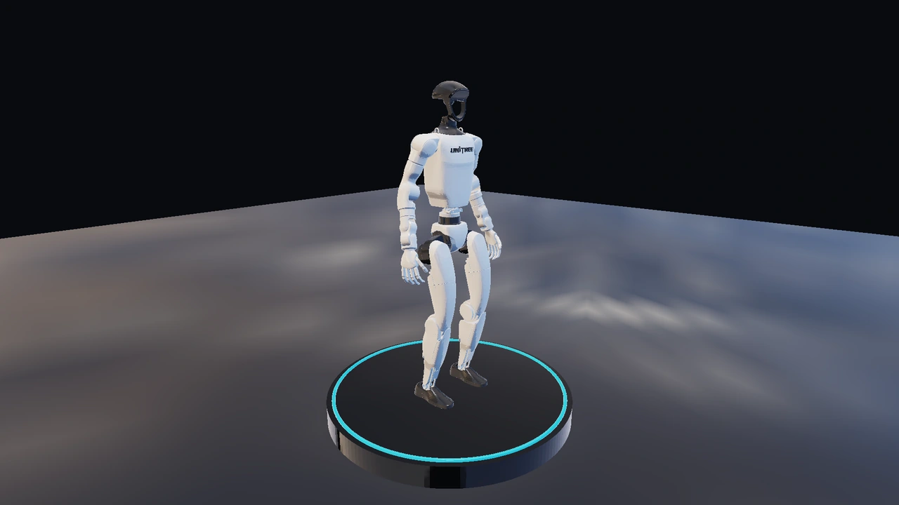
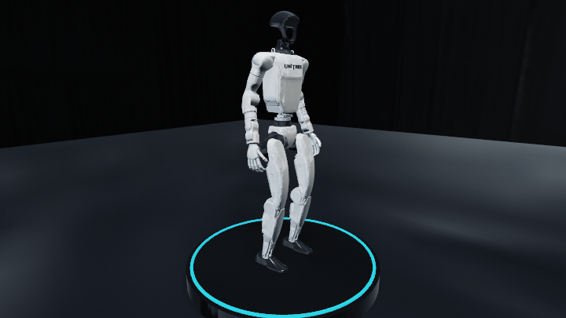
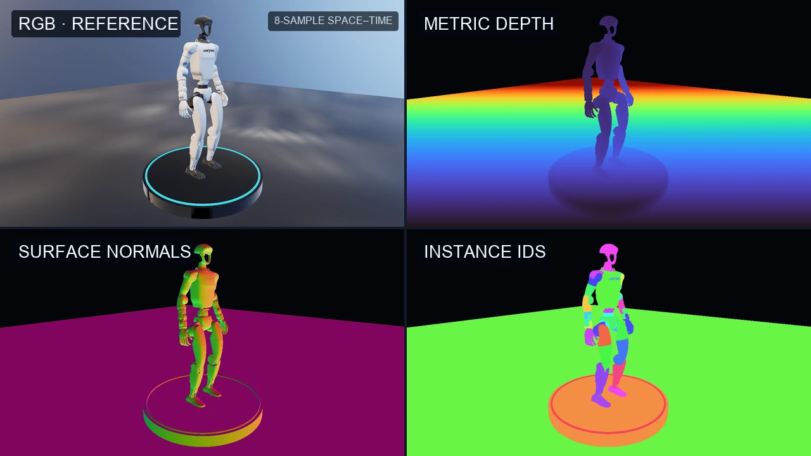
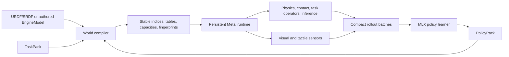
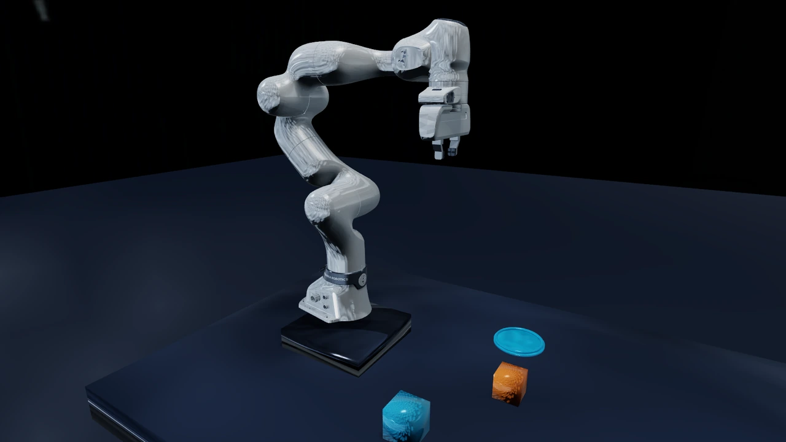

<div align="center">

<h1>numi-lab</h1>

<p><strong>Metal-native robotics simulation, sensing, and MLX policy infrastructure for Apple Silicon</strong></p>

<p><code>C++23</code> · <code>Metal 4</code> · <code>MLX</code> · <code>Model I/O</code> · <code>Core ML-ready</code></p>



<p><sub>
numi-lab <code>sensor_reference</code> render on Apple M4 using the
<a href="https://github.com/unitreerobotics/unitree_ros/tree/aa0f5c68b5aba347bad409e71b6430407da758d7/robots/g1_description">official Unitree G1 visual geometry</a>.
Robot geometry is upstream-authored; the presentation stage and lighting are numi-lab-authored.
</sub></p>

</div>

numi-lab turns authored robots, worlds, and sensors into immutable runtime
packs, advances them in persistent Metal memory, and exposes synchronized
observations to MLX, Core ML, Swift, C++, and Python. The runtime does not link
or call an external physics engine.

Every image below is a native numi-lab sensor output. There is no generated
concept art and no screenshot from another simulator.

> One authoritative state drives physics, contact, vision, tactile sensing,
> supervisory truth, and policy observations.

## What is implemented

| System | Current capability |
| --- | --- |
| **Dynamics and contact** | Rigid and articulated dynamics, fixed and floating roots, revolute and prismatic joints, deterministic broadphase/manifolds, Coulomb contact, joint limits, and transactional state publication. |
| **Persistent Metal execution** | Batched worlds, fixed-capacity device graphs, private GPU resources, transactional resets, and Swift-scheduled native task/policy rollouts. |
| **Robot-independent tasks** | Authored TaskPacks resolve semantic joint/body names into immutable action, observation, contact, reward, termination, randomization, and terrain tables consumed by generic Metal kernels. |
| **Native policy execution** | Fingerprinted PolicyPacks carry normalization and dense actor weights into generic Metal inference; MLX owns PPO updates and publishes the next policy revision. |
| **GPU-native scene queries** | Vectorized world or body-mounted grid/LiDAR rays against dynamic analytic, convex, and authored mesh geometry, with metric hits and stable identities retained in native Metal buffers. |
| **Visual Presentation V3** | Direct USD/USDZ/GLB cooking, native textures, glTF metallic-roughness PBR, visible HDR environments, shadows, global or rolling shutter, and fast/reference sensor profiles. |
| **Policy-ready sensing** | Scene-linear RGB, metric depth, normals, semantic/instance/link identities, motion, validity, calibration, tactile depth, solver wrench, and center of pressure. |
| **Perception and data plane** | Replaceable perception providers, separate deployable and privileged streams, synchronized policy assembly, deterministic visual episodes, and a LeRobot v3 exporter. |
| **Tactile imitation** | Pinned LeRobot 3 season-safe ingestion, synchronized multi-view/wrench training, dual-time action-tube diffusion, reactive tactile replanning, and provenance-gated MLX checkpoints for Apple GPUs. |
| **Reference robots** | Franka manipulation, the pinned 29-DoF Unitree G1, and a dVRK-style PSM research model with physical insertion and independent jaws. |

## Official G1 standing-policy transfer

The pinned official Unitree MuJoCo-Lab policy now completes the native
20-second zero-command gate through MetalRobo's `temporalCone` path. On Apple
M4 the 1,000-step run reported mean tilt `0.009 rad`, mean pelvis height
`0.785 m`, tracking `0.9998`, zero failed physics steps, and only the expected
episode-timeout termination. A pinned MuJoCo oracle reported `0.015 rad` mean
tilt and `0.784 m` mean pelvis height for the same policy contract.

The fix was in the generic dynamics loop: a held position target now refreshes
implicit PD effort from current `q,v` before every physics microstep. Reusing
the effort computed at the beginning of a 20 ms control step caused the visible
shaking and falls. The policy, observation construction, contact, articulated
physics, and rollout scheduler remain native Metal execution.



[Play or download the 20-second H.264 capture](docs/media/g1-standing-native-20s.mp4).
This is the complete successful zero-command gate, not a trimmed upright
prefix. Its 100 displayed poses sample the real 1,000-step trajectory at even
intervals and are rendered through numi-lab's native `sensor_reference`
pipeline. MuJoCo supplies no pixels and no intermediate motion is synthesized.
Full capture provenance is recorded in
[`docs/media/README.md`](docs/media/README.md).

## The renderer is a sensor



These four panels are read from the same `sensor_reference` frame. RGB remains
scene-linear in the policy path; tone mapping is applied only to the preview.
Depth is metric, identities stay integer-typed, and every output shares the
same camera, timestamp, physics state, and immutable provenance.

Two profiles use the same assets, materials, lighting, truth buffers, and
perception contract:

- `sensor_fast` uses GPU-built mesh clusters, parallel frustum and shutter-band
  culling, hierarchical tile visibility, parallel near-plane resolve, shadow
  atlases, and two-sample space-time integration for online observations.
- `sensor_reference` uses compacted mesh BLASes, grouped motion-instance
  TLASes, Metal ray queries, stratified space-time samples, direct shadow
  rays, and exact per-row exposure timing for deterministic high-fidelity
  rerendering.

`metalrobo_visual_cook` writes sectioned, content-addressed packs from GLB,
glTF, USD, USDA, USDC, or USDZ. `metalrobo_environment_cook` converts HDR/EXR
sources into diffuse irradiance, a prefiltered GGX cubemap, and a split-sum
BRDF LUT. Runtime geometry and texture payloads load into private Metal heaps;
there is no collision-derived presentation path.

## Architecture



C++ owns model compilation and public contracts. Metal owns batched execution
and sensor generation. Swift owns rollout length, submission chunking,
completion, reset requests, and policy revisions. MLX receives compact
learning batches and returns PolicyPacks; it does not own production physics
state or rollout scheduling.

## Robots and research worlds

| Robot | numi-lab integration |
| --- | --- |
| **Franka** | Fixed-base manipulation, pick-and-place world family, fixed and wrist cameras, tactile fingertip atlases, and deterministic replay. |
| **Unitree G1** | COM-consistent floating-base 29-DoF model with pinned topology, inertials, limits, collision geometry, IMU frames, and named locomotion presets. |
| **Surgical PSM** | Fixed-base serial research model with a true prismatic insertion axis, independent jaws, mixed articulated/rigid contact, needle and thread infrastructure, and multi-PSM composition. |



<p><sub>
numi-lab <code>sensor_reference</code> render on Apple M4 using the
<a href="https://github.com/frankarobotics/franka_description/tree/02afaae282d4a8e10d7d2f781b23b3515c303ce5/meshes/robots/fr3v2/visual">official Franka FR3v2 visual geometry</a>.
The calibrated camera, pick-and-place workcell, materials, lighting, and
supervisory buffers are produced by numi-lab.
</sub></p>

The Surgical PSM integration is a robotics research world, not a clinical
simulator; it makes no biomechanical, procedural, safety, or real-hardware
transfer claim.

## Quick start

numi-lab currently targets Apple Silicon, macOS 26 / Metal 4, and the Xcode
toolchain. The build requires CMake 3.28 or newer, Ninja, SQLite3, and LibXml2.

```sh
cmake -S . -B build -G Ninja -DCMAKE_BUILD_TYPE=Release
cmake --build build --parallel
```

Run focused product probes:

```sh
./build/bin/metalrobo_task_program_check
./build/bin/metalrobo_task_rollout \
  --metallib build/shaders/MetalRobo.metallib \
  --envs 32 --steps 48 --chunk 8 --scene terrain --native-policy
./build/bin/metalrobo_visual_platform_probe
./build/bin/metalrobo_tactile_check
./build/bin/metalrobo_g1_model_probe
./build/bin/metalrobo_surgical_psm_probe
```

Cook authored presentation resources:

```sh
./build/bin/metalrobo_visual_cook scene.usdz scene.mrvpack \
  --license NOASSERTION --provenance authored-source

./build/bin/metalrobo_environment_cook studio.exr studio.mrenv \
  --face-size 512 --source-color-space auto
```

Validate the policy-learning boundary after the native engine:

```sh
cd python
python3 -m pip install -e .
python3 probes/mlx_policy_learning_check.py \
  --library ../build/lib/libmetalrobo.dylib \
  --output /tmp/metalrobo-policy.policypack
```

The Python package pins `mlx>=0.32,<0.33`. Its production learning surface
owns actor/critic parameters, optimizer state, and PPO updates. The focused
check performs a real update and writes the same fingerprinted PolicyPack
consumed by the Swift/Metal rollout.

`metalrobo_task_train` is the production scheduler: it keeps one native
resident world, launches one persistent MLX learner process, collects compact
rollouts, evaluates the terminal critic value without advancing physics, and
installs each new PolicyPack revision transactionally. Every update also
publishes a deterministic deployment PolicyPack with the same actor revision
and no exploration distribution. Its atomic learner sidecar includes the
native task-wide curriculum level, while a restarted simulator begins a fresh
synchronized evaluation window with the restored policy and optimizer state.

## Repository map

| Path | Purpose |
| --- | --- |
| [`include/metalrobo`](include/metalrobo) | Public C++ and shared CPU/Metal contracts. |
| [`src/core`](src/core) | Models, compilers, world families, contact, observation, and episode logic. |
| [`src/metal`](src/metal) | Physics, collision, solvers, rendering, IBL, tactile, and sensor kernels. |
| [`src/apple`](src/apple) | Model I/O, Core Image, Metal I/O, and Apple-native asset/environment cooking. |
| [`python`](python) | MLX batch learning, tactile-dataset ingestion, perception/data adapters, policy export, and independent sim2sim checks. |
| [`schemas`](schemas) | Persisted world, visual, sensor, perception, and episode contracts. |
| [`apps`](apps) | Focused probes, cookers, examples, and benchmarks. |

## Documentation

- [Architecture](docs/ARCHITECTURE.md)
- [Persistent Metal execution](docs/METAL_WORLD.md)
- [World authoring and packs](docs/WORLD_ENGINE.md)
- [Visual simulation and perception](docs/VISUAL_PLATFORM.md)
- [Geometry-native tactile sensing](docs/TACTILE_GEOMETRY_BRIDGE.md)
- [Python and MLX](python/README.md)
- [Numerical contract](docs/NUMERICS.md)
- [Validation record](docs/VALIDATION.md)
- [Detailed capability ledger](docs/ENGINE_CAPABILITY_LEDGER.md)

numi-lab is a pre-release research platform. It supplies simulation,
perception, and policy-training infrastructure; it does not ship or train a
particular vision or policy model. Robot sources, adaptations, and required
upstream notices are recorded in
[`THIRD_PARTY_NOTICES.md`](THIRD_PARTY_NOTICES.md). README render provenance is
recorded in [`docs/media/README.md`](docs/media/README.md).
