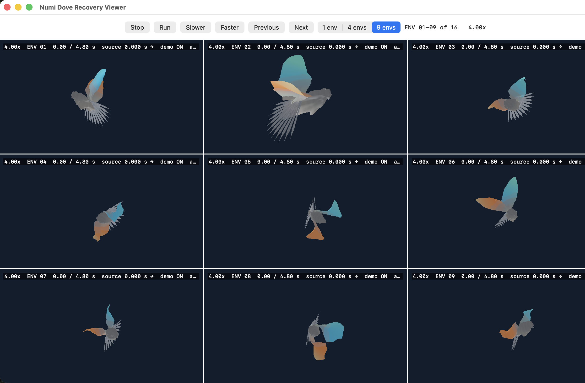

<div align="center">

# Numi Lab

<strong>Teach robots to perceive, move, adapt, and recover—entirely on Apple Silicon.</strong>

`C++23` · `Metal` · `Swift` · `MLX` · `Physics-first robotics`


**One Mac. One native runtime. A laboratory full of robots.**

[Start in five minutes](#start-in-five-minutes) ·
[See the laboratory](#one-laboratory-many-robots) ·
[Understand the stack](#one-apple-native-loop) ·
[Read the evidence](#evidence-not-vibes)

</div>

Numi Lab is an Apple-native physics and learning system for robotics. Bring a
robot, a world, sensors, a task, and an optional policy. Numi compiles them into
one persistent Metal program where physics, contact, sensing, policy inference,
reward, termination, and reset stay on the GPU.

Swift schedules bounded asynchronous rollouts. MLX learns from compact batches.
Python is an optional data and learning boundary—it does not step the production
simulator.

The ambition is simple to say and difficult to build: make serious robotics
feel approachable enough for a first experiment, yet rigorous and extensible
enough for new physics, new robots, and frontier learning systems.

## Start in five minutes

Requirements: Apple Silicon, the current Xcode/Metal toolchain, CMake 3.28 or
newer, Ninja, SQLite3, and LibXml2.

```sh
git clone https://github.com/Numi2/numi-lab.git
cd numi-lab

./tools/numi doctor
./tools/numi context
./tools/numi window
```

That opens the native **Numi Window**. The controls follow the mental model a
new roboticist actually needs:

1. **Robot** — choose the machine.
2. **Environment** — choose the physical world.
3. **Task** — choose what the robot should learn.
4. **Policy** — inspect a compatible, qualified controller.
5. **Train** — configure and start a native Metal/MLX learning run.

No controller is presented as intelligence by default. An untrained humanoid
is labeled **Untrained · no controller**. Training artifacts are always kept,
but a falling candidate does not enter the Policy menu unless its current
held-out physical gate passes.

Keyboard controls keep exploration fluid:

| Key | Action |
| --- | --- |
| `Space` | Pause or resume presentation; simulation ownership stays explicit |
| `T` | Open guided training configuration |
| `R` | Reset the camera |
| `?` | Reopen the learning guide |

## From curiosity to a qualified policy

The training sheet starts with human concepts, not a wall of RL flags:

- **Pipeline check** confirms that simulation, MLX, checkpoints, and selection
  are wired correctly. It is explicitly too short to claim useful behavior.
- **Learn standing** begins at the easiest curriculum band and gives balance
  time to emerge.
- **Build robust movement** expands a working controller into harder physical
  variation.
- **Advanced settings** expose environments, rollout horizon, updates, GPU
  submission cadence, seed, and checkpoint interval when the user is ready.

Every run follows the same visible journey:

```text
configure → simulate on Metal → learn with MLX → checkpoint
          → compare on held-out physics → keep only qualified behavior
```

Numi releases the preview world before training acquires Metal, retains the
complete run directory, bounds held-out evaluation, and cancels the full child
process tree when a run is stopped. A result is not promoted merely because its
reward improved.

## One laboratory, many robots

Numi Lab is not a G1 demo or a fixed task catalog. G1 locomotion, Franka
manipulation, measured-surface flight, surgical mechanisms, perception, contact,
recovery, rods, and deformables are workloads over one compiled runtime.

### Articulated locomotion


Official G1 mechanics and presentation assets run through floating-base ABA,
joint drives, full-body collision, coupled frictional contact, task programs,
native policy inference, and physical outcome measurement.

### Vision that shares the physics clock


RGB, metric depth, normals, identities, motion, and validity share the same
camera, accepted physics state, timestamp, reset semantics, and fingerprint.
Presentation images can leave the GPU; production observations do not need to.

### Manipulation


Franka uses the same authored-world, articulated-contact, sensor, task, policy,
and renderer boundaries as the humanoid workloads. Adding a robot does not add
a robot-specific simulation mode.

### Measured-surface robotics



The Deetjen OB-F03 robotic dove preserves a provenance-locked measured surface
of 2,157 vertices and 3,968 triangles, then adds explicit simulator assumptions:
a floating root, mirrored right wing, bounded component actuation, aerodynamic
loading, transactional state, and accepted load telemetry.

### Research surgical mechanisms


Numi includes Franka workcells and a JHU dVRK PSM research mechanism with an
executable jaw transmission. Authored presentation is not silently promoted to
physical task completion, deformable-tissue validity, or clinical evidence.

## One Apple-native loop

```text
RobotPack + WorldPack + SensorPack + TaskPack + RealityPack
                    +
       InteractionPack or PolicyPack (optional)
                    │
                    ▼
     stable indices, capacities, tables, fingerprints
                    │
                    ▼
        persistent device-private Metal world
  physics · contact · terrain · sensing · inference · task
                    │
                    ▼
         accepted state + compact rollout batches
                    │
                    ▼
       Swift scheduler → MLX learner → next PolicyPack
```

| Layer | Owns |
| --- | --- |
| **C++23** | Robot/world compilation, packs, topology, capacities, fingerprints |
| **Metal** | Dynamics, collision, coupled contact, tasks, inference, rendering, sensing |
| **Objective-C++** | Pipelines, heaps, buffers, command encoding, submission tickets |
| **Swift** | Rollout cadence, asynchronous completion, timeout, reset, revision, native UX |
| **MLX** | Batch actor/critic learning and PolicyPack publication |

One environment control step is a transaction. Accepted state publishes.
Failed state rolls back with typed evidence while healthy environments continue.
Chunk size and scheduling must not change randomness or replay.

## What runs today

- Fixed- and floating-base articulated dynamics with authored inertias,
  actuators, limits, collision geometry, and free rigid bodies.
- Deterministic broadphase, analytic narrowphase, persistent manifolds, terrain,
  CCD, and coupled circular/elliptical Coulomb friction.
- Persistent batched Metal worlds with native reset, randomization, sensing,
  observations, rewards, termination, policy inference, and rollout capture.
- Rigid, articulated, rod, deformable, tactile, plantar, proprioceptive, and
  visual program families with explicit coupling boundaries.
- `WorldPack`, `TaskPack`, `SensorPack`, `RealityPack`, `InteractionPack`, and
  fingerprinted `PolicyPack` artifacts.
- Provider-neutral action chunks, native ARDY motion proposals, and a qualified
  GR00T N1.7 execution path through Core ML on Apple Silicon.
- Unitree G1, Franka, measured dove, PX4 X500, ROBOTIS K1, and research PSM
  integrations at different, explicitly documented qualification levels.

## Evidence, not vibes

Numi reports implementation only at the boundary the live runtime proves.
These are simulator measurements—not hardware claims:

| Workload | Recorded result | What it establishes |
| --- | ---: | --- |
| Batched G1 learning | `12,288` environments, `19,070,976` transitions, `6,430` transitions/s, `0` failed steps | Persistent Apple-GPU learning scale at the recorded revision |
| Streamed inverse ABA | `5,708` transitions/s vs `4,104` dense, identical `4,194,304` transitions, `0` failed steps | `1.39×` matched throughput improvement |
| Native G1 standing capture | `1,000` control steps, `0.785 m` mean pelvis height, `0.009 rad` mean tilt, `0` physics failures | A recorded 20-second simulator rollout |
| Disturbance training | peak tilt `0.771 → 0.087 rad`, `4,000 / 4,000` standing steps after training, `0` physics failures | Matched recorded simulator improvement |
| Measured dove | deterministic replay, whole-step rollback, accepted force/torque telemetry | Executable measured-surface simulation boundary |

Recorded media and PolicyPacks belong to their exact world, task, observation,
action, and runtime fingerprints. A beautiful historical rollout is not assumed
compatible with today’s checkout. Current contracts are re-evaluated instead of
being bypassed.


The get-up frontier is still unsolved. A recorded 300-update Stage-I run improved
mean pelvis height from `0.0623 m` to `0.0848 m` and mean tilt from `1.533 rad`
to `1.445 rad`, but produced zero standing steps. Numi calls that better rolling
and bracing—not a get-up.

## Build and verify

```sh
cmake -S . -B build -G Ninja -DCMAKE_BUILD_TYPE=Release
cmake --build build --parallel

./build/bin/metalrobo_task_program_check
./build/bin/metalrobo_tactile_check
./build/bin/metalrobo_visual_platform_probe
```

Operate the same native runtime through the small, self-describing Numi CLI:

```sh
./tools/numi doctor
./tools/numi context
./tools/numi train --help
./tools/numi evaluate --help
./tools/numi window --help
```

Capabilities are executable overlays, not a closed robotics schema. A workspace
can add `.numi/commands/<name>` without turning the core CLI into a second
planner. See the [Numi CLI contract](docs/NUMI_CLI.md).

## Extend the laboratory

A new robot belongs at the mechanics and artifact boundary:

```text
mechanics + authored packs + policy contract
```

It should not require a robot branch in a shader, a host-side per-environment
loop, or a parallel simulator. Start with:

- [Platform direction](docs/PLATFORM_DIRECTION.md)
- [World authoring and packs](docs/WORLD_ENGINE.md)
- [Metal execution and TemporalCone](docs/METAL_WORLD.md)
- [Numerical and replay rules](docs/NUMERICS.md)
- [Visual presentation and sensing](docs/VISUAL_PLATFORM.md)
- [Tactile geometry](docs/TACTILE_GEOMETRY_BRIDGE.md)
- [Measured-surface mechanics](docs/MEASURED_SURFACE_MECHANICS.md)
- [Foundation policies](docs/FOUNDATION_POLICIES.md)

| Path | Owner |
| --- | --- |
| `include/metalrobo` | Public C++, C, and shared CPU/Metal contracts |
| `src/core` | Models, pack compilers, world construction, CPU references |
| `src/metal` | Physics, solvers, tasks, inference, rendering, sensors |
| `src/apple` | Apple-native asset and environment cooking |
| `bindings/swift` | Swift rollout and policy interfaces |
| `apps` | Native applications, probes, cookers, and benchmarks |
| `python` | MLX learning, datasets, exporters, and independent oracles |

## North star

- Make the first robotics experiment understandable without hiding the real
  physics or learning system.
- Solve balance, locomotion, recovery, manipulation, dexterity, and perception
  through one compiled native path.
- Scale exact contact, sensing, inference, and learning across the Apple GPU
  memory and execution envelope.
- Train synchronized vision-tactile policies from native RGB-D, contact,
  pressure, deformation, and robot state.
- Close the loop from authored worlds to deterministic qualification and,
  eventually, carefully gated real hardware.

## Provenance and honest boundaries

- G1 mechanics and visual assets are pinned to official Unitree sources.
- Franka presentation uses official FR3v2 visual assets.
- G1, Franka, sensor, and measured-dove media are native Numi Lab outputs
  captured on Apple Silicon unless a caption explicitly states otherwise.
- The surgical workcell is authored presentation. It does not establish
  coordinated manipulation, tissue deformation, suturing, clinical validity,
  or hardware execution.
- Stable simulation, internal parity, reward improvement, and rendered media do
  not prove real-world fidelity, safety, transfer, or material calibration.
- Real hardware execution requires the owner’s arming, limits, emergency stop,
  and approval policy. Nothing in this README arms hardware.

Third-party sources and required notices are recorded in
[THIRD_PARTY_NOTICES.md](THIRD_PARTY_NOTICES.md).

Numi Lab is pre-release robotics research infrastructure, not a finished robot
product or a clinical system.

Copyright © 2026 Numan Thabit. All rights reserved. Third-party components
remain subject to their respective copyrights and licenses.
