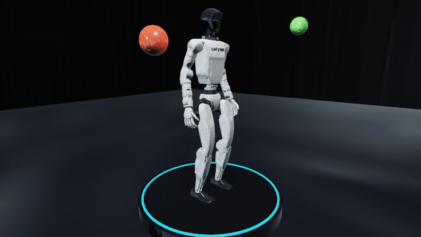
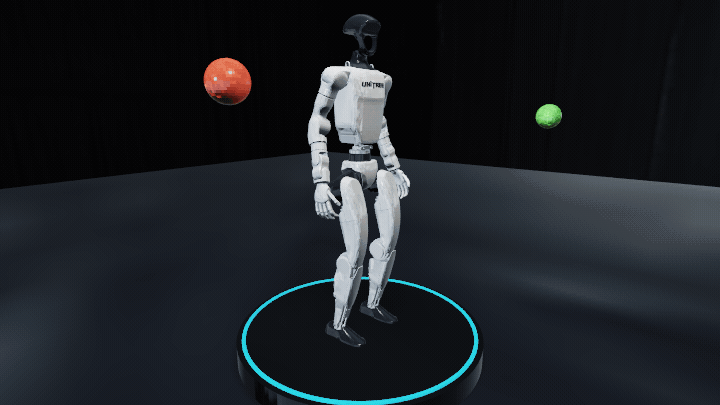
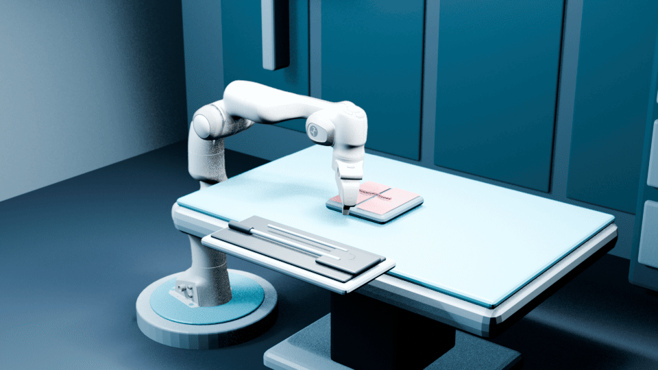
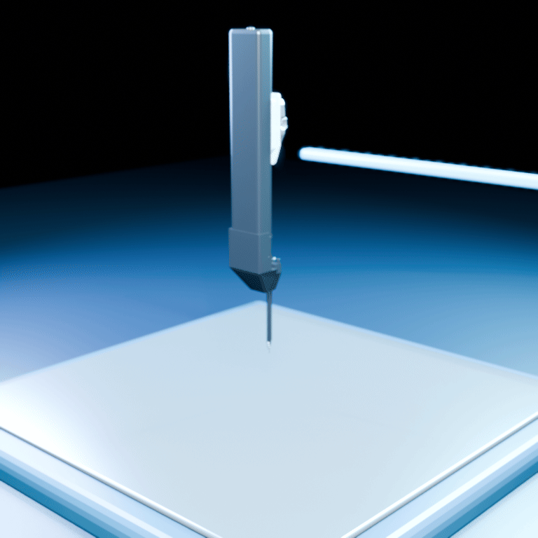

<div align="center">

# numi-lab

**An Apple-native physics and robotics laboratory.**

`C++23` · `Metal` · `Objective-C++` · `Swift` · `MLX`


</div>

numi-lab keeps robot physics, contact, task execution, policy inference, and
sensor generation in native Apple GPU memory. Swift schedules rollouts. MLX
updates policies. Python is an optional learning and data boundary; it does
not step the production simulator.

This is a pre-release research engine. It is not a finished robot product and
does not yet establish real-robot transfer.

Numi Lab is not a G1, locomotion, recovery, or dodge product. Those are useful
qualification workloads over one shared simulator. The platform goal is a
general robotics laboratory for Apple Silicon: many robots, scenes, tasks,
materials, sensors, controllers, and learning systems executing through the
same compiled native physics path.

## Platform scope

- **Physics:** rigid bodies, floating and fixed articulations, coupled contact,
  terrain, rods, deformables, tactile fields, and stable cross-domain coupling.
- **Robotics:** locomotion, manipulation, recovery, mobile manipulation,
  multi-robot interaction, and research surgical mechanisms.
- **Sensing:** proprioception, contact, plantar pressure, RGB-D, identities,
  motion, tactile observations, and future task-authored sensor combinations.
- **Intelligence:** native policies, generated motion, demonstrations,
  foundation-model proposals, imitation, reinforcement learning, and recovery.
- **Scale:** persistent batched Metal execution, deterministic replay,
  transactional failure isolation, unified-memory accounting, and profiling.
- **Extensibility:** robot mechanics plus `WorldPack`, `TaskPack`,
  `InteractionPack`, and `PolicyPack` artifacts—not new robot-specific shader
  modes or a fixed catalog of tasks.

The durable platform direction is described in
[Numi Lab platform direction](docs/PLATFORM_DIRECTION.md).

## What runs today

- Fixed- and floating-base articulated dynamics with authored inertias,
  actuators, joint limits, collision geometry, and free rigid bodies.
- Deterministic broadphase, analytic narrowphase, persistent manifolds,
  coupled Coulomb friction, terrain, and transactional state publication.
- Resident batched Metal worlds with native reset, randomization,
  observations, rewards, termination, policy inference, and rollout capture.
- Robot-independent `TaskPack` tables, generated motion/contact
  `InteractionPack` references, and fingerprinted `PolicyPack` actors.
- Native RGB, metric depth, normals, identities, motion, and tactile outputs
  from authored presentation and sensor geometry.
- Swift rollout and PPO scheduling with MLX restricted to the learning
  backend.
- Provider-neutral foundation-policy action chunks, including a qualified
  GR00T N1.7 G1 execution path through Core ML on Apple Silicon.
- Fingerprinted motion-provider proposals, including ARDY Core prompt-to-motion
  inference through ONNX Runtime on arm64 Apple Silicon.
- Bundled Unitree G1, Franka, and research PSM models.

## NumiSolver: the production physics path

The production contact solver is named `temporalCone`. `numisolver` is the
development branch carrying the current G1 recovery work.

Each 20 ms G1 control interval is normally divided into four physics
microsteps. On every microstep numi-lab:

1. refreshes implicit drive effort from the current joint state;
2. predicts articulated motion with ABA;
3. rebuilds transforms, collision, manifolds, Jacobians, and response terms;
4. solves normal and two-axis friction together as a circular or elliptical
   Coulomb cone;
5. integrates immediately and repeats from the accepted state.

The complete horizon is encoded into native Metal command buffers. Normal
stepping has no CPU contact-count readback, solver fallback, or Python
scheduling boundary. Work is parallel across environments and independent
islands. Failed environments roll back without publishing partial state.

This has the temporal refresh behavior that makes TGS useful, but it is our
own exact-cone Metal implementation—not PhysX TGS and not a renamed PGS loop.
A slower `qualityNewton` mode exists for numerical comparison; it is not the
throughput rollout path.

## Selected qualification workloads

The following G1 runs exercise standing, disturbance response, perception,
generated motion, destructive contact, and get-up learning. They are evidence
for shared simulator capabilities, not the product boundary.

### Prompt-to-G1 motion imagination

Numi runs the
INT4 ARDY Llama 3 text encoder and ARDY Core ONNX model on arm64 Apple Silicon,
then applies bounded full-body retargeting to the official 29-DoF Unitree G1
mechanics. The source proposal can be inspected kinematically, but a rendered
landing is publishable only after the proposal has been executed through G1
actuation, gravity, collision, and contact in NumiSolver. The workflow begins
with:

```sh
numi motion imagine-g1 \
  --prompt 'do backflip' \
  --seed 4
```

The retargeter preserves ARDY's complete 40-frame temporal proposal and never
invents flight, touchdown, foot locks, or a settling pose. InteractionPack may
use the joint-space proposal as controller intent, while the root remains a
simulated outcome. NumiSolver applies the compiled world's gravity every
physics substep and resolves whether the robot takes off, lands, slips, falls,
or recovers. `imagine-g1` now performs that physical realization by default;
its GIF and MP4 are forward-kinematic renders of accepted solver states, not
of the provider root trajectory. A failed physical realization stays visible
as a failed result; presentation code must not repair it.

### Native G1 standing

The actor was converted once to `PolicyPack` and runs through numi-lab's
native Metal inference engine with a zero velocity command. On Apple M4, the
retained 20-second run completed all 1,000 control steps with:

- mean pelvis height: `0.785 m`;
- mean tilt: `0.009 rad`;
- tracking score: `0.9998`;
- failed physics steps: `0`;
- termination: the expected 20-second timeout only.


[Full H.264 capture](docs/media/g1-standing-native-20s.mp4)

The animation is rendered by numi-lab's native `sensor_reference` path from
the accepted state trace. No external simulator supplies pixels or
intermediate motion.

### Physical disturbance and recovery workload

The balls below are ordinary dynamic scene bodies in the same broadphase,
manifold, island, and temporal-cone solve as G1.



[Full H.264 disturbance capture](docs/media/g1-standing-ball-disturbance-20s.mp4)

The current randomized physical-ball training task launches four spheres from
independent directions with per-episode variation in position, height,
velocity, and launch time. In an identical 8-environment, 500-step evaluation:

| Policy | Peak tilt | Mean tilt | Standing steps | Physics failures |
| --- | ---: | ---: | ---: | ---: |
| Recovery initializer | `0.771 rad` | `0.0146 rad` | `3,992 / 4,000` | `0` |
| After 153,600 physical training steps | `0.087 rad` | `0.00557 rad` | `4,000 / 4,000` | `0` |

These are simulator results. The trained experimental policy artifact is not
currently bundled in the repository.

### Perceptive dodge workload

The G1 dodge TaskPack now exposes only deployable proprioception plus four
ball-only 16x9 masked-depth frames at sparse offsets `0, 3, 8, 18`. Authored
Visual Presentation instance IDs perform the mask on Metal; depth history,
normalization, reset, physics, reward, and inference stay device-resident.
Exact ball tracks are critic-only. Link-CBF shaping uses compiled collision
envelopes for every collidable robot link and each authored projectile radius.

The native task and visual kernels are qualified on Apple M4. No trained dodge
policy or G1/ball visual packs are bundled yet, so this is an implemented
training path—not a claimed dodge result.

### Generated intent, physically accepted

The minimal `raise left hand` InteractionPack example demonstrates the
generated-intent boundary without a projectile or learned policy. On Apple M4
it completed all 50 native control steps standing, with zero physics failures
or terminations; accepted-state kinematics measured a `0.190 m` left-wrist
rise relative to the pelvis. The reproducible example and stricter claim
boundary are documented in
[World engine: InteractionPack](docs/WORLD_ENGINE.md#interactionpack-generated-intent-solved-outcome).

Across tasks, generated actions become distillation targets only in proportion
to solver-measured physical outcomes. Stable partial progress is retained;
failed or terminated transitions cannot be attributed to the teacher as
successful behavior. Dodge supplies one set of outcome signals, while
manipulation, recovery, locomotion, and contact-rich tasks supply their own.

### Deliberately destructive test



[Full H.264 escalation capture](docs/media/g1-twelve-ball-escalation.mp4)

This continuous 8.5-second inspection run does not reset after falling. The
`6 kg` impact knocks G1 down; the `7 kg` and `8 kg` impacts and three seconds
of aftermath remain visible. All 425 control steps completed with zero physics
failures. This demonstrates continuous native dynamics under a destructive
load, not successful recovery.

### Get-up workload status: not solved yet

The Stage-I supine task now has ten frames of proprioceptive history, a
privileged critic, full-body contact, and generic height, support, body-up,
and standing-completion operators.

A 300-update run completed 460,800 physical environment steps with zero
physics failures. Relative to its untouched initializer:

| Metric | Initial | Trained |
| --- | ---: | ---: |
| Mean pelvis height | `0.0623 m` | `0.0848 m` |
| Maximum pelvis height | `0.126 m` | `0.137 m` |
| Mean tilt | `1.533 rad` | `1.445 rad` |
| Standing steps | `0` | `0` |

The policy learned a better rolling and bracing behavior, not a get-up.
Trajectory refinement remains gated until discovery produces a real standing
transition.

## Native sensors and presentation


The panels above share one camera, timestamp, physics state, and authored
scene. RGB is tone-mapped only for presentation; policy RGB remains
scene-linear. Depth is metric and identity outputs remain integer typed.

Presentation comes from cooked USD, USDZ, GLB, or glTF assets. numi-lab does
not synthesize a visible robot from collision geometry. The G1 and Franka
images use their official upstream visual meshes.


### Authored surgical workcell



The scene combines two official-mesh Franka arms facing an operating table
with a sterile drape, instrument tray, suturable tissue phantom, unsutured
incision, curved needle, and coiled suture presentation. Both arms start from
one accepted Numi Lab pose, with a rigid station transform applied to the
second arm. The second robot and surgical props are authored presentation, not
yet a compiled dual-robot physics task; this media does not claim coordinated
motion, needle contact, tissue deformation, suturing, task completion,
clinical validity, or hardware execution.

## Architecture

```text
URDF / authored world
        +
TaskPack
        +
InteractionPack (optional generated joint/contact intent)
        +
PolicyPack
        |
        v
compiled indices, capacities, tables and fingerprints
        |
        v
persistent Metal world
  physics + contact + tasks + inference + sensors
        |
        v
compact rollout batches
        |
        v
Swift scheduler -> MLX learner -> next PolicyPack
```

| Layer | Responsibility |
| --- | --- |
| C++23 | Robot/world compilation, packs, topology, capacities, public contracts |
| Metal Shading Language | Dynamics, collision, contact solving, tasks, inference, rendering, tactile sensing |
| Objective-C++ | Pipeline creation, heaps, buffers, command encoding, submission tickets |
| Swift | Rollout length, chunking, reset requests, completion, policy revisions |
| MLX | Actor/critic optimization and PolicyPack publication |

## Build

Requirements: Apple Silicon, the current Xcode/Metal toolchain, CMake 3.28 or
newer, Ninja, SQLite3, and LibXml2.

```sh
cmake -S . -B build -G Ninja -DCMAKE_BUILD_TYPE=Release
cmake --build build --parallel
```

Run focused checks rather than every executable:

```sh
./build/bin/metalrobo_task_program_check
./build/bin/metalrobo_tactile_check
./build/bin/metalrobo_visual_platform_probe
```

Codex can operate the same native runtime through the deliberately small,
self-describing Numi CLI:

```sh
./tools/numi doctor
./tools/numi context
./tools/numi codex install
./tools/numi train --help
./tools/numi evaluate --help
```

Capabilities are executable overlays rather than a fixed robotics schema, so a
user or Codex can add `.numi/commands/<name>` without changing the CLI. See
[the Numi CLI contract](docs/NUMI_CLI.md).

Native rollout example:

```sh
./build/bin/metalrobo_task_rollout \
  --metallib build/shaders/MetalRobo.metallib \
  --envs 32 --steps 48 --chunk 8 \
  --scene terrain --native-policy
```

MLX is pinned by the Python package to `mlx>=0.32,<0.33` on Apple Silicon.

## Repository map

| Path | Current owner |
| --- | --- |
| `include/metalrobo` | Public C++, C, and shared CPU/Metal contracts |
| `src/core` | Models, pack compilers, world construction, CPU references |
| `src/metal` | Native physics, solvers, tasks, inference, rendering, sensors |
| `src/apple` | Apple-native asset and environment cooking |
| `bindings/swift` | Swift rollout and policy interfaces |
| `python` | MLX learning, datasets, export, and independent oracle tools |
| `apps` | Focused checks, examples, cookers, and benchmarks |

Only current subsystem contracts remain under `docs`:

- [World authoring and packs](docs/WORLD_ENGINE.md)
- [Metal execution and TemporalCone](docs/METAL_WORLD.md)
- [Numerical rules](docs/NUMERICS.md)
- [Visual presentation](docs/VISUAL_PLATFORM.md)
- [Foundation policies on Apple Silicon](docs/FOUNDATION_POLICIES.md)
- [Tactile geometry](docs/TACTILE_GEOMETRY_BRIDGE.md)

## Roadmap

- Solve G1 get-up, recovery, locomotion, and dexterity in one native stack.
- Scale persistent Metal worlds, exact contact, inference, and sensors to the
  full Apple GPU memory and execution envelope.
- Train vision-tactile policies directly from synchronized native RGB-D,
  force, deformation, and robot state.
- Close the loop from authored worlds to sim2sim qualification and deployed
  Apple-native robot control.

## Provenance and boundaries

- G1 mechanics and visual assets are pinned to official Unitree sources; the
  retained standing actor is a fingerprinted third-party artifact.
- Franka imagery uses official FR3v2 visual assets.
- The retained G1 and Franka images and animations are native numi-lab
  renderer outputs captured on Apple M4. They are not generated concept art.
- The dVRK PSM showcase below uses the authored PSM USD in an offline
  presentation pass while preserving Numi Lab's robot identity and scene
  conventions; it is not evidence of native-renderer or hardware execution.
- Internal agreement, stable simulation, and simulator policy performance are
  not proof of real-world fidelity, safety, or transfer.
- The PSM uses the pinned JHU Classic arm and Large Needle Driver kinematic,
  limit, effort, and actuator-coupling records. Its jaw transmission is an
  executable generalized gear constraint. Body masses/reset/drives come from
  pinned ORBIT-Surgical records; collision shapes and inertias remain explicit
  research approximations because the public sources do not provide identified
  hardware tensors. It is robotics research infrastructure, not a clinical or
  biomechanical simulator.

Third-party sources and required notices are recorded in
[THIRD_PARTY_NOTICES.md](THIRD_PARTY_NOTICES.md).

Copyright © 2026 Numan Thabit. All rights reserved. Third-party components
remain subject to their respective copyrights and licenses.

## dVRK PSM in Numi Lab


