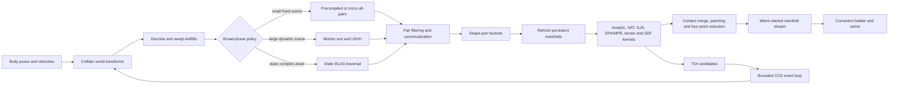

# Production collision pipeline

## Status and scope

This document is the implementation contract for MetalRobo's production
collision detector. It is a design target, not a claim about the current
vertical slice. The current runtime only applies compliant sphere/capsule
contacts against one ground plane. None of the LBVH, general pair generation,
persistent-manifold, convex, mesh, heightfield, SDF, or CCD work below should
be described as shipped until its corresponding milestone is measured.

The target is a headless, GPU-resident collision system for thousands of
logically isolated robotics environments on Apple silicon. It must serve both
reduced-coordinate articulations and free rigid bodies without routing pairs
through the CPU. It must be:

- conservative in the broad phase: no valid pair may be lost;
- explicit about authored surface, contact envelope, and rest separation;
- stable under persistent resting and frictional contact;
- bounded in memory and iteration count on the GPU;
- deterministic when the diagnostic mode is selected;
- recoverable and observable when a capacity or numerical limit is reached;
- independent of rendering and of Metal ray-tracing availability.

Collision detection only produces geometric contact data. It does not apply
penalty forces or impulses. Constraint construction and the contact solver
consume the manifolds described here.

## Non-negotiable conventions

All geometry uses SI units and FP32 on Metal. CPU references evaluate the same
queries in FP64. World and body quaternions are `(x, y, z, w)`. A collider has
a fixed local transform relative to its body.

For an ordered pair `(A, B)`:

- `normalWorld` is a unit vector pointing from A toward B.
- `pointAWorld` and `pointBWorld` lie on the authored geometric surfaces.
- `geometricSeparation = dot(pointBWorld - pointAWorld, normalWorld)`.
- Positive separation means separated, zero means touching, and negative
  separation means overlap.
- `contactDistance = contactOffsetA + contactOffsetB` controls when a contact
  may be generated.
- `restDistance = restOffsetA + restOffsetB` controls the solver's desired
  separation.
- A narrow-phase result is eligible when
  `geometricSeparation <= contactDistance`.
- The value sent to the solver is
  `constraintSeparation = geometricSeparation - restDistance`.

The two offsets must satisfy `contactOffset >= restOffset` for each collider.
They are not baked into the support mapping or visual geometry. This keeps
surface witnesses meaningful and permits positive or negative rest distances.

An impulse along `normalWorld` acts as `-normalWorld` on A and
`+normalWorld` on B. Pair order is canonical: environment first, then the
smaller stable collider slot as A. Narrow-phase implementations may swap
shapes internally, but must restore this convention at output.

Environments occupy the same logical world coordinates. Environment identity
is part of every instance and pair key; placing environments far apart is not
a correctness mechanism.

## End-to-end graph



All arrows in the normal training path are GPU resources. Counts and dispatch
sizes are generated on the device. The CPU encodes the graph, commits it, and
does not inspect intermediate counts.

## Scene representation

### Immutable cooked data

The model cooker produces immutable, versioned buffers. Runtime code never
walks C++ object graphs from Metal.

| Buffer | Element data |
| --- | --- |
| `colliderBody` | Body slot for each collider |
| `colliderShapeType` | Plane, sphere, capsule, box, cylinder, convex, mesh, heightfield, or SDF |
| `colliderGeometryIndex` | Index into the type-specific geometry table |
| `colliderLocalPosition` | Aligned `float4`, xyz used |
| `colliderLocalRotation` | Aligned quaternion `float4` |
| `colliderMaterial` | Material-table index |
| `colliderGroup`, `colliderMask` | Symmetric collision-filter bits |
| `colliderFlags` | Enabled, sensor, one-sided, CCD mode, query-only, and response flags |
| `colliderContactRestOffset` | `float2(contactOffset, restOffset)` |
| `colliderBoundingRadius` | Conservative radius about the collider origin |
| `bodyColliderRange` | Offset/count into a body-to-collider index list |
| `bodyCollisionClass` | Static, kinematic, dynamic, articulation link, or world |
| `excludedPairBits` | Cooked self-collision and user-exclusion matrix |
| `materialTable` | Friction, restitution, compliance, damping, rolling/torsional friction |
| `materialPairOverrides` | Optional sorted interaction table |

Type-specific data is also structure-of-arrays:

- spheres store radius;
- capsules store local endpoints and radius;
- boxes store half extents;
- cylinders store half length, radius, and local axis;
- convex hulls store vertex, face-plane, face-index, and edge-adjacency ranges;
- triangle meshes store vertices, triangles, adjacency, material indices, and
  a cooked static BVH;
- heightfields store samples, scale, tile min/max data, and a fixed cell
  diagonal convention;
- SDFs store grid transforms, conservative error bounds, texture/atlas
  handles, and sparse brick metadata.

Every cooked asset contains:

- a schema version and byte-order marker;
- a content hash;
- its source coordinate and unit conversion;
- conservative local bounds;
- counts checked against 32-bit indexing;
- a cook report containing rejected or repaired degeneracies.

The existing `MRColliderGPU` is a v0 record and is not extended in place.
Production geometry uses a versioned scene ABI so old metallibs cannot
reinterpret new records accidentally.

### Mutable batched data

Fields are separate buffers unless two fields are always loaded together.
`float4` arrays remain naturally aligned and vector-loadable.

| Buffer | Shape |
| --- | --- |
| `bodyPosition`, `bodyRotation` | `[environment, body]` |
| `bodyLinearVelocity`, `bodyAngularVelocity` | `[environment, body]` |
| `previousBodyPosition`, `previousBodyRotation` | `[environment, body]` for CCD and transactional replay |
| `colliderWorldPosition`, `colliderWorldRotation` | `[active collider instance]` |
| `aabbLower`, `aabbUpper` | `[active collider instance]`, aligned `float4` |
| `sweptAabbLower`, `sweptAabbUpper` | `[CCD collider instance]` |
| `mortonKey`, `sortedCollider` | double-buffered sort arrays |
| `bvhNodeLower`, `bvhNodeUpper` | `[LBVH node]` |
| `bvhLeft`, `bvhRight`, `bvhParent`, `bvhEscape` | `[LBVH node]` |
| `candidatePairs` | compacted broad-phase output |
| `pairBuckets` | compacted, shape-class-sorted narrow-phase work |
| `rawContacts` | transient narrow-phase points |
| `manifoldHeaders`, `manifoldPoints`, `manifoldPatchImpulses` | persistent, double-buffered |
| `indirectArguments` | one aligned dispatch record per variable kernel |
| `collisionDiagnostics` | counters, flags, first failing key, maxima |

`previousBody*` is the last accepted state, not merely the start of the most
recent kernel. A failed collision step therefore cannot partially publish a
new physical state.

### GPU record contracts

These logical records are each a multiple of 16 bytes. They are illustrative
of the generic engine ABI introduced as `MR_ENGINE_ABI_VERSION == 1`; their
definitions must live in one C++/Metal shared header with compile-time size
and offset checks.

```c
struct MRAabbGPU {
    float4 lower;                 // xyz finite, w unused
    float4 upper;                 // xyz finite, w unused
};                               // 32 bytes

struct MRCandidatePairGPU {
    uint environment;
    uint colliderA;               // canonical local slot
    uint colliderB;
    uint flags;                   // pair class, sensor, CCD, static/dynamic
};                               // 16 bytes

struct MRRawContactGPU {
    float4 normalAndSeparation;   // xyz normal, w geometric separation
    float4 pointAWorld;           // xyz surface witness
    float4 pointBWorld;           // xyz surface witness
    uint4 featureAndFlags;        // feature A, feature B, patch seed, flags
};                               // 64 bytes

struct MRManifoldHeaderGPU {
    uint4 pairAndCount;           // environment, collider A, collider B, count
    uint4 generationsAndFlags;    // slot generations, patch id, flags
    float4 normalAndAge;          // xyz body-A-local normal, w rebuild age
    float4 tangentAndMetric;      // xyz body-A-local tangent, w break metric
};                               // 64 bytes

struct MRManifoldPointGPU {
    float4 localAnchorA;          // body-A local surface witness
    float4 localAnchorB;          // body-B local surface witness
    float4 impulses;              // normal, tangent 1, tangent 2, reserved
    uint4 featureAndLife;         // feature ids, lifetime, flags
};                               // 64 bytes
```

Manifold points live in a separate fixed-stride array with four slots per
manifold. One `float4` in `manifoldPatchImpulses` stores torsional and two
rolling impulses for each patch. This lets the solver read only headers for
inactive/sensor pairs. Mesh, heightfield, and SDF contacts may form multiple
normal patches for one collider pair; `patch id` distinguishes those
manifolds.

No correctness path depends on 64-bit atomics. Apple feature availability for
64-bit atomics differs across GPU families. Stable keys are represented as
`uint2`/`uint4` and sorted lexicographically. Device counters and arrival
flags use 32-bit atomics.

### Identity and slot reuse

A collider identity is `(environment, colliderSlot, slotGeneration)`.
Collider slots are stable through a rollout. If a dynamic slot is destroyed
and reused, its generation increments before the new shape is enabled.
Persistent manifolds compare both generations and cannot warm-start a new
object using an old object's impulses.

Pairs use ordered collider slots. Shape features use stable cooked indices:

- sphere: one surface feature;
- capsule/cylinder: endpoint, side, or cap plus subfeature;
- box/convex: vertex, edge, or face index;
- mesh: triangle index plus vertex/edge/face region;
- heightfield: cell index, triangle half, and region;
- SDF: brick and quantized local anchor only as a matching hint.

Feature IDs accelerate matching but are never the sole validity test.
Reprojected anchors and normals must still pass the manifold breaking tests.

## World transforms and AABBs

`mr_update_collider_transforms` composes each enabled collider's local pose
with its body's world pose. It also calculates point velocities only when a
later path requests them.

`mr_compute_world_aabbs` uses closed-form conservative bounds:

- sphere: `center +/- radius`;
- capsule: component-wise min/max of its two world endpoints, expanded by
  radius;
- box: `worldCenter +/- abs(R) * halfExtent`;
- cylinder and convex: transform their cooked local bounding box using
  `abs(R) * localHalfExtent`;
- mesh, heightfield, and SDF instance: transform the cooked root bound in the
  same way;
- plane: it is not inserted into a finite dynamic broad phase.

Every finite bound is expanded by the pair-independent collider
`contactOffset` plus `broadphaseSlop`. The narrow phase still applies the
sum of both colliders' contact offsets exactly.

For speculative contact and CCD, a swept bound covers both endpoint AABBs and
an angular-motion expansion:

```text
angularExpansion = boundingRadius * min(abs(angularVelocity) * dt, 2)
sweptLower = min(startLower, endLower) - angularExpansion - ccdSlop
sweptUpper = max(startUpper, endUpper) + angularExpansion + ccdSlop
```

The scalar angular term is applied on every axis. It is intentionally
conservative. The endpoint union already covers translation. Endpoint bounds
use the predicted end transform, not only `velocity * dt`, for kinematic
bodies.

The kernel rejects non-finite transforms, radii, and bounds. It does not turn
a NaN into a plausible empty AABB. The affected environment is quarantined
and the diagnostic records the first body and collider.

World-scale handling is explicit:

- normal robotics scenes use a configured environment AABB;
- Morton coordinates outside it are clamped, but exact AABBs remain
  unchanged, so clamping affects tree quality rather than correctness;
- a degenerate configured axis maps to its midpoint;
- large worlds use per-environment origin rebasing rather than sacrificing
  FP32 local precision.

## Broad phase

No single broad phase is best for a 20-collider robot, a 500-object
manipulation scene, and a large static terrain. MetalRobo therefore has three
production paths selected per compiled scene. Thresholds are benchmarked per
GPU family and stored in tuning data, not asserted in source comments.

### Path A: precompiled and micro broad phase

This is the first and normally fastest path for Franka and G1.

The cooker enumerates the structurally possible pairs for fixed scene
topology, removes permanent exclusions, and emits a compact pair table.
Moving free-body slots add a small dynamic pair range. One SIMD group evaluates
AABB overlap and runtime filter bits for a tile of candidate pairs.

For a small variable scene, a tiled upper-triangular all-pairs kernel is used.
It avoids sort and tree-build overhead while remaining GPU-batched across
environments. The implementation must compare this path against LBVH on each
supported GPU; the initial switching range should be measured around 64--256
active colliders per environment, not hard-coded from that estimate.

This path is exact with respect to AABB overlap and naturally supports
articulation self-collision. It is not a temporary correctness shortcut.

### Path B: segmented Morton sort and LBVH

Large dynamic scenes rebuild a linear BVH from current or swept AABBs. Rebuild
is preferred to a pointer-heavy dynamic tree on a massively batched GPU.

The passes are:

1. Compact enabled finite colliders.
2. Reduce collider centers to an environment bound, unless the scene provides
   a fixed bound.
3. Quantize each center to 10 bits per axis and interleave a 30-bit Morton
   code.
4. Form a stable lexicographic key
   `(environment, mortonCode, colliderSlot)`.
5. Sort keys and collider indices.
6. Construct the binary radix tree in parallel from longest-common-prefix
   ranges.
7. Refit exact AABBs from leaves to root.
8. Traverse the tree to count overlapping leaf pairs.
9. Exclusive-scan the counts.
10. Write canonical pairs into exact, non-overlapping output ranges.

Equal Morton codes are resolved by the stable collider slot. Environments are
separate radix-tree segments; an internal node may never span two
environments. For fixed per-environment collider capacity, segment offsets
are known. For variable counts, a scan produces offsets and the build's
longest-common-prefix function returns `-1` across an environment boundary.

Two sort implementations share one interface:

- small segments use a deterministic threadgroup sorting network;
- large streams use a stable LSD radix sort with histogram, scan, and scatter
  passes over double-buffered key/value arrays.

The initial radix is 8 bits. A 32-bit field therefore takes four passes.
Composite fields are sorted least-significant field first. A wider digit or a
decoupled-lookback/OneSweep implementation is adopted only after Metal
profiling demonstrates a win without weakening deterministic output or
capacity handling.

The LBVH follows the binary radix-tree construction described by Karras:
one thread chooses the range and split for one internal node using common
prefix lengths. Refit uses 32-bit arrival counters. A child writes its bounds
before an acquire-release increment on its parent; the second arrival merges
both children and proceeds upward. A depth-pass refit is available as the
diagnostic fallback.

Traversal is stackless using cooked/generated escape indices. Each leaf
queries the tree and emits only `otherSlot > thisSlot`, preventing duplicates.
An alternative fixed local stack is permitted only if overflow has an exact
fallback; silently abandoning nodes is forbidden.

Morton order changes hierarchy quality, not overlap correctness: every
internal bound is the union of exact child AABBs. A broad-phase differential
check against brute force is therefore straightforward.

### Path C: static geometry hierarchy

Static meshes, heightfields, and SDF domains do not enter the dynamic LBVH as
individual triangles or voxels.

- Each cooked static geometry owns a bottom-level acceleration structure
  (BLAS).
- A static instance contributes only its root AABB to a small top-level
  structure.
- Dynamic collider versus static-instance AABB overlap creates a mid-phase
  query.
- The query is transformed into the static geometry's local coordinates and
  traverses its BLAS or tile hierarchy.

Static planes use direct signed-distance queries and need no BVH node. Static
versus static pairs are rejected.

Metal ray-tracing acceleration structures may accelerate optional ray and
sensor queries. They are not the authoritative overlap path: a ray API does
not replace conservative swept-volume tests or manifold generation.

### Other spatial alternatives

The engine keeps the broad-phase interface independent of LBVH:

- sweep and prune is useful for highly coherent scenes with one dominant
  spread axis;
- a uniform or hierarchical grid is useful for similarly sized particles;
- a CPU dynamic AABB tree is useful for editor queries but not the batched
  training path;
- multi-box pruning is useful when a world has stable spatial regions.

These are measured alternatives, not simultaneous mandatory passes. The
micro path and LBVH cover the initial rigid robotics workloads.

## Pair filtering and self-collision

Filtering happens before expensive narrow-phase work and is identical across
broad-phase paths. A pair survives only when:

1. both colliders belong to the same environment;
2. both are enabled and have a supported shape-class combination;
3. they are distinct colliders on distinct welded bodies;
4. at least one body can move or the pair is an explicit sensor/query pair;
5. `(groupA & maskB) != 0` **and** `(groupB & maskA) != 0`;
6. the cooked exclusion bit is clear;
7. runtime pair state has not disabled response/query;
8. the relevant discrete, speculative, or CCD AABBs overlap.

The AND mask convention is part of the generic engine ABI. Importers
translate URDF, SRDF, MJCF, and USD semantics into it.

Articulation self-collision is compiled, not inferred expensively every step.
The cooker begins with all distinct-link pairs and applies, in this order:

- same rigid/welded body exclusion;
- parent-child and configurable kinematic-neighbour exclusion;
- SRDF/MJCF/user disabled pairs;
- explicit re-enable overrides;
- geometry-level group/mask filtering.

The result is a dense bit matrix for small collider counts and a sorted pair
list for larger ones. G1's intended exclusions are pinned with the model
asset; they are not guessed from link names at runtime.

Sensors pass geometric filtering and generate begin/persist/end overlap
events, but set `noResponse`. Query-only colliders are absent from the solver.
A GPU filter table can override material, response, or notification flags for
specific pair classes. Arbitrary CPU callbacks are excluded from headless
training because they force synchronization and make batched behavior opaque.

Pairs are canonicalized and then sorted/uniqued by
`(environment, colliderA, colliderB)`. The normal broad-phase algorithms
should already be duplicate-free; unique is retained as a cheap invariant
check and for merging explicit pairs with generated pairs.

## Narrow-phase dispatch

### Shape-class bucketing

A histogram and prefix scan partition surviving pairs by canonical shape
class. Specialized kernels then execute coherent work:

- plane/analytic primitive;
- sphere/sphere, sphere/capsule, capsule/capsule;
- sphere/box and capsule/box;
- box/box SAT and clipping;
- primitive or convex hull;
- convex/convex;
- convex/triangle-mesh;
- convex/heightfield;
- convex/SDF;
- sensor-only distance/overlap;
- CCD casts.

Each queue uses a count pass followed by a scan/write pass in deterministic
mode. A relaxed atomic append mode is optional for throughput experiments,
but it cannot become the only implementation.

### Analytic primitive paths

Common robot collision shapes do not pay for a generic convex algorithm.

- Sphere/sphere uses the center delta and sum of radii.
- Sphere/capsule projects the center onto the capsule segment.
- Capsule/capsule computes robust closest points of two segments, including
  parallel and degenerate cases.
- Sphere/box transforms the sphere center into box space and clamps to the
  box. The inside case selects the nearest face deterministically.
- Capsule/box computes the closest segment/box features in box space and
  classifies face, edge, or endpoint witnesses.
- Plane/sphere, plane/capsule, plane/box, and plane/convex project the deepest
  eligible support features onto the plane.
- Cylinder pairs use analytic cap/side paths where they are materially
  cheaper; all remaining cylinder combinations use the convex support path.

Coincident centers and zero-length capsule axes use a deterministic fallback
normal chosen from relative velocity, the previous manifold normal, and
finally the least-aligned world axis. Input cooking rejects negative radii and
non-finite dimensions.

### Box/box and polytope SAT

Box/box tests the 15 standard separating axes:

- three face normals from A;
- three face normals from B;
- nine cross products of one edge direction from each box.

Near-zero cross axes are skipped using a scale-aware squared-length
threshold. The absolute rotation matrix includes a small numerical guard.
When separated, the maximum separating axis gives distance information for
speculative contact. When overlapping, the minimum-penetration axis selects:

- face/face contact: choose reference and incident faces, then clip the
  incident polygon against the reference side planes;
- edge/edge contact: use robust segment closest points.

Convex hulls with complete face/edge topology use cached SAT for coherent
polytope pairs when it is cheaper than generic support mapping. The previous
separating face/edge is tested first. Sutherland-Hodgman clipping operates in
the reference-face plane with bounded temporary vertices. The cooker limits
face degree or triangulates/splits oversized collision faces.

### GJK distance

Every convex type implements:

```text
supportWorld(direction) -> (pointWorld, stableFeatureId)
```

The Minkowski support point stores both original witnesses, not just
`supportA(d) - supportB(-d)`. The GJK distance implementation follows the
original support-map formulation with the robust simplex handling described
by van den Bergen:

- warm-start with the prior simplex or separating axis;
- reduce point, segment, triangle, and tetrahedron simplexes using
  barycentric regions;
- reject duplicate support points;
- terminate on absolute-plus-relative progress, not exact equality;
- preserve the best valid witness pair at every iteration;
- use scale-aware tolerances derived from the pair's bounding radii;
- cap iterations (initially 24, measured and exposed in diagnostics).

Small hulls scan vertices in one SIMD group. Large hulls use adjacency
hill-climbing seeded by the last support feature, with a full-scan diagnostic
fallback. Support mapping must return the true maximum; an approximate
support is not allowed to turn collision detection non-conservative.

Separated GJK produces distance, normal, witnesses, and a reusable simplex.
Pairs within `contactDistance` create speculative/near contacts. An overlap
simplex proceeds to penetration handling.

### Penetration and full manifold generation

The primary penetration path depends on available geometry:

1. Polytope/polytope uses cached SAT plus face clipping. This produces a
   higher-quality patch than one arbitrary point.
2. Generic support-mapped overlap uses EPA initialized by the GJK simplex.
3. If EPA is degenerate or exhausts its bounded workspace, MPR is used as an
   independent overlap/normal fallback.
4. If both bounded methods fail, a conservative one-point contact is produced
   from the best GJK/MPR direction and marked `approximate`; a definite
   overlap is never silently changed to separation.

EPA stores a bounded polytope in a global scratch slot assigned only to hard
pairs, not in every thread's private memory. The initial budget is 64 vertices
and 128 faces with at most 32 expansion iterations. It repeatedly expands the
closest valid face toward a new support point and terminates when support
advance is below the pair tolerance. Horizon construction rejects duplicate,
zero-area, and inward faces. Workspace exhaustion is a diagnostic and invokes
the fallback.

The resulting normal is used to classify support features. When both shapes
provide polygonal faces, the incident face is clipped to the reference face
to generate a full patch even if EPA found only the penetration direction.
Smooth pairs keep one witness unless geometry warrants a second point.

MPR is not used for separated distance queries because it does not replace
GJK distance. It is a bounded degeneracy fallback, not a reason to omit EPA
or clipping.

### Numerical policy

There is no single global epsilon. For a pair scale
`L = max(radiusA, radiusB, 1e-3)`, algorithms derive:

```text
distanceTolerance = max(absoluteTolerance, relativeTolerance * L)
areaTolerance     = distanceTolerance * distanceTolerance
progressTolerance = distanceTolerance * max(1, currentDistance)
```

The exact constants are calibration data accompanied by adversarial
qualification, not scattered literals.

FP32 fast predicates use an error bound. Ambiguous orientation/region tests
take a conservative branch or a bounded expansion-arithmetic predicate.
The CPU cooker and FP64 reference use adaptive robust predicates for mesh
validation. Metal has no native shader FP64, so a GPU path must never pretend
that a cast to a wider source-language type creates double precision.

## Persistent contact manifolds

### Lookup and lifetime

The persistent cache is double-buffered and sorted by
`(environment, colliderA, colliderB, patchId)`. Sorted merge with the current
pair stream gives deterministic lookup without an open-addressing table or
64-bit atomic compare/exchange.

Each old manifold is refreshed before full narrow phase:

1. Verify collider slot generations.
2. Transform body-local anchors to world space.
3. Rotate the stored normal with the appropriate reference frame and
   normalize it.
4. Recompute normal separation and tangential drift.
5. Drop a point if separation exceeds the breaking threshold, tangential
   drift exceeds the projection threshold, its normal flips beyond the
   angular threshold, or either anchor is non-finite.
6. Retain its accumulated impulses only when the point survives.

A manifold is fully regenerated when:

- no point survives;
- fewer than the shape-class minimum points survive after meaningful relative
  motion;
- the cached separating/simplex/SAT axis fails validation;
- the reference feature changes materially;
- the manifold exceeds its maximum age;
- a mesh/heightfield patch crosses disconnected topology.

Otherwise a cheap distance query may add one candidate in the direction of
largest uncovered motion. This is persistent contact manifold behavior, not
blind reuse.

### Merge and four-point reduction

New candidates match refreshed points by exact feature IDs first, then by
nearby body-local anchors and compatible normal. Matching retains the old
solver impulses and lifetime. Unmatched points begin with zero impulse.

Each convex patch is reduced to at most four points:

1. keep the deepest point;
2. keep the point farthest from it in the tangent plane;
3. keep the point maximizing triangle area with the first two;
4. keep the point maximizing covered quadrilateral area on the opposite side.

Ties use feature IDs, never append order. Near-duplicate points are merged
before reduction. This produces spatial coverage for stacking and flat feet
without feeding dozens of redundant constraints to the solver.

Mesh, heightfield, and SDF candidates are clustered into normal patches by
connectivity, normal angle, and tangent proximity. Each patch has four points.
The default maximum patches per collider pair is four; if reduction is
necessary, deepest and widest-coverage patches win deterministically and a
counter reports the reduction.

### Stable friction frames and warm start

The prior tangent is projected onto the new contact plane and normalized.
When that projection degenerates, a tangent is derived from relative
tangential velocity; at rest, it comes from the least-aligned world axis with
a stable sign. The second tangent is `cross(normal, tangent1)`.

Normal, two tangential, rolling, and torsional accumulated impulses are stored
as enabled by the material/contact dimensionality. The solver clamps
warm-start values against the new friction limits. A contact's lifetime and
feature IDs remain observable for sensors and debugging.

## Triangle meshes

### Cooking

Triangle meshes are static or kinematic in the first production version.
General dynamic concave bodies use convex decomposition or a cooked SDF.

The cooker:

- rejects non-finite vertices and out-of-range indices;
- removes or reports zero-area triangles;
- records winding and one/two-sided behavior;
- builds vertex/edge adjacency;
- identifies boundary, convex, concave, and non-manifold edges;
- stores original triangle remap and per-triangle material indices;
- computes conservative triangle and root bounds;
- builds a high-quality SAH BVH4 offline;
- emits escape indices for stackless traversal;
- inflates quantized node bounds by at least one quantization unit.

The physical triangle surface stays faithful to the cooked asset. Visual mesh
and collision mesh hashes are reported separately.

### Runtime mid/narrow phase

A dynamic shape's world or swept AABB is transformed conservatively into mesh
local space. BVH4 traversal yields candidate triangles. Triangle batches are
then processed by specialized sphere, capsule, or hull-versus-triangle
queries. Generic convex/triangle uses triangle face/edge SAT plus clipping,
with GJK distance as a witness/degeneracy tool.

For one-sided meshes, back-face contacts are rejected unless a CCD start state
is already behind the surface, which is reported as an initial-overlap
condition. Adjacent coplanar triangles are welded into one smooth patch.
Internal-edge suppression prevents a convex object from snagging on a
triangulation diagonal; concave and boundary edges retain their collision
features.

Dynamic mesh/mesh collision is not approximated as triangle-pair explosions.
It requires either convex decomposition, SDF contact, or a later deformable
topology pipeline with its own guarantees.

## Heightfields

A heightfield is a regular sampled surface with a fixed local up axis. The
cooker divides it into tiles, stores min/max elevation per tile, and builds a
min/max mip hierarchy. Each cell uses one pinned triangle diagonal so ray,
contact, and rendering queries agree.

Runtime:

1. transform the query bound into heightfield space;
2. reject tiles by horizontal range and min/max elevation;
3. enumerate overlapping cells or descend the min/max hierarchy;
4. run the corresponding shape/triangle routines;
5. weld adjacent triangle normals and cluster patches.

Collision uses the two actual cell triangles, not an unrelated bilinear
surface. Smooth interpolated normals may be a response option, but geometric
separation and feature IDs remain tied to the triangles. Holes, finite
boundaries, one/two-sided behavior, scale, and per-cell material are cooked
data.

## Signed-distance fields

SDF collision is for high-detail static or kinematic concave geometry and,
after qualification, dynamic concave geometry. It is not a universal
replacement for exact primitive or convex contact.

The cooked representation has:

- a coarse background grid;
- sparse high-resolution bricks near the surface;
- signed distance and either stored gradients or enough halo for finite
  differences;
- world-to-grid transform and voxel spacing;
- a conservative interpolation/quantization error bound per level;
- a sign/watertightness report;
- narrow-band extent and out-of-domain behavior.

Metal stores dense levels as private 3D textures. Sparse SDFs use a brick page
table plus texture atlas; placement-sparse textures are an optional backend
when the device supports them. Missing bricks return a conservative
background lower bound, never zero-filled fake geometry.

For a sample `x`, contact uses:

```text
d = sampledDistance(x)
n = normalize(sampledGradient(x))
safeDistance = d - interpolationError - quantizationError
```

Invalid or tiny gradients fall back to a prior manifold normal, then to the
vector toward the last valid surface sample. Persistent invalid gradients
quarantine the pair.

Sphere/SDF uses its center and radius directly. Capsule/SDF samples endpoints
and performs bounded segment minimization. Convex/SDF begins with support
features along SDF gradients, adds edge/face samples where coverage demands,
projects candidates toward the zero set, and forms patches. SDF/SDF requires
a separate symmetric sampling/optimization path and is not enabled merely
because each individual SDF query works.

Sphere tracing and CCD may only step by a certified lower bound. A trilinearly
interpolated SDF without a Lipschitz/error bound is not accepted as
conservative CCD.

Thin, open, or non-watertight meshes default to triangle-surface collision
unless the cooker can establish the intended SDF sign semantics.

## Speculative and continuous collision

### Modes

Each collider selects one of:

- `discrete`: current-pose contact only;
- `speculative`: swept broad phase plus predicted separating constraints;
- `linearCast`: analytic or GJK shape cast with fixed orientation;
- `conservativeAdvancement`: translation and bounded rotation;
- `alwaysCCD`: exact-mode event candidate every substep.

Robotics defaults are speculative for links and conservative advancement for
small, fast, safety-critical objects. A scene-wide all-CCD switch is available
for qualification, not as the default throughput setting.

### Speculative contacts

For a near pair, let:

```text
vn = dot(velocityBAtPoint - velocityAAtPoint, normal)
angularBound = |omegaA| * radiusA + |omegaB| * radiusB
closingDistance = max(0, -(vn - angularBound)) * dt
```

A separated contact is emitted when current geometric separation is within
`contactDistance + closingDistance`. Its positive separation is preserved.
The solver limits closing velocity so the predicted constraint separation
does not become negative during the step; it does not apply positional
penetration bias to a point that is still separated.

Speculative contact can produce conservative false positives and can inhibit
very fast grazing motion. It is paired with exact CCD for flagged objects,
not marketed as equivalent to time of impact.

### Time of impact

Analytic casts cover sphere/plane, sphere/sphere, capsule/plane, and common
expanded-box cases. General convex casts use GJK distance and conservative
advancement.

At time `t`, with separation `d(t)` and normal `n`, the conservative closing
speed bound is:

```text
closing = max(0, -dot(relativeLinearVelocity, n))
          + |omegaA| * radiusA
          + |omegaB| * radiusB
deltaT = (d(t) - targetDistance) / max(closing, speedEpsilon)
```

`deltaT` is clamped to a minimum progress and the remaining interval.
Transforms are evaluated from the original motion, not by repeatedly
integrating an already-rounded intermediate pose. Dynamic orientation uses
the quaternion exponential of the substep angular velocity. A kinematic body
uses its authored trajectory evaluator; shortest-arc interpolation is valid
only when that is the declared trajectory and its angular bound covers it.
The cast brackets contact and refines the bracket before returning `toi` in
`[0, 1]`. Initial overlap is a distinct result, not `toi = 0` with lost
context.

Convex-versus-mesh CCD traverses swept bounds against the mesh BLAS and takes
the minimum conservative triangle TOI. Heightfield CCD uses the swept cell
range. SDF CCD uses certified distance lower bounds only.

### Bounded event loop

CCD work is bucketed so discrete pairs do not diverge with iterative casts.
Each environment reduces its TOI candidates deterministically, integrates to
the earliest event, generates impact contacts, solves, then advances the
remaining time. The number of events per substep is bounded (initially four).

When the event budget or cast iteration limit is exhausted:

- the engine does not integrate blindly through the unresolved interval;
- it falls back to a smaller remaining microstep plus speculative contacts;
- if that bounded fallback also exhausts, the environment is rolled back and
  reports `ccdUnresolved`.

The diagnostic records pair key, last bracket, distance, iteration count, and
fallback used.

For offline gold qualification of difficult triangle trajectories, an
inclusion-based CCD reference is used. It is not silently substituted into
the real-time Metal path without a performance and precision design.

## Capacity and overflow contract

All buffers are preallocated before stepping. Let:

- `N` be active collider instances across the batch;
- `P` be broad-phase pair capacity;
- `R` be raw-contact capacity;
- `M` be persistent manifold capacity.

A first-order scratch estimate is:

```text
AABBs                  32 * N bytes per discrete/swept set
sort keys and values   16 * N bytes per ping-pong side
binary BVH             about 64 * (2*N - environmentCount) bytes
candidate pairs        16 * P bytes
raw contacts           64 * R bytes
manifolds              64 * M + 16 * M + 4 * 64 * M bytes
```

The allocator also includes scans, histograms, per-class queues, EPA scratch,
diagnostics, solver constraints, rollout storage, and MLX headroom. It checks
every buffer against `MTLDevice.maxBufferLength` and checks the aggregate plan
against `recommendedMaxWorkingSetSize` with an explicit reserve before making
partial allocations.

Variable-output kernels use count, exclusive scan, and write:

- count kernels may saturate their diagnostic count but never their address;
- scan uses checked 64-bit arithmetic on the CPU at allocation time and
  checked 32-bit ranges on the GPU;
- write kernels first compare the scanned total with capacity;
- no kernel writes a truncated prefix and calls it success.

Fast atomic append mode has the same bounds check and overflow flag.

Physics stepping is transactional. State input remains intact until collision
and solve complete. On global capacity overflow, the runtime can grow buffers
between submissions and replay the step from `stateIn`. In fixed-memory RL
mode, only affected environments may be terminated/reset, and the transition
is labeled `physicsError`; it is never fed to learning as an ordinary task
failure.

## Metal execution plan

### Kernel graph

The initial production graph uses these logical pipelines:

1. `mr_collision_begin`
2. `mr_update_collider_transforms`
3. `mr_compute_world_aabbs`
4. micro path **or**
   `mr_reduce_environment_bounds` ->
   `mr_encode_morton` ->
   radix passes ->
   `mr_build_lbvh` ->
   `mr_refit_lbvh`
5. `mr_pair_count` -> scan -> `mr_pair_write`
6. `mr_filter_pair_count` -> scan -> `mr_filter_pair_write`
7. `mr_pair_class_histogram` -> scan -> `mr_pair_class_scatter`
8. `mr_refresh_manifolds`
9. analytic/SAT/GJK/terrain distance kernels
10. `mr_hard_pair_count` -> scan -> EPA/MPR hard-pair kernels
11. `mr_contact_count` -> scan -> `mr_contact_write`
12. `mr_merge_reduce_manifolds`
13. `mr_build_contact_constraints`
14. optional TOI reduction and bounded CCD passes
15. `mr_collision_finalize`

Variable kernels consume `MTLDispatchThreadgroupsIndirectArguments` generated
by the preceding count/scan pass. This keeps empty queues off the GPU without
a CPU readback.

### Thread organization

- Flat transforms and AABBs: one thread per collider instance.
- Small pair tiles: one SIMD group per tile/environment.
- Radix histogram/scatter: multiple SIMD groups per threadgroup, tuned from
  pipeline `threadExecutionWidth`.
- LBVH build/refit: one thread per internal/leaf node.
- Pair traversal: one thread or SIMD group per query leaf depending on scene
  density.
- Analytic narrow phase: one thread per pair after bucketing.
- hull support scans and face clipping: one SIMD group per pair.
- EPA and difficult CCD: one SIMD group per hard pair with an assigned global
  scratch slot.
- manifold reduction: one SIMD group per patch.

Threadgroup sizes are selected using each pipeline's
`threadExecutionWidth`, `maxTotalThreadsPerThreadgroup`, register pressure,
and `staticThreadgroupMemoryLength`. A device maximum is not assumed to be a
kernel maximum.

### Resources and synchronization

Immutable geometry and GPU-only intermediates use `MTLStorageModePrivate`.
Small CPU-written controls and CPU-visible diagnostics use shared storage.
MLX-facing state/output uses a deliberate shared or tensor-compatible
boundary; the entire collision scratch graph is not made shared merely
because Apple silicon has unified physical memory.

The Metal 4 path uses:

- `MTL4ArgumentTable` for the stable scene/batch binding set;
- residency sets populated when scene buffers change;
- command allocators in a ring, reset only after GPU completion;
- indirect dispatch for device-generated queue lengths;
- low-overhead command barriers between true producer/consumer stages.

A compatibility encoder can run the same kernels with ordinary Metal compute
encoders and indirect buffers. Tracked hazards are the correctness baseline.
Untracked heaps and scratch aliasing are enabled only after explicit lifetime
barriers are captured and validated.

Independent buffers prevent false resource-level dependencies. Dependent
dispatches insert the narrowest buffer/command barrier available. Reusing one
giant scratch buffer for unrelated queues is avoided because Metal tracks
hazards at resource granularity.

No host wait occurs between collision stages. Multiple physics substeps and,
after the MLX custom-primitive boundary exists, policy inference can be
encoded before one completion point.

### Bandwidth and divergence

The design reduces Apple-silicon system-memory traffic by:

- SoA reads for hot fields;
- shape bucketing before divergent algorithms;
- 16/32/64-byte records and coalesced linear queues;
- private buffers for GPU-only data;
- cached simplex, SAT axis, support vertex, and manifold features;
- count/scan compaction before expensive kernels;
- static BLAS reuse rather than triangle expansion;
- four-point manifold reduction before constraint assembly.

Half precision is not used for world AABBs, contact normals, separation,
anchors, impulses, Morton normalization, or CCD. Quantized mesh BVH bounds are
inflated so decompression remains conservative.

## Failure handling and diagnostics

Every environment has a bitset and the batch has exact counters:

| Flag | Required response |
| --- | --- |
| `nonFiniteTransform` | Quarantine environment, retain prior accepted state |
| `invalidAabb` | Quarantine; record collider and bounds |
| `pairCapacity` | Do not write out of bounds; grow/replay or physics-error reset |
| `bvhBuildInvariant` | Use brute-force micro fallback when it fits, otherwise rollback |
| `bvhTraversalInvariant` | Abort affected environment; never skip a subtree |
| `gjkIterationLimit` | Conservative near contact if not provably separated; mark approximate |
| `epaDegenerate` / `epaCapacity` | MPR/SAT fallback; retain definite overlap |
| `manifoldCapacity` | Grow/replay or rollback; no arbitrary contact-prefix truncation |
| `meshCandidateCapacity` | Grow/replay or rollback |
| `invalidSdfGradient` | Cached/geometric fallback; quarantine after repeated failure |
| `ccdIterationLimit` | Microstep/speculative fallback |
| `ccdUnresolved` | Rollback affected environment |
| `commandBufferFailure` | Invalidate the runtime globally |

Diagnostics also report high-water marks and histograms for pair count,
contacts per pair, manifold age, GJK/EPA/CCD iterations, fallback frequency,
BVH depth, and time per kernel. The first failing key is captured with atomic
compare/exchange on a 32-bit flag followed by ordinary record fields under the
documented ordering protocol.

Approximate fallback contacts are visible to task code and replay logs. They
are not automatically treated as simulator success evidence.

## Deterministic mode

Diagnostic determinism uses:

- stable collider slots and generations;
- stable radix or sorting-network order;
- count/scan/write instead of unordered append;
- canonical pair order and sorted unique;
- deterministic tie-breaking by feature ID;
- ordered manifold merge and reduction;
- fixed environment-local reductions;
- absolute substep index for time;
- strict shader math for qualification pipelines.

Fast mode may use relaxed atomics and fast math where measured, but it must
preserve bounds, finite-state checks, and failure flags. Cross-device bitwise
identity is not promised. Same-device replay and CPU/GPU geometric tolerances
are measured separately.

## Staged implementation order

The stages are ordered to put real G1/Franka contact ahead of broad feature
breadth while preserving the final ABI.

### C0 — ABI and CPU geometry reference

- Introduce versioned scene, pair, raw-contact, manifold, and diagnostic
  records.
- Add body-local collider poses and stable slot generations.
- Implement FP64 CPU analytic distance/SAT/GJK queries against the same cooked
  data.
- Make a physics step transactional.

Exit: shared-header layout checks pass and one CPU contact can enter the new
constraint ABI without the old penalty-force path.

### C1 — G1-ready GPU contact

- Cook sphere/capsule/box/plane geometry.
- Compile self-collision exclusions.
- Implement precompiled/micro broad phase and full filtering.
- Implement analytic primitive pairs, box SAT/clipping, four-point persistent
  manifolds, stable friction frames, and sensor overlaps.
- Feed manifolds to the warm-started frictional solver.

Exit: Franka can contact a free object and G1 can stand with flat-foot patches,
self-collision enabled, finite state, persistent features, and no CPU pair
loop.

### C2 — General dynamic scenes

- Add deterministic scans and pair-class buckets.
- Add Morton coding, radix sort, segmented Karras LBVH, refit, and stackless
  traversal.
- Add indirect dispatch and private scratch heaps.
- Implement buffer growth/replay and fixed-memory environment quarantine.

Exit: broad-phase output has zero false negatives against brute force in the
qualified random/adversarial corpus and large-scene throughput beats the
micro path beyond a measured crossover.

### C3 — Complete convex collision

- Cook cylinders and convex hull topology.
- Implement cached robust GJK distance, hull support acceleration, SAT cache,
  EPA scratch queue, MPR fallback, and convex face clipping.
- Persist simplex/support/feature caches and expose fallback diagnostics.

Exit: all supported convex type pairs produce canonical witnesses and stable
patches through separation, first impact, deep overlap, resting, and release.

### C4 — Terrain and static concave geometry

- Cook SAH BVH4 triangle meshes with adjacency/internal-edge data.
- Add primitive/convex versus triangle mesh.
- Add tiled min/max heightfields.
- Add patch clustering, per-triangle/cell materials, and mesh shape casts.

Exit: rough-terrain G1 and Franka table/object scenes run entirely on Metal
without triangle seams causing persistent false impulses.

### C5 — Speculative contact and CCD

- Add swept AABBs and speculative constraints.
- Add analytic casts, GJK conservative advancement, deterministic TOI
  reduction, and bounded event looping.
- Add mesh/heightfield casts and unresolved-interval rollback.

Exit: the pinned thin-wall, fast projectile, rotating rod, foot scuff, and
fast gripper closures do not tunnel within the documented size/speed envelope.

### C6 — SDF and dynamic concave assets

- Cook dense and sparse error-bounded SDFs.
- Add SDF contact sampling, patching, and certified sphere tracing.
- Qualify dynamic SDF inertia/contact behavior and SDF/SDF separately.

Exit: SDF contact error is bounded against source meshes at multiple voxel
resolutions and missing sparse bricks cannot create false free space.

### C7 — Production tuning

- Tune path crossover, radix width, dispatch size, queue capacities, and
  private/shared placement per Apple GPU family.
- Integrate Metal 4 argument tables, residency sets, command allocators, and
  counter heaps.
- Fuse only passes whose measured bandwidth reduction exceeds occupancy loss.

Exit: published benchmark records include scene shape counts, pair/contact
high-water marks, fallback counts, memory plan, GPU time by stage, and exact
hardware/OS/compiler identifiers.

## High-signal qualification

The collision pipeline needs a compact set of hard gates rather than a large
collection of shallow tests:

1. Compare every broad phase with brute-force AABB pairs on small randomized
   scenes; false negatives are zero.
2. Differential-check Metal analytic/SAT/GJK witnesses against the FP64 CPU
   reference, including coincident, parallel, tiny, huge, and near-touching
   cases.
3. Replay an adversarial degeneracy corpus through EPA/MPR and prove every
   limit selects a documented fallback without NaN or out-of-bounds access.
4. Measure manifold continuity, feature lifetime, impulse warm start, resting
   drift, and flat-patch coverage rather than checking overlap booleans only.
5. Run mesh edge/vertex/triangle seam cases and validate one-sided and
   non-manifold policies.
6. Run discrete, speculative, and CCD variants of pinned tunnelling cases and
   record TOI brackets and unresolved flags.
7. Stress exact capacities and verify transactional grow/replay or quarantine;
   a truncated contact stream is a failure.
8. Run Metal API validation, Shader Validation, GPU capture, and counter
   profiling on the production command graph.
9. Compare selected trajectories and contacts with pinned MuJoCo, PhysX, and
   Genesis versions as external references, without treating agreement as
   proof that either engine is physically correct.

## Primary references

These sources establish algorithms and platform facts. MetalRobo's code is an
original implementation; no source code is copied merely because an algorithm
or open implementation is cited.

- Tero Karras, [Maximizing Parallelism in the Construction of BVHs, Octrees,
  and k-d Trees](https://research.nvidia.com/publication/2012-06_maximizing-parallelism-construction-bvhs-octrees-and-k-d-trees),
  HPG 2012.
- Duane Merrill and Andrew Grimshaw, [Radix Sort for Stream
  Architectures](https://doi.org/10.18130/V3ST94), University of Virginia
  Technical Report CS-2010-03, and the 2011 Parallel Processing Letters
  version.
- Scott Le Grand, [Broad-Phase Collision Detection with
  CUDA](https://developer.nvidia.com/gpugems/gpugems3/part-v-physics-simulation/chapter-32-broad-phase-collision-detection-cuda),
  GPU Gems 3, Chapter 32.
- Elmer Gilbert, Daniel Johnson, and S. Sathiya Keerthi,
  [A Fast Procedure for Computing the Distance Between Complex Objects in
  Three-Dimensional Space](https://doi.org/10.1109/56.2083), IEEE Journal of
  Robotics and Automation 4(2), 1988.
- Gino van den Bergen, [A Fast and Robust GJK Implementation for Collision
  Detection of Convex Objects](https://doi.org/10.1080/10867651.1999.10487502),
  Journal of Graphics Tools 4(2), 1999, and
  [Proximity Queries and Penetration
  Depth](https://graphics.stanford.edu/courses/cs468-01-fall/Papers/van-den-bergen.pdf)
  for EPA.
- Gary Snethen, "XenoCollide: Complex Collision Made Simple," in *Game
  Programming Gems 7*, 2008, for the original MPR presentation.
- Stefan Gottschalk, Ming Lin, and Dinesh Manocha,
  [OBBTree: A Hierarchical Structure for Rapid Interference
  Detection](https://www.cs.cornell.edu/courses/cs667/2005sp/readings/gottschalk96.pdf),
  SIGGRAPH 1996.
- Ivan Sutherland and Gary Hodgman,
  [Reentrant Polygon Clipping](https://doi.org/10.1145/360767.360802),
  Communications of the ACM 17(1), 1974.
- Erin Catto's primary
  [GJK, contact-manifold, continuous-collision, and dynamic-BVH
  publications](https://box2d.org/publications/) and current
  [Box3D collision contract](https://box2d.org/documentation3d/md_collision.html).
- NVIDIA PhysX,
  [Advanced Collision Detection](https://nvidia-omniverse.github.io/PhysX/physx/5.1.2/docs/AdvancedCollisionDetection.html)
  for contact/rest offsets, PCM, and CCD behavior, and
  [Geometry](https://nvidia-omniverse.github.io/PhysX/physx/5.5.1/docs/Geometry.html)
  for cooked convex, mesh, heightfield, and SDF design.
- Min Tang and collaborators,
  [A Large Scale Benchmark and an Inclusion-Based Algorithm for Continuous
  Collision Detection](https://arxiv.org/abs/2009.13349), 2020.
- Jonathan Shewchuk,
  [Adaptive Precision Floating-Point Arithmetic and Fast Robust Predicates
  for Computational Geometry](https://people.eecs.berkeley.edu/~jrs/papers/robustr.pdf),
  Discrete & Computational Geometry 18, 1997.
- Apple,
  [Metal feature set tables](https://developer.apple.com/metal/capabilities/),
  [Discover Metal 4](https://developer.apple.com/videos/play/wwdc2025/205/),
  [indirect dispatch
  arguments](https://developer.apple.com/documentation/metal/specifying-drawing-and-dispatch-arguments-indirectly),
  [resource storage
  modes](https://developer.apple.com/documentation/metal/setting-resource-storage-modes),
  and [Shader
  Validation](https://developer.apple.com/documentation/xcode/validating-your-apps-metal-shader-usage/).
