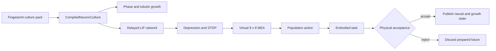

# Synthetic neuron-culture twin

Numi Lab Gate B is a native Apple-Metal environment for studying how a growing
synthetic neuronal culture can sense, adapt, and control an embodied task. It
does not operate biological cultures or physical micro-electrode arrays, and
it is not an experimentally calibrated digital twin.



The compiler owns stable topology, incoming-synapse CSR, dimensions,
capacities, provenance, and the culture fingerprint. Metal owns the persistent
membrane, refractory, spike-history, short-term depression, STDP trace and
weight, electrode, phase, and tubulin state. A submission prepares private
state. Only an explicit accepted publication copies it into the public culture;
rejection leaves the accepted bytes unchanged.

## Scientific basis

The bundled `potter-embodied-mea-synthetic-v1` preset preserves the defining
dimensions of Chao, Bakkum, and Potter's simulated embodied culture: 1,000 LIF
neurons, 50,000 synapses, 70 percent excitatory neurons with STDP, and an 8 by 8
MEA with 60 active electrodes. The current Numi implementation is a new native
runtime and does not claim statistical reproduction of the published learning
curves.

Growth uses a bounded two-field phase/tubulin model derived from the equations
and stage structure reported by Qian et al. The current Metal/CPU pair uses a
five-point spatial operator and a bounded local implicit Newton update. It is
not the paper's cubic B-spline isogeometric collocation discretization. Exact
IGA fixture parity is a later scientific qualification gate.

The implemented phase update is

\[
\phi^{n+1}-\phi^n = \Delta t M\left[
\epsilon^2\nabla^2\phi^n +
\phi^{n+1}(1-\phi^{n+1})(\phi^{n+1}-\tfrac12) +
g c^n\phi^{n+1}(1-\phi^{n+1})
\right],
\]

solved with a fixed, fingerprinted Newton budget. Tubulin uses implicit decay
with explicit diffusion and a phase-local source. Stages 1 through 4 are
represented as authored growth regimes. Maturation stage 5, automatic stage
transition inference, organelle transport, and biological synapse formation
are not represented.

Neurite overlap never creates a synapse. The authored synthetic graph is the
electrophysiology authority; morphology may only provide candidate contacts to
a future graph compiler.

## Network and virtual MEA

Each 1 ms network tick performs, in order:

1. deterministic incoming-CSR delayed spike gathering;
2. leaky integrate-and-fire membrane and refractory evolution;
3. pre/post trace evolution and excitatory STDP;
4. frequency-dependent synaptic depression and recovery;
5. virtual-electrode recording and 256-tick history publication.

Stimuli are injected within each electrode's authored radius. Recording counts
spikes within a separate authored radius. The virtual MEA intentionally models
the computational stimulation/recording boundary only; it does not simulate
electrode impedance, culture temperature, amplifier electronics, or SALPA as a
qualified signal-processing implementation.

## Numi Lab commands

```sh
numi neurons inspect
numi neurons compile
numi neurons grow --quick
numi neurons simulate --quick
numi neurons embody --quick
numi neurons replay --quick
numi neurons render --quick --output .numi/runs/neuron-culture.ppm
```

`--quick` selects 64 neurons and 512 synapses for bounded iteration. The default
compiles the 1,000/50,000/60 reference preset. Commands publish JSON with the
schema, culture fingerprint, accepted ticks or growth iterations, and measured
simulation outcomes.

The embodied command is the reference two-dimensional population decoder. It
is not yet a general `CompiledRun` policy replacement. A production adapter
must encode physical tactile/support observations into stimulation, retain the
prepared culture through the physical decision, and invoke culture publication
only after the same root is accepted.

The native `encodeAcceptedSupportStimulus` boundary already validates all ten
versioned NHCNT support consequences, derives a force-weighted support location,
and maps it to the nearest virtual electrode with a fingerprinted bounded
current. It accepts no publication authority and leaves its previous output
untouched when any consequence is malformed. Direct borrowed-buffer encoding
inside the full NumanX root transaction remains a later integration gate.

## Current executable evidence

The focused probe is:

```sh
cmake --build build --target metalrobo_neuron_culture_probe -j4
ctest --test-dir build -R '^numi\.integration\.neuron_culture_gate_b$' \
  --output-on-failure
```

It checks:

- transactional compile rejection without replacing the active artifact;
- bitwise CPU replay;
- CPU/Metal parity for membrane, spikes, depression, STDP, MEA counts, phase,
  and tubulin;
- prepared-state nonpublication and exact rejected-candidate preservation;
- exact ten-row accepted NHCNT consequence mapping and malformed-input rejection;
- an STDP-off ablation whose weights remain byte-identical;
- the full preset's 1,000-neuron, 50,000-synapse, 60-electrode dimensions.

This evidence is simulator correctness on a named Apple Metal runtime. It is
not wet-lab, disease, clinical, hardware-MEA, biological-fidelity, or
performance qualification.

## References

- Chao, Bakkum, and Potter, [*Long-Term Plasticity in a Self-Learning Context*](https://doi.org/10.1371/journal.pcbi.1000042), 2008.
- Qian et al., [*Modeling neuron growth using isogeometric collocation based phase field method*](https://doi.org/10.1038/s41598-022-12073-z), 2022.
- Hales et al., [*How to Culture, Record and Stimulate Neuronal Networks on Micro-electrode Arrays*](https://doi.org/10.3791/2056), 2010.
- Bi and Poo, [*Synaptic Modifications in Cultured Hippocampal Neurons*](https://pmc.ncbi.nlm.nih.gov/articles/PMC6793365/), 1998.
- Song, Miller, and Abbott, [*Competitive Hebbian Learning through Spike-Timing-Dependent Synaptic Plasticity*](https://doi.org/10.1038/78829), 2000.
