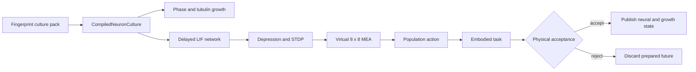

# Synthetic neuron-culture simulation

Numi Lab provides a native Apple-Metal environment for studying how a growing
synthetic neuronal culture can sense, adapt, and control an embodied task. It
does not operate biological cultures or physical micro-electrode arrays, and
it is not an experimentally calibrated digital twin.



The compiler owns stable topology, incoming-synapse CSR, dimensions,
capacities, provenance, and the culture fingerprint. Metal owns the persistent
membrane, refractory, spike-history, short-term depression, STDP trace and
weight, electrode, phase, and tubulin state. A submission prepares private
state. Only an explicit accepted publication copies it into the public culture;
rejection leaves the accepted bytes unchanged.

## Scientific basis

The bundled `potter-embodied-mea-synthetic-v1` preset preserves the defining
dimensions of Chao, Bakkum, and Potter's simulated embodied culture: 1,000 LIF
neurons, 50,000 synapses, 70 percent excitatory neurons with STDP, and an 8 by 8
MEA with 60 active electrodes. The current Numi implementation is a new native
runtime and does not claim statistical reproduction of the published learning
curves.

The authored topology also preserves the functional spatial constraints from
Text S1: the electrode grid is spaced at one third of a millimetre, one
recording site observes approximately five nearby neurons, one stimulation
site reaches approximately 76, and most axons are short-range with a retained
long-range tail. A canonical one-tick 20 mV-equivalent pulse makes that local
population response explicit in this deterministic LIF model. These are
simulation mechanics, not calibrated electrode voltages or biological claims.
The reference initializer gives 30 percent of neurons the larger member of a
deterministic zero-mean counter-based current distribution and the remainder
the smaller member, preserving the source model's 30:10 noise-amplitude ratio.
The samples are triangular rather than Gaussian and the absolute scale is not
an nA calibration. They are generated identically by the CPU oracle and Metal
authority without dispatch-order state. Every signed synaptic magnitude starts
at 0.05, with excitatory plasticity bounded at 0.1.

The paper initialized its evaluated networks after five simulated hours of
unstimulated activity and two hours of RBS with stochastic current noise. A
fresh v1 pack still starts from immutable authored 0.05 weights. Checkpointed
preparation and protocol execution are separate so a qualified equilibrated
state can be supplied explicitly, but the unequilibrated initializer does not
claim the paper's bimodal ensemble or Gaussian biological variability.

Growth uses a bounded two-field phase/tubulin model derived from the equations
and stage structure reported by Qian et al. The current Metal/CPU pair uses a
five-point spatial operator and a bounded local implicit Newton update. It is
not the paper's cubic B-spline isogeometric collocation discretization. Exact
IGA fixture parity is a later scientific qualification gate.

The implemented phase update is

\[
\phi^{n+1}-\phi^n = \Delta t M\left[
\epsilon^2\nabla^2\phi^n +
\phi^{n+1}(1-\phi^{n+1})(\phi^{n+1}-\tfrac12) +
g c^n\phi^{n+1}(1-\phi^{n+1})
\right],
\]

solved with a fixed, fingerprinted Newton budget. Tubulin uses implicit decay
with explicit diffusion and a phase-local source. Stages 1 through 4 are
represented as authored growth regimes. Maturation stage 5, automatic stage
transition inference, organelle transport, and biological synapse formation
are not represented.

Neurite overlap never creates a synapse. The authored synthetic graph is the
electrophysiology authority; morphology may only provide candidate contacts to
a future graph compiler.

## Network and virtual MEA

Each 1 ms network tick performs, in order:

1. deterministic incoming-CSR delayed spike gathering;
2. leaky integrate-and-fire membrane and refractory evolution;
3. excitatory multiplicative STDP using the source `A+=0.5`, `A-=0.525`, and
   20 ms timing window, bounded by distance to the authored weight limits;
4. 34/75 ms pre/post inter-spike suppression encoded in the two checkpointed
   trace fields, followed by frequency-dependent depression and recovery;
5. virtual-electrode recording and 256-tick history publication.

Every authored synapse uses the reference release-use fraction `U = 0.5` and
800 ms recovery. Its integer delay is derived from axon length at 0.3 m/s on
the 1 ms clock, rather than sampled independently of the spatial topology.
Recurrent current observes that delay; this v1 STDP update is evaluated from
neuron AP timing rather than a separately checkpointed per-synapse arrival
trace. That distinction is explicit and is not presented as exact CSIM parity.

The authored v3 culture header makes recurrent-current gain and both
suppression time constants explicit rather than hiding them in the executable.
The reference value is 175,000 current units per unit-weight recovered spike,
so an authored maximum weight of 0.1 contributes 17.5 mV over the canonical
1 ms step. A matched deterministic pair probe measures a 48.0 percent
postsynaptic firing probability at that maximum, versus 0.8 percent without
the synapse, anchoring the source model's approximately 50 percent operating
point. The gain is finite, bounded, fingerprinted, and replayed identically by
the CPU oracle and Metal authority. It is an internal simulation calibration,
not an electrode-voltage, nA, or wet-lab calibration.

Stimuli are injected within each electrode's authored radius. Recording counts
spikes within a separate authored radius. The virtual MEA intentionally models
the computational stimulation/recording boundary only; it does not simulate
electrode impedance, culture temperature, amplifier electronics, or SALPA as a
qualified signal-processing implementation.

The Potter-switch cycle is causal rather than batched for convenience. RBS or
the behavior-selected PTS occupies the inter-probe interval; the fixed
three-pulse CPS follows with 200–400 ms spacing and ends in the probe; only the
next 100 ms contributes to center-of-activity movement. PTS pairs use the full
60 × 11 electrode/timing pool and randomized 400–800 ms repetition intervals.
The selected pool is bound to the exact preceding CPS (including after the
Q1/Q3 exchange), and reinforcement compares against the exact movement that
caused the PTS—not an older same-quadrant observation. An improving outward
response repeats and increases that pattern's pool weight, a worsening response
removes one surplus copy while retaining the original discoverable pattern,
and successful inward movement
selects triangular deterministic-random RBS intervals in the paper's 200–400 ms
range (about 333 ms mean and 3.00 Hz) instead.

The canonical switch phase has the paper's four-hour ceiling. A run may finish
early only after a complete trailing ten-minute interval reaches 90 percent
inward movements. Learning qualification compares adaptive PTS with its paired
PTS-off control over that trailing ten-minute interval; it does not dilute a
late restoration by averaging the entire post-switch search, and it does not
relax the fixed ten-percentage-point promotion threshold.

The 15 qualification setups follow the experiment's actual factorization:
three authored network connectivities crossed with five deterministic,
independently selected CPS sets. In every setup the perturbation exchanges Q1
and Q3 while leaving Q2 and Q4 unchanged; the CPS-set index is never
misinterpreted as a second four-quadrant permutation. CPS selection is keyed by
network seed and mapping index rather than the dynamics fingerprint, so all
four ablation arms receive identical electrode/timing authority. Qualification
also restores one exact seven-hour accepted checkpoint per seed into all five
mappings and all four arms. The STDP-off arm disables plasticity in each window
dispatch; it does not compile a different topology or start from different
weights. Adaptive-selection-off still draws from all 660 PTS types uniformly;
it removes learned pool weighting and favorable-pattern repetition, not pattern
diversity or behavior-contingent delivery.

## Numi Lab commands

```sh
numi neurons inspect
numi neurons compile
numi neurons grow --quick
numi neurons simulate --quick
numi neurons simulate --mode potter-equilibrate-v1 --window-limit 120 \
  --checkpoint-out potter-equilibrium-seed-2056.ncstate
numi neurons embody --quick
numi neurons protocol --preset potter-switch-v1 \
  --checkpoint-in potter-equilibrium-seed-2056.ncstate \
  --checkpoint-out learned.ncstate \
  --output run.ncrun.json
numi neurons qualify --checkpoint-in equilibrium-checkpoints \
  --output qualification.json
numi neurons benchmark --mode throughput
numi neurons view --live
numi neurons replay --quick
numi neurons render --quick --output .numi/runs/neuron-culture.ppm
```

`--quick` selects 64 neurons and 512 synapses for bounded iteration. The default
compiles the 1,000/50,000/60 reference preset. Commands publish JSON with the
schema, culture fingerprint, accepted ticks or growth iterations, and measured
simulation outcomes.

`potter-equilibrate-v1` separates the source preparation timeline from the
learning experiment: five simulated hours of spontaneous activity followed by
two hours of deterministic 3 Hz RBS. `--window-limit` bounds one invocation;
the atomic checkpoint can be resumed without replaying accepted windows. A
partial checkpoint is preparation evidence, not a qualified learning result.
Full qualification fails closed unless its checkpoint directory contains
`potter-equilibrium-seed-2056.ncstate`, `-4099.ncstate`, and `-8191.ncstate`,
each at the exact seven-hour horizon.

The portable embodied command is the reference two-dimensional population
decoder. The full NumanX bridge additionally maps the ten accepted NHCNT
support consequences into a prepared culture window on Metal, retains that
future through proposal/ACK/apply, and publishes it only under the aggregate
Brain–Human/Matter–HumanIO–culture reader gate. Rejection discards the prepared
culture byte-exactly; timeout or command failure retains it as quarantine.

The native support kernel validates the exact ten-row NHCNT consequence arena,
derives a force-weighted support location, and maps it to the nearest virtual
electrode with a fingerprinted bounded current. An unloaded support fixture
produces the canonical zero schedule. The prepared culture receipt is folded
into NumiBrain's joint preflight fingerprint; mutable culture buffers never
escape before publication.

## Persistent artifacts and viewer

- `.nculture` is an immutable, versioned culture topology with provenance,
  runtime FNV identity, and SHA-256 content identity.
- `.ncstate` is an accepted-only checkpoint covering neural, plasticity, MEA,
  phase/tubulin, accepted-publication generation, neural tick, and growth
  generation state. Restore validates the complete archive—including monotonic
  generation consistency—before mutation; writes use a temporary file and
  atomic rename.
- `.ncrun.json` records source/runtime identity, protocol, checkpoints,
  measurements, the exact accepted-state FNV identity, replay, and the
  simulation-only boundary. Matrix qualification is a separate compact JSON
  evidence record with every seed/mapping/ablation result and terminal state
  fingerprint.

`numi neurons protocol --output NAME.ncrun.json` atomically publishes
`NAME.nculture` and `NAME.ncstate` before the manifest. `view --run` validates
the manifest and both exact companions, restores the accepted checkpoint, and
opens paused; Replay returns to that same accepted state.

`NumiNeuronLab` is a native AppKit/MetalKit viewer for accepted GPU state. Its
four-panel view combines phase/tubulin fields, network/electrode geometry,
spike raster/MEA activity, weight/depression distributions, embodiment state,
and transaction status. Occluded or unavailable frames are dropped rather
than stalling simulation; only compact qualification telemetry is read back.

## Current executable evidence

The focused probe is:

```sh
cmake --build build --target metalrobo_neuron_culture_probe -j4
ctest --test-dir build -R '^numi\.integration\.neuron_culture_gate_b$' \
  --output-on-failure
```

It checks:

- transactional compile rejection without replacing the active artifact;
- bitwise CPU replay;
- CPU/Metal parity for membrane, spikes, depression, STDP, MEA counts, phase,
  and tubulin;
- prepared-state nonpublication and exact rejected-candidate preservation;
- exact ten-row accepted NHCNT consequence mapping and malformed-input rejection;
- culture-enabled full-body ACCEPT, REJECT, retry, and aggregate-v4 publication;
- an STDP-off ablation whose weights remain byte-identical;
- the full preset's 1,000-neuron, 50,000-synapse, 60-electrode dimensions.

Learning promotion is a separate hard gate: three network seeds crossed with
five independently authored CPS sensory sets, all three ablations, adaptive PTS at least ten
percentage points above PTS-off, and a positive deterministic 95% bootstrap
lower bound. Failed cohorts remain content-addressed negative evidence.

This evidence is simulator correctness on a named Apple Metal runtime. It is
not wet-lab, disease, clinical, hardware-MEA, biological-fidelity, or
performance qualification.

## References

- Chao, Bakkum, and Potter, [*Shaping Embodied Neural Networks for Adaptive Goal-directed Behavior*](https://doi.org/10.1371/journal.pcbi.1000042), 2008.
- Chao, Bakkum, and Potter, [*Text S1: simulated-network and electrode parameters*](https://doi.org/10.1371/journal.pcbi.1000042.s001), 2008.
- Qian et al., [*Modeling neuron growth using isogeometric collocation based phase field method*](https://doi.org/10.1038/s41598-022-12073-z), 2022.
- Hales et al., [*How to Culture, Record and Stimulate Neuronal Networks on Micro-electrode Arrays*](https://doi.org/10.3791/2056), 2010.
- Bi and Poo, [*Synaptic Modifications in Cultured Hippocampal Neurons*](https://pmc.ncbi.nlm.nih.gov/articles/PMC6793365/), 1998.
- Song, Miller, and Abbott, [*Competitive Hebbian Learning through Spike-Timing-Dependent Synaptic Plasticity*](https://doi.org/10.1038/78829), 2000.
