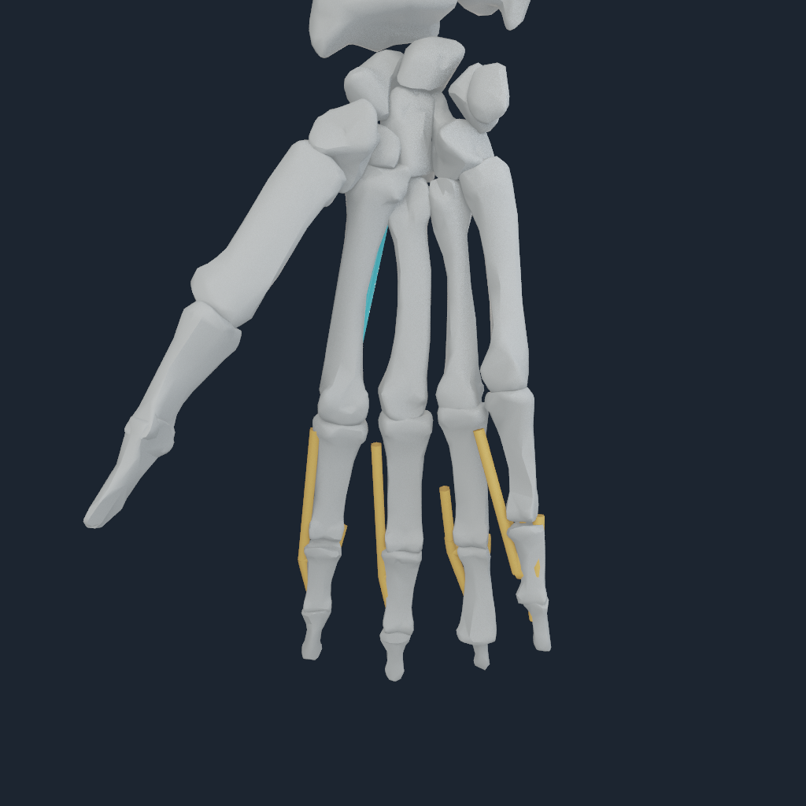
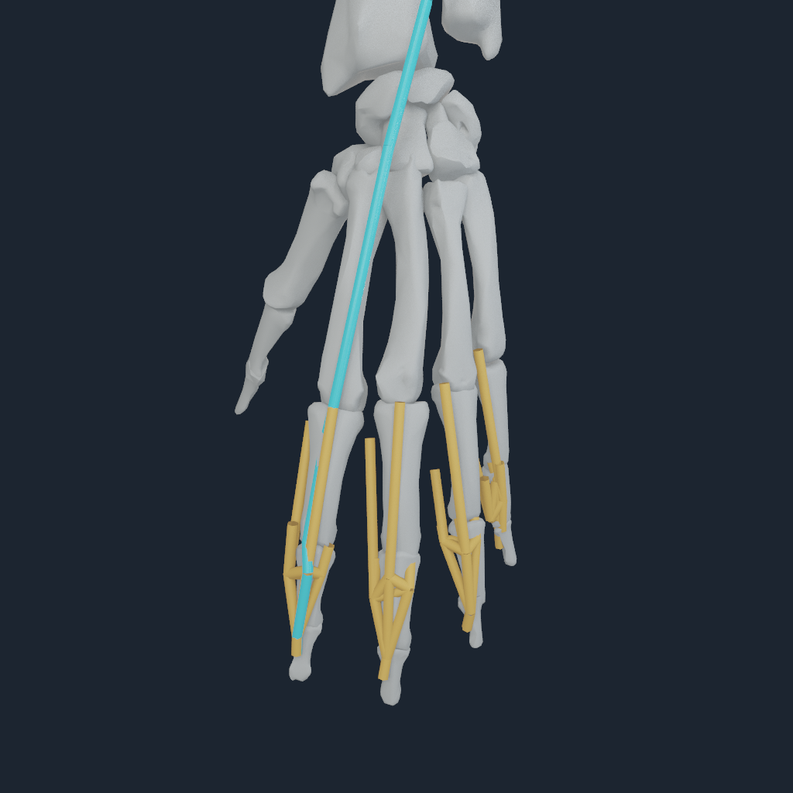

# Live bilateral extensor-hood mechanics

NumiLab Human now replaces the distal OpenSim/MyoSim route share for all eight
non-thumb finger rays with a live, tension-only extensor network on Apple Metal.
The source prefix, exact wrapped route-suffix derivative, hood solve, rigid-body
reaction assembly, state integration, acceptance audit, and history commit use
one borrowed command buffer and one generalized-force authority.

## Validation result

The Apple M4 Pro accepted all 8 rays in both a one-step and an eight-step run.
At eight steps, the maximum free-node residual was 2.047 mN, force closure was
8.448 mN, moment closure was 6.688 mN m, maximum free-node displacement was
0.963 mm, and maximum active engineering strain was 2.833%. The hood produced a
nonzero generalized correction and a different rigid state from the original
source-JT-only transaction. Replay was bitwise and a rejected enclosing command
buffer left no accepted hood history.

The NHHOOD2 loader also fails closed on ray ordering and coverage, node and
element bounds, source-length plausibility, named MyoSim site/body identity,
proximal route identity, and the complete site/sphere/cylinder suffix grammar.
The CPU FP64 reference test and all-rays source oracle passed. Eight actual
1024 px frames were inspected across front, oblique, side, and rear views. Each
hand renders all 50 owned segments and its digit-5 distal phalanx.

The machine-readable receipt is
[m4-pro.json](media/numi-human-extensor-hood-live-v1/m4-pro.json).

## Evidence boundary

Exact source sites, bodies, muscles, route cuts, wrap grammar, force fields, and
rigid-body Jacobians are preserved. Hood connectivity, areas, moduli, and the
body-relative fascial foundation are literature-constrained inference rather
than subject-specific calibration. The foundation prevents unsupported axial
mechanisms but is not a deformable fascia sheet or FEM solve. NHHOOD2 covers
digits 2 through 5. Direct EPL/EPB/FPL/APL thumb force transfer is qualified in
the separate thumb certificate; passive capsules and ligaments, retinacular and
pulley tissue, articular contact, sustained loaded motion, and whole-body static
equilibrium remain separate work.
