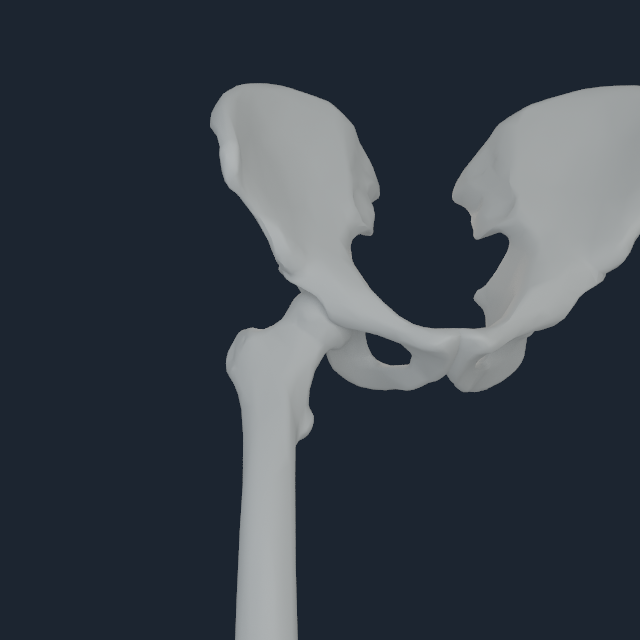
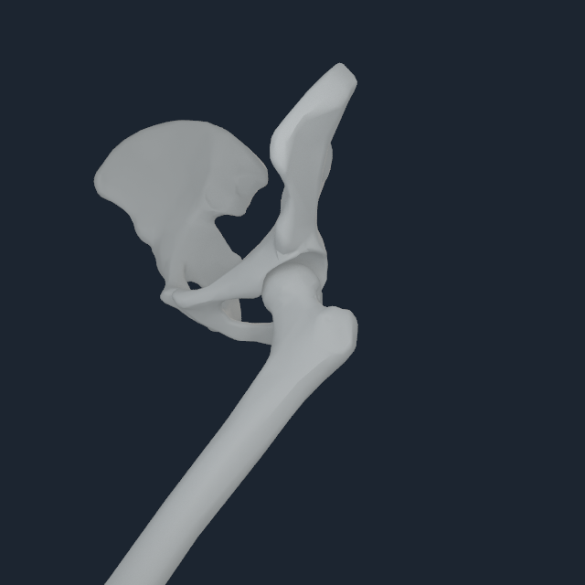
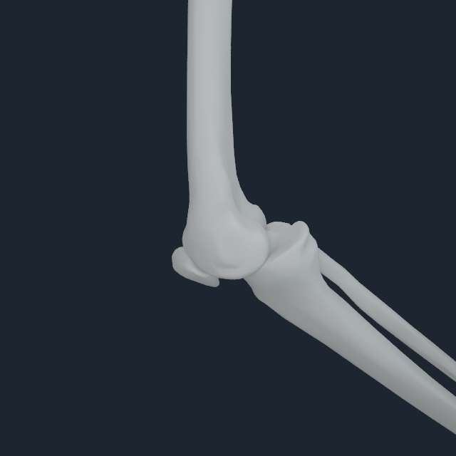
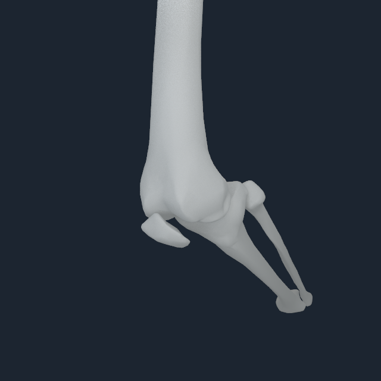
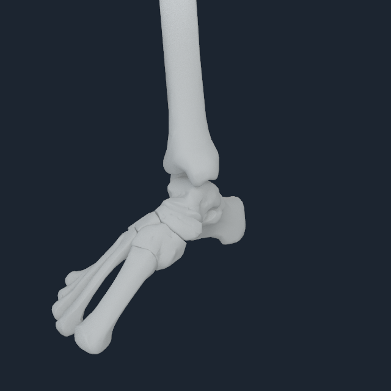
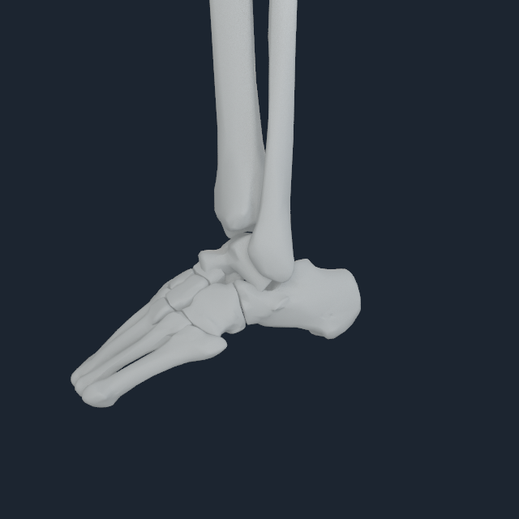
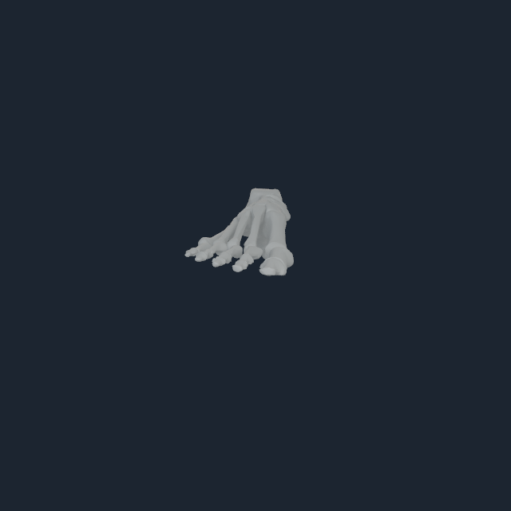
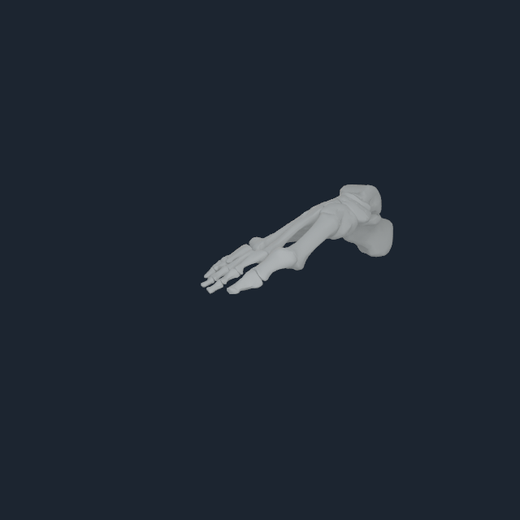
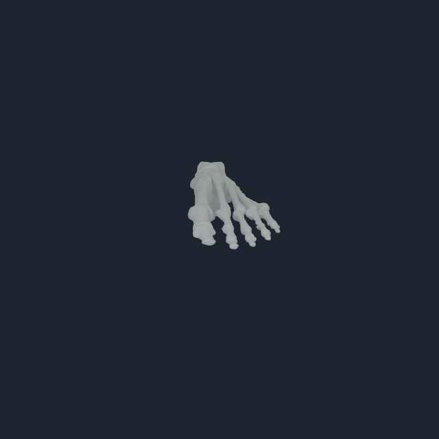

# Lower-joint mechanics-anchor validation v1

## Outcome

The native Human renderer and coupled source mechanics now validate the
replacement lower-limb registration directly at posed hip, knee, ankle,
hindfoot, and MTP mechanics anchors. Eleven Apple M4 Pro runs retain four fixed
views each. All use the current 185-surface NHBONES1 and exact NHEQ1 dependent
coordinate projection; none introduces a new or per-toe joint.

| Inspection | Joint child body | Pose | Anchor residual | Bone pixels across four views |
| --- | ---: | --- | ---: | ---: |
| right hip | 131 | hip flexion 0.70 rad | 0.0000167 mm | 86,281--156,766 |
| left hip | 145 | hip flexion 0.70 rad | 0.0000615 mm | 63,587--90,467 |
| right knee | 136 | knee flexion 0.90 rad | 0.0000308 mm | 45,538--76,623 |
| left knee | 150 | knee flexion 0.90 rad | 0.0000447 mm | 48,595--71,397 |
| right ankle | 137 | dorsiflexion -0.25 rad | 0.0000149 mm | 39,369--71,662 |
| left ankle | 151 | dorsiflexion -0.25 rad | 0.0000309 mm | 39,273--69,971 |
| right hindfoot | 138 | subtalar 0.20 rad | 0.0000224 mm | 8,156--126,781 |
| right toes, neutral/posed | 139 | MTP 0/0.35 rad | <=0.0000352 mm | 7,855--33,093 |
| left toes, neutral/posed | 153 | MTP 0/0.35 rad | <=0.0000269 mm | 7,521--33,899 |

All runs use the 640 px sensor-reference profile with 8 temporal and 8
area-light samples. Full frames, packs, manifests, transcripts, and compiler
receipts are retained in
[`numi-human-lower-joint-focus-v1`](media/numi-human-lower-joint-focus-v1/).

## Direct review

The four-angle review shows each femoral head seated coherently at the pelvis,
both knees flexing in the intended direction with anterior patellae and lateral
fibulae, continuous ankle/hindfoot chains, and five visible toe rays on both
sides in neutral and flexed states. The hallux remains the dominant ray within
one shared MTP body; no independent toe articulation is synthesized.

  
  

  
  

  
  

  
  
  

## Tendon-to-bone transaction

A separate selected-control run excites source EHL/FHL right while evaluating
all 416 source routes. Over two persistent 0.1 ms steps, NHTENDON3 executes
1,664 endpoint transfers: 1,276 distributed-envelope transfers and 388 exact
source-point fallbacks. Maximum resultant force and source-point moment
residuals are `0.000122071 N` and `1.43245e-6 N m`.

The transfer consumer borrows the exact producer snapshot in the same command
buffer. An injected consumer rejection preserves the accepted state, and the
transfer layer reports `transfer_only_bitwise_identical_no_direct_joint_torque`:
MyoSim `J^T` remains the sole rigid generalized-force authority. The two-step
selected increment changes maximum velocity by `0.0295352` and configuration
by `4.43352e-6`, with a `3.42e-8 m` camera-anchor residual.

This is intentionally a tendon force-transfer law, not a continuum tendon
claim. The rendered transaction pack shows the owning bone state; route and
surface overlays were disabled in that capture and must not be inferred from
the white bone-only frames.

## Evidence boundary

Passing proves mechanics-anchor framing, lower-bone visibility from four
angles, exact dependent-coordinate posing, source-owned registration, and the
bounded NHTENDON3 transfer transaction on Apple Metal. It does not prove
cartilage contact, ligament restraint, deformable tendon or fascia continuum
mechanics, balanced standing, gait, or clinical validity. The compiled standing
baseline remained `balanced=false`; this bounded two-step run is not a static
equilibrium certificate.
