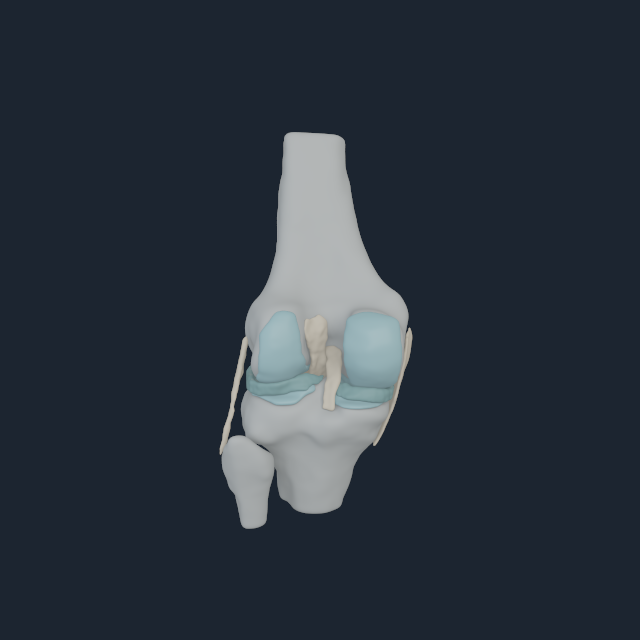
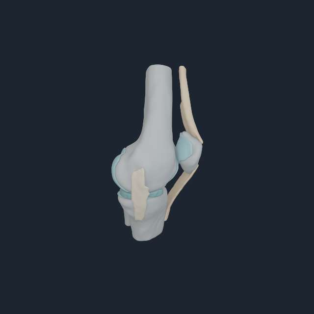
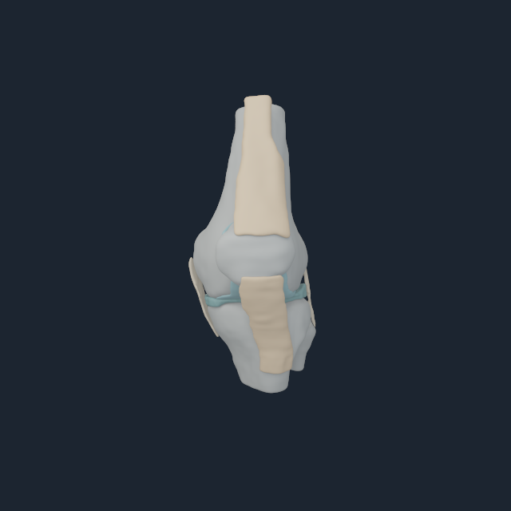

# Numi Human Open Knee(s) oks003 native validation

The native Apple renderer now consumes the exact `NHKNEE1` left-knee payload
instead of trying to infer local bone placement from unrelated whole-body
visual meshes. The decoder rejects source, region, node, surface, attachment,
contact-pair, body-frame or index ownership drift before a frame can render.

The focused view suppresses the overlapping BodyParts3D femur/tibia/patella
meshes and draws all 16 Open Knee(s) regions in the live MyoSim articulated
frames: femur body 145, tibia body 150 and patella body 156. This avoids the
double-specimen overlay that previously made apparently displaced bones hard
to distinguish from a bad registration.

## M4 Pro multi-angle result

| Global camera | Native frame |
| --- | --- |
| Front |  |
| Oblique |  |
| Side |  |
| Rear |  |

These labels are fixed global cameras, not claims about clinical anatomical
view convention. The views are useful together because the posterior joint
surfaces, patella/extensor mechanism, collateral anatomy and tibial plateau
cannot all hide behind the same projection.

The run used the Apple M4 Pro native renderer at 640 px with 32 temporal and 32
area-light samples. Every view had bone coverage, and every anatomical class
was visible across the set. Exact per-angle pixel receipts and the full runtime
boundary are in
[`open-knee-oks003-m4-pro.transcript.txt`](media/numi-human-open-knee-oks003-v1/open-knee-oks003-m4-pro.transcript.txt).

## Reproduction

```sh
metalrobo_numilab_human_myosim_visual_probe \
  myosim-fullbody-core-reference.nhrigid \
  myosim-fullbody-muscle-reference.nhmyo \
  bodyparts3d-myosim-major-bones.nhbones \
  Build/open-knee-visual \
  --open-knee-payload open-knee-oks003-left.nhknee \
  --visible-bone-body-index 145 \
  --visible-bone-body-index 150 \
  --visible-bone-body-index 156 \
  --focus-body-index 150 \
  --dimension 640
```

## Evidence boundary

This validates exact-source neutral geometry, topology and articulated
placement on the M4 Pro. It does not yet validate loaded contact, subject
matching, cartilage constitutive response, ligament strain, patellar tracking
under flexion, or a deformable tendon continuum. Those mechanics must consume
the preserved attachment sets and surface pairs rather than using these visual
instances as a force law.
