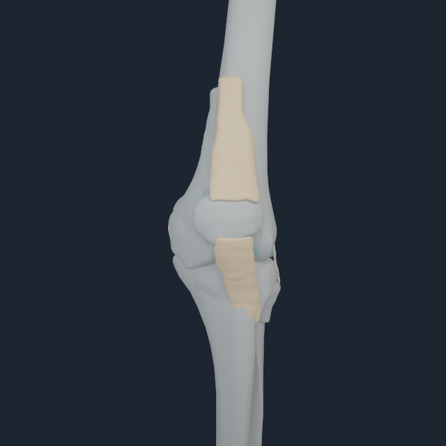
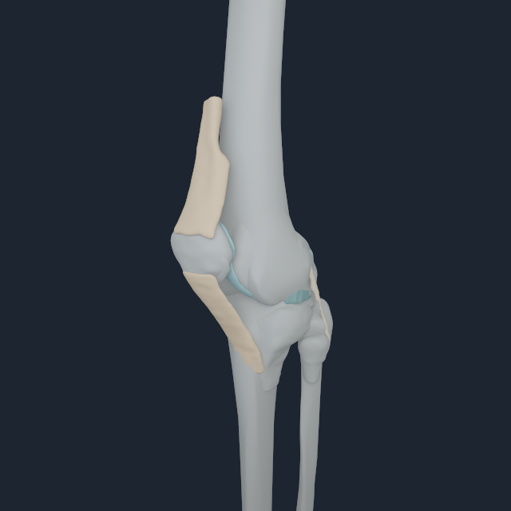
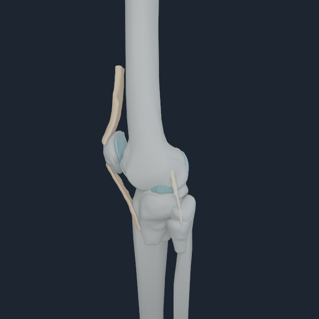
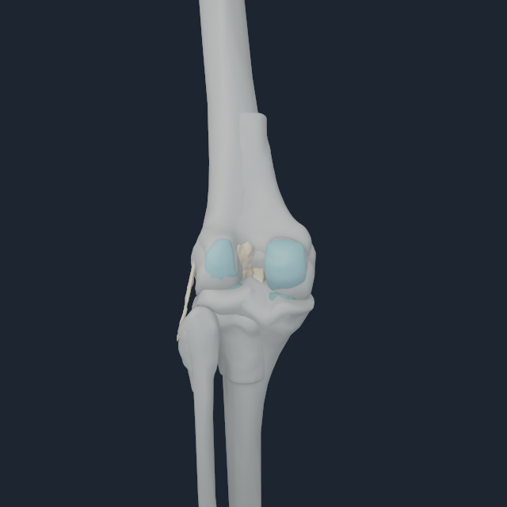
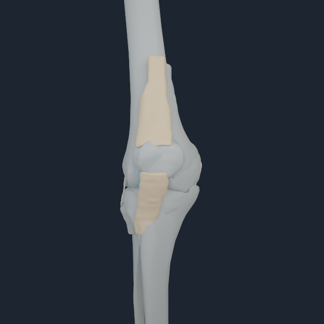
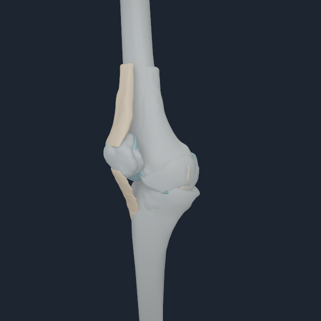
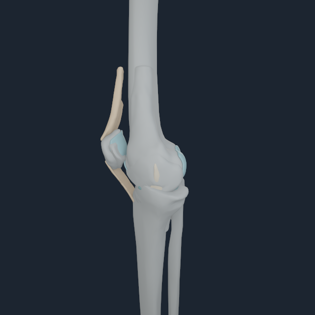
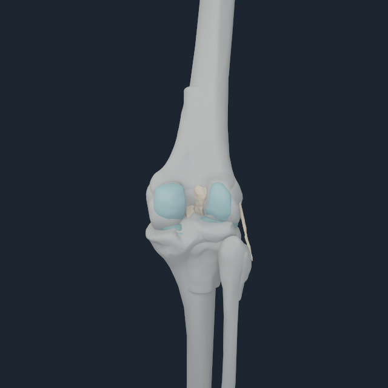
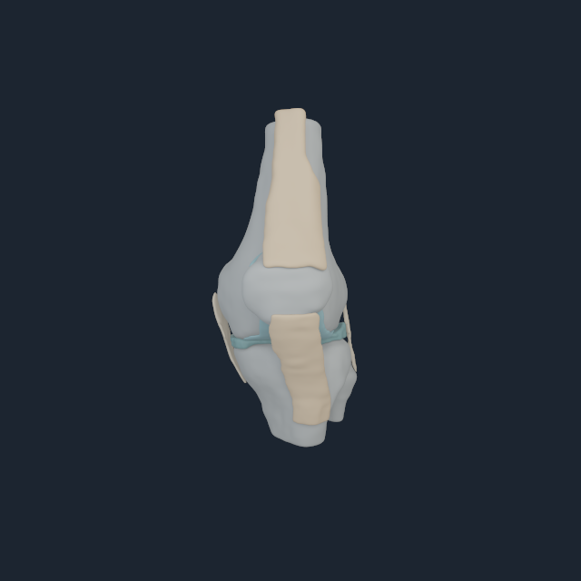
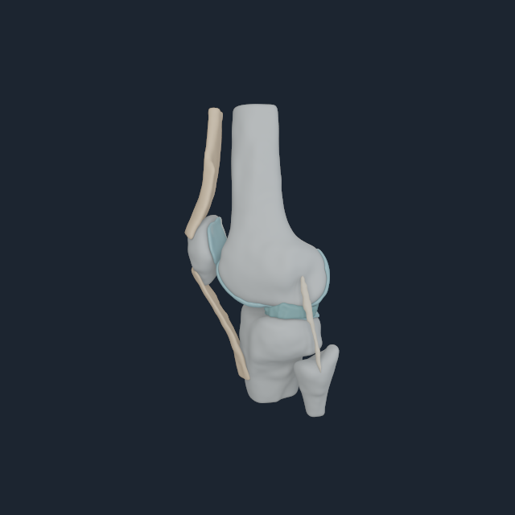

# Numi Human Open Knee(s) oks003 native validation

The native Apple renderer now consumes exact `NHKNEE1` left-knee and
explicitly mirrored-right payloads
instead of trying to infer local bone placement from unrelated whole-body
visual meshes. The decoder rejects side code, source, region, node, surface,
attachment, contact-pair, body-frame or index ownership drift before a frame
can render.

The earlier payload resolved the flexion-axis *line* with the wrong sign. That
choice was still a proper rotation and could fit the nearly symmetric distal
femur, but it rotated the specimen 180 degrees about the long axis: the patella
was posterior and the fibula medial. Those frames are rejected under
[`rejected-axial-sign`](media/numi-human-open-knee-tissue-fem-v2/rejected-axial-sign/).
The compiler now selects the unique proper basis aligned with Human anterior
(`-world Y`) and fails unless the patella is at least 25 mm anterior and the
fibula at least 20 mm lateral. Both emitted sides measure 46.934 mm and
28.565 mm respectively, with anterior-axis alignment `0.999999366`.

The focused view now uses a deliberately composite bone presentation. Full
BodyParts3D femur, tibia, fibula and patella meshes supply the continuous
Human bone shafts, while the exact Open Knee(s) articular bone ends remain at
the joint as the attachment/contact topology owner for its cartilage,
menisci, ligaments and extensor tissues. This removes the finite scan-volume
cut ends that looked like hanging bone fragments without translating the
patella or detaching tissue from its source bone topology. The left live
frames are femur body 145, tibia body 150 and patella body 156.

For the right side the same exact specimen topology is sagittally mirrored
into the measured live femur/tibia/patella frames 131, 136 and 142.  It is
labelled `right-mirrored` throughout; it is not an independently segmented
right subject.

## M4 Pro multi-angle result

The current accepted live-Human composite is retained in
[`numi-human-live-open-knee-composite-v1`](media/numi-human-live-open-knee-composite-v1/).
It replaces the older joint-only bone presentation below. The older frames
remain useful as exact Open Knee source inspection, but their truncated bone
segments are not a full-Human presentation reference.

| Side | Front | Oblique | Side | Rear |
| --- | --- | --- | --- | --- |
| Left |  |  |  |  |
| Mirrored right |  |  |  |  |

These frames were rendered only after the live 157-body transaction accepted
all five exact tissues. The projected-rest correction removed a stale-frame
displacement of `53.5171 mm` left and `53.5173 mm` right; reconstruction
residual was `30.7 nm` and `59.6 nm`, respectively. The full device receipts
are [`left-m4-pro.txt`](media/numi-human-live-open-knee-composite-v1/left-m4-pro.txt)
and [`right-m4-pro.txt`](media/numi-human-live-open-knee-composite-v1/right-m4-pro.txt).

### Earlier joint-only source inspection

| Global camera | Native frame |
| --- | --- |
| Front |  |
| Oblique |  |
| Side |  |
| Rear |  |

These are fixed global Human cameras: front now exposes the patella and
extensor mechanism, while rear exposes the cruciate/posterior joint anatomy.
The views are useful together because the collateral anatomy and tibial
plateau cannot all remain visible in one projection.

The run used the Apple M4 Pro native renderer at 640 px with 32 temporal and 32
area-light samples. Every view had bone coverage, and every anatomical class
was visible across the set. Exact per-angle pixel receipts and the full runtime
boundary are in
[`open-knee-left-accepted-tissue-fem-m4-pro.txt`](media/numi-human-open-knee-tissue-fem-v2/open-knee-left-accepted-tissue-fem-m4-pro.txt).

The corrected mirrored right side was separately reviewed from the same four
cameras; the fibula is lateral and the patellar mechanism is anterior. Its
accepted neutral receipt is
[`open-knee-right-accepted-tissue-fem-m4-pro.txt`](media/numi-human-open-knee-tissue-fem-v2/open-knee-right-accepted-tissue-fem-m4-pro.txt).
The old q106 flexion frames used single-body tissue ownership and are retained
only under `rejected-single-body-flexion` as diagnostic failures.

## Reproduction

```sh
metalrobo_numilab_human_myosim_visual_probe \
  myosim-fullbody-core-reference.nhrigid \
  myosim-fullbody-muscle-reference.nhmyo \
  bodyparts3d-myosim-major-bones.nhbones \
  Build/open-knee-visual \
  --open-knee-payload open-knee-oks003-left.nhknee \
  --open-knee-tissue-fem-snapshot open-knee-tissue-left-accepted.nhkfem \
  --visible-bone-body-index 145 \
  --visible-bone-body-index 150 \
  --visible-bone-body-index 156 \
  --focus-body-index 150 \
  --dimension 640
```

For the mirrored right payload use body indices `131`, `136`, `142`, focus
body `136`, and `open-knee-oks003-right-mirrored.nhknee`.

## Evidence boundary

This validates exact-source neutral geometry, corrected anatomical basis and
mirrored connectivity, and four ligament plus patellar-tendon surfaces owned by an accepted
three-body Matter FEM snapshot on the M4 Pro. The snapshot uses all 47,439
nodes and 195,032 tetrahedra and is deliberately rejected for an arbitrary
articulated pose.
It does not validate loaded flexion, source transverse-isotropic fibres,
initial prestretch, loaded contact, subject matching, cartilage constitutive
response, clinical ligament strain, patellar tracking, or a deformable
muscle-loaded quadriceps tendon continuum. The old flexed tissue pictures remain
diagnostic failures, not showcase evidence.
