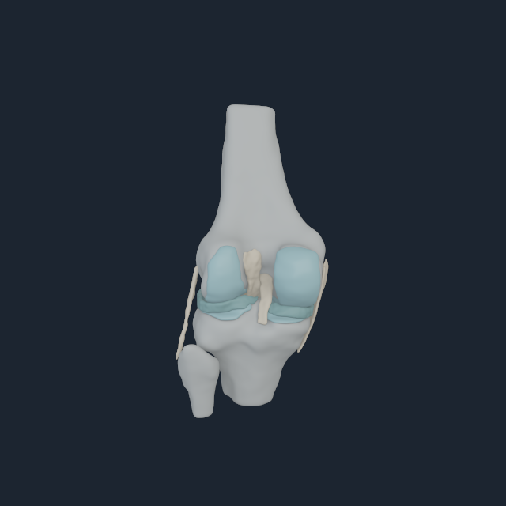
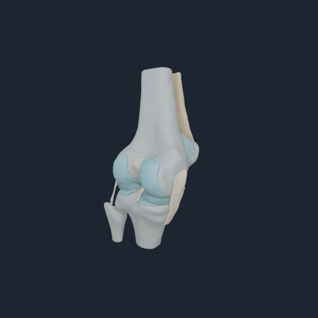
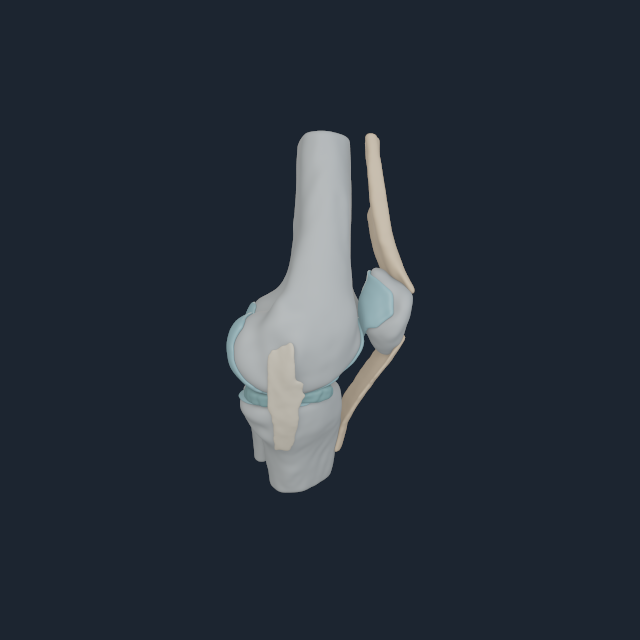
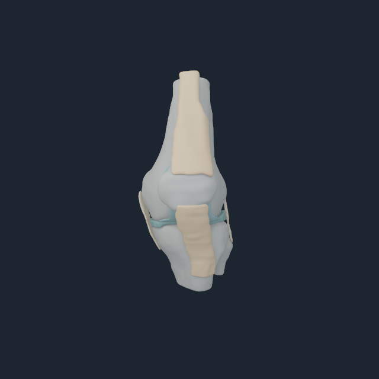

# Numi Human Open Knee(s) oks003 native validation

The native Apple renderer now consumes exact `NHKNEE1` left-knee and
explicitly mirrored-right payloads
instead of trying to infer local bone placement from unrelated whole-body
visual meshes. The decoder rejects side code, source, region, node, surface,
attachment, contact-pair, body-frame or index ownership drift before a frame
can render.

The focused view suppresses the overlapping BodyParts3D femur/tibia/patella
meshes and draws all 16 Open Knee(s) regions in the live MyoSim articulated
frames: femur body 145, tibia body 150 and patella body 156. This avoids the
double-specimen overlay that previously made apparently displaced bones hard
to distinguish from a bad registration.

For the right side the same exact specimen topology is sagittally mirrored
into the measured live femur/tibia/patella frames 131, 136 and 142.  It is
labelled `right-mirrored` throughout; it is not an independently segmented
right subject.

## M4 Pro multi-angle result

| Global camera | Native frame |
| --- | --- |
| Front |  |
| Oblique |  |
| Side |  |
| Rear |  |

These labels are fixed global cameras, not claims about clinical anatomical
view convention. The views are useful together because the posterior joint
surfaces, patella/extensor mechanism, collateral anatomy and tibial plateau
cannot all hide behind the same projection.

The run used the Apple M4 Pro native renderer at 640 px with 32 temporal and 32
area-light samples. Every view had bone coverage, and every anatomical class
was visible across the set. Exact per-angle pixel receipts and the full runtime
boundary are in
[`open-knee-left-accepted-fem-m4-pro.txt`](media/numi-human-open-knee-ligament-fem-v1/open-knee-left-accepted-fem-m4-pro.txt).

The corrected mirrored right side was separately reviewed from the same four
cameras; the fibula is lateral and the patellar mechanism is anterior. Its
accepted neutral receipt is
[`open-knee-right-accepted-fem-m4-pro.txt`](media/numi-human-open-knee-ligament-fem-v1/open-knee-right-accepted-fem-m4-pro.txt).
The old q106 flexion frames used single-body tissue ownership and are retained
only under `rejected-single-body-flexion` as diagnostic failures.

## Reproduction

```sh
metalrobo_numilab_human_myosim_visual_probe \
  myosim-fullbody-core-reference.nhrigid \
  myosim-fullbody-muscle-reference.nhmyo \
  bodyparts3d-myosim-major-bones.nhbones \
  Build/open-knee-visual \
  --open-knee-payload open-knee-oks003-left.nhknee \
  --open-knee-ligament-fem-snapshot open-knee-ligament-left-accepted.nhkfem \
  --visible-bone-body-index 145 \
  --visible-bone-body-index 150 \
  --visible-bone-body-index 156 \
  --focus-body-index 150 \
  --dimension 640
```

For the mirrored right payload use body indices `131`, `136`, `142`, focus
body `136`, and `open-knee-oks003-right-mirrored.nhknee`.

## Evidence boundary

This validates exact-source neutral geometry, corrected mirrored connectivity,
and four ligament surfaces owned by an accepted two-body Matter FEM snapshot
on the M4 Pro. The snapshot uses all 38,159 ligament nodes and 159,416
tetrahedra and is deliberately rejected for an arbitrary articulated pose.
It does not validate loaded flexion, source transverse-isotropic fibres,
initial prestretch, loaded contact, subject matching, cartilage constitutive
response, clinical ligament strain, patellar tracking, or a deformable
quadriceps/patellar tendon continuum. The old flexed tissue pictures remain
diagnostic failures, not showcase evidence.
