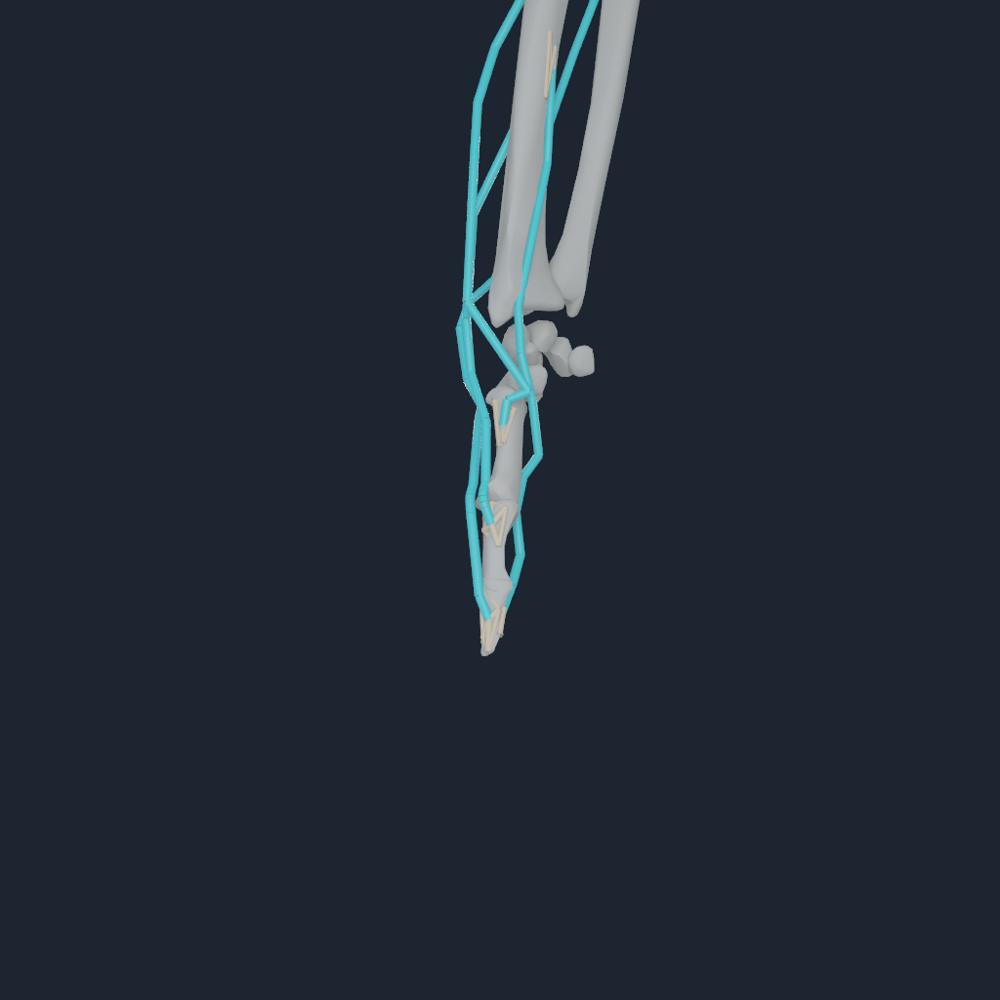
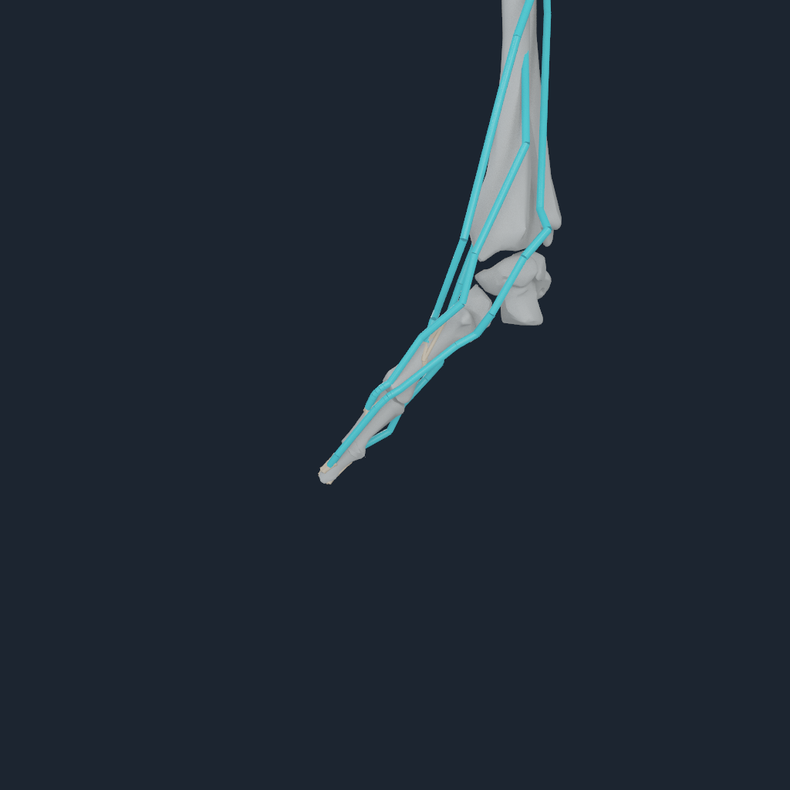

# Live bilateral thumb tendon mechanics

NumiLab Human now has a fail-closed Apple Metal certificate for the direct
thumb tendon apparatus already present in the pinned MyoSim full-body source:
extensor pollicis longus (EPL), extensor pollicis brevis (EPB), flexor
pollicis longus (FPL), and abductor pollicis longus (APL), bilaterally. The
thumb is deliberately not added to NHHOOD2 because it does not use the
digits-2-through-5 extensor hood.

## Validation result

One-step and eight-step runs passed on an Apple M4 Pro. All eight source
muscles solved with positive tendon tension and produced nonzero torque at the
CMC flexion, CMC abduction, MP flexion, and IP flexion coordinates on each
side. All 16 origins and insertions used their exact non-migrated NHTENDON3
four-node BodyParts3D bone envelopes. The eight-step endpoint force residual
was at most 7.65 uN and the endpoint moment residual was at most 34.1 nN m.
Bilateral represented-force difference was 1.07%.

The accepted transaction used one direct source-route J-transpose force
authority. The distributed enthesis solve was a force- and moment-equivalent
witness, not a second actuator. The same borrowed command buffer contained the
muscle solve, endpoint transfer, generalized-force assembly, and articulated
state update. Replay was bitwise; rejecting the enclosing consumer preserved
the prior accepted result.

Eight actual 1024 px frames were inspected across front, oblique, side, and
rear views. The final scenes retain the radius, ulna, relevant carpal group,
first metacarpal, and both thumb phalanges. Cyan lines are the exact resolved
source routes; warm four-node structures are the load-transfer envelopes.
Visual-only attachment spheres were rejected from the final evidence because
they obscured the entheses and could be mistaken for anatomy.

The machine-readable receipt is
[m4-pro.json](media/numi-human-thumb-tendon-live-v1/m4-pro.json).

## Evidence boundary

This is a bounded direct-tendon force-transfer certificate, not a claim that
the cyan diagnostic lines are volumetric tendon surfaces. Passive extensor
retinaculum and flexor pulley contact, tendon sheath mechanics, thumb capsules
and ligaments, compliant articular contact, deformable tendon material,
subject-specific calibration, sustained loaded motion, and clinical validity
remain open.
