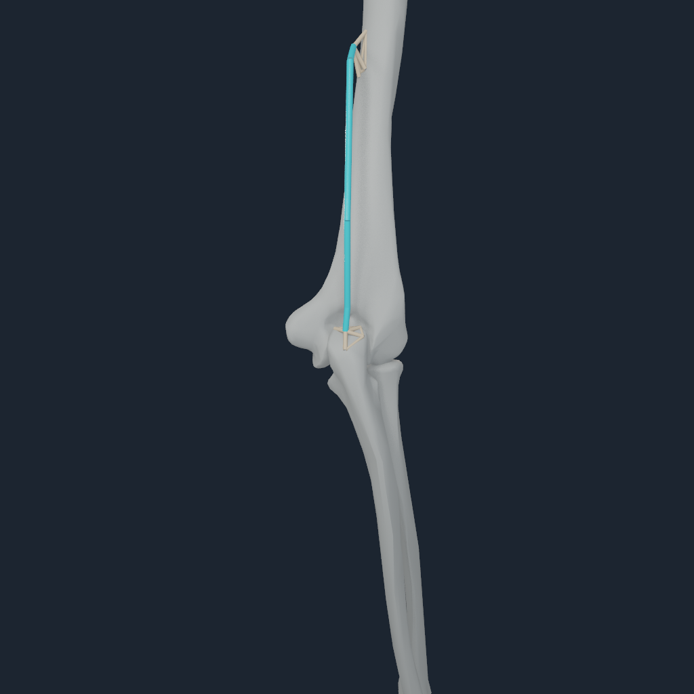
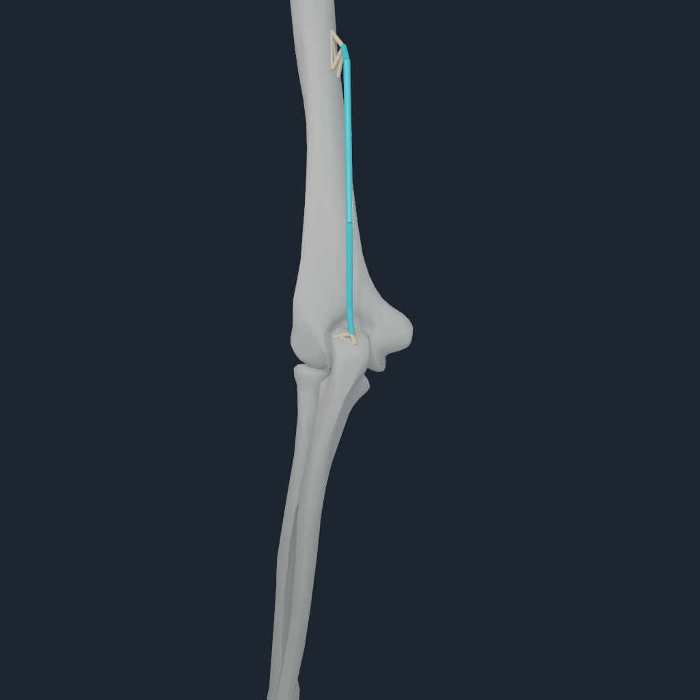

# Live bilateral triceps medialis enthesis mechanics

NumiLab Human now has a fail-closed Apple Metal certificate for the bilateral
triceps medialis routes in the pinned full-body source. `TRImed` (muscle 227)
and `TRImed_l` (muscle 290) retain their exact source paths from humerus to
ulna. Their four origins and insertions now terminate through exact, named,
zero-migration BodyParts3D four-node envelopes.

## Validation result

One-step and eight-step runs passed on an Apple M4 Pro. Both source muscles
solved with positive tendon tension and produced nonzero elbow torque,
configuration change, and velocity change. At eight steps the represented
endpoint loads were 415.656 N right and 416.797 N left, a 0.274% bilateral
difference. Maximum endpoint force residual was 15.3 uN and maximum moment
residual was 0.256 uN m.

The source route `J^T` is the single force authority. NHTENDON3 distributes
each terminal wrench to its four-node BodyParts3D surface envelope as a
force/moment-equivalent witness; it does not apply a second actuator. The
muscle solve, endpoint transfer, generalized-force assembly, and articulated
state update share one borrowed command buffer. Replay was bitwise and a
deliberately rejected consumer preserved the prior accepted state.

The old 641-envelope payload fails closed because the left humeral origin is a
point binding. Omitting either source muscle also fails before execution.

Eight 1024 px frames were inspected. The right side uses front, oblique, side,
and rear cameras. The left anterior-oblique camera truthfully reports complete
bone occlusion of the posterior route, so the retained set uses front, side,
rear, and flexed-rear views. The cyan polyline is the exact resolved source
route, not a rendered tendon surface; the warm structures are the exact
four-node load-transfer envelopes. Both endpoints visibly meet their
bone-surface envelopes in the exposed side and rear views.

The machine-readable receipt is
[m4-pro.json](media/numi-human-triceps-medialis-enthesis-live-v1/m4-pro.json).

## Evidence boundary

This is a bounded active bilateral triceps medialis enthesis force-transfer
certificate. It does not certify a deformable or volumetric tendon, passive
elbow capsule or ligaments, articular contact, sustained loaded motion,
subject-specific calibration, or clinical validity.
