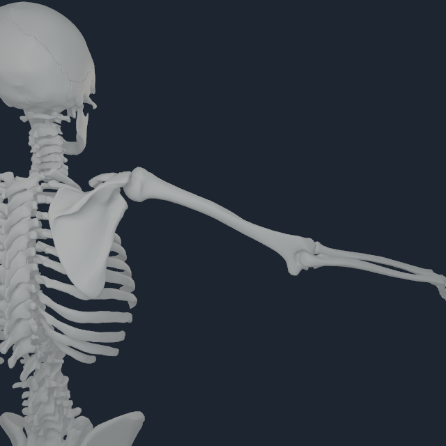
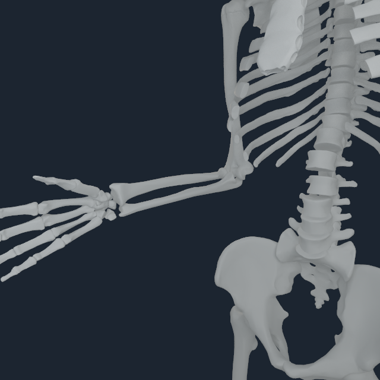

# Numi Human upper-limb articular validation v3

The old upper-limb showcase was rejected after direct review showed separated
shoulder, elbow and wrist geometry.  Its registration artifact predated the
humeral-head articular-center gate.  The replacement payload rebuilds the
complete 185 BodyParts3D bone surfaces against the pinned mechanics meshes and
keeps the humeral heads constrained to the source joint axes.

Default right scapula-to-humerus distance fell from 7.600 mm to 0.421 mm;
left fell from 7.908 mm to 0.336 mm.  Right/left humerus-to-radius distance
fell from 5.400 mm to 0.549/0.342 mm.  This is a registration correction, not
a camera or postprocessing fix.

## M4 Pro review

| Inspection | Rear/oblique native frame |
| --- | --- |
| shoulder elevation, q36 = 1.2 rad |  |
| elbow flexion, q39 = 1.4 rad |  |
| wrist deviation/flexion, q41 = 0.25 and q42 = 0.6 rad |  |

All three use exact NHEQ1 dependent-coordinate projection and the native Apple
M4 Pro renderer.  Four fixed cameras were retained for each pose.  A side view
can be occluded by the forearm itself; acceptance uses the full angle set and
the source-space audit, not a single attractive frame.

## Evidence boundary

This validates bone placement and kinematic continuity.  The persistent
ulna-to-triquetrum space is anatomically expected until TFCC, cartilage and
ligament geometry are present; forcing direct bone contact would be wrong.
Loaded joint stability, compliant cartilage, TFCC mechanics, ligament
restraint and deformable tendon/fascia remain separate qualification gates.
