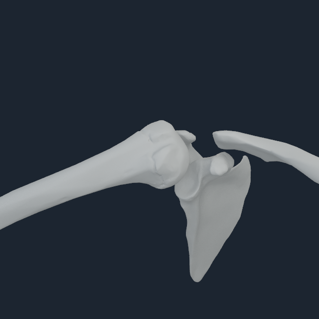
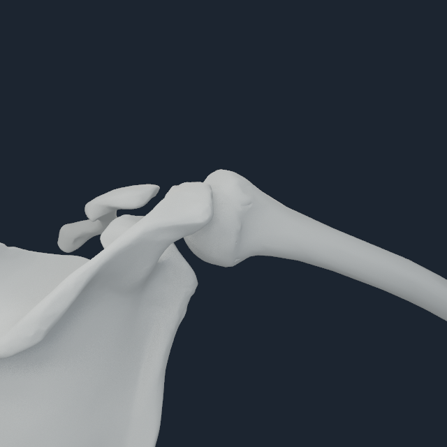
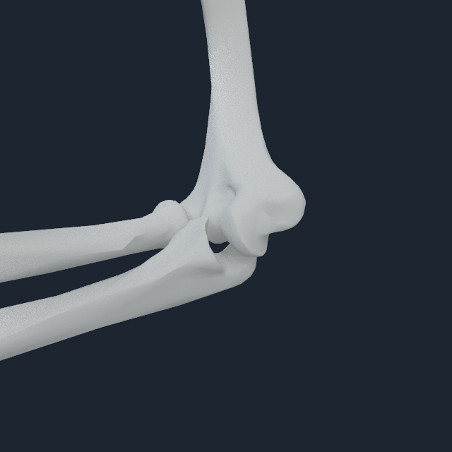
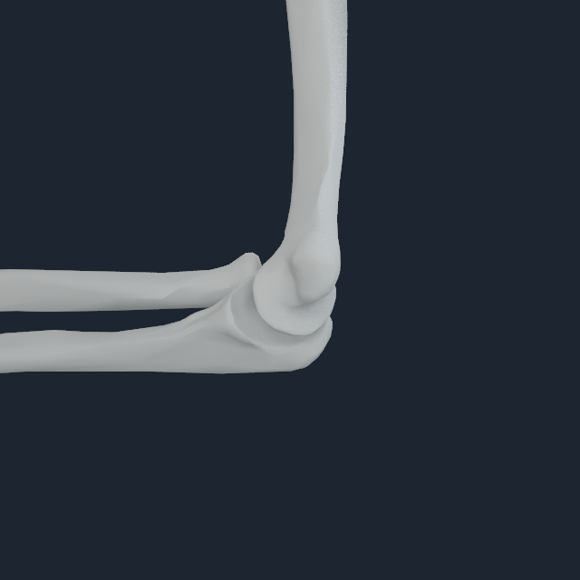
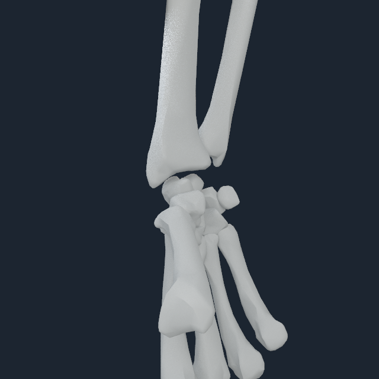
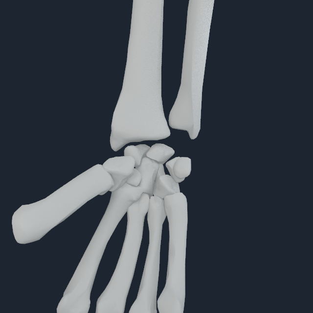
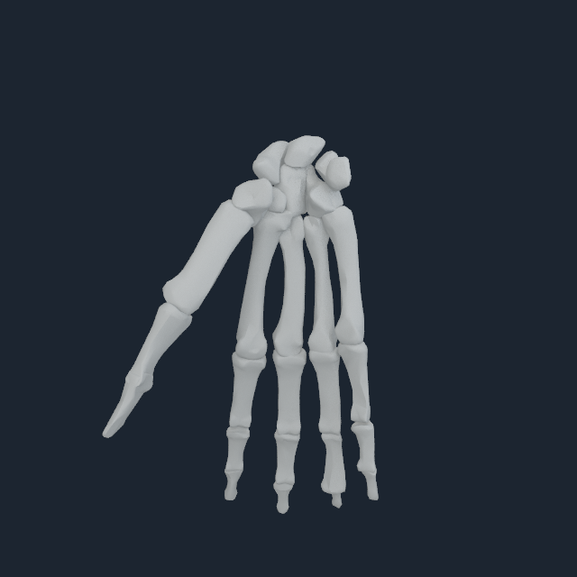
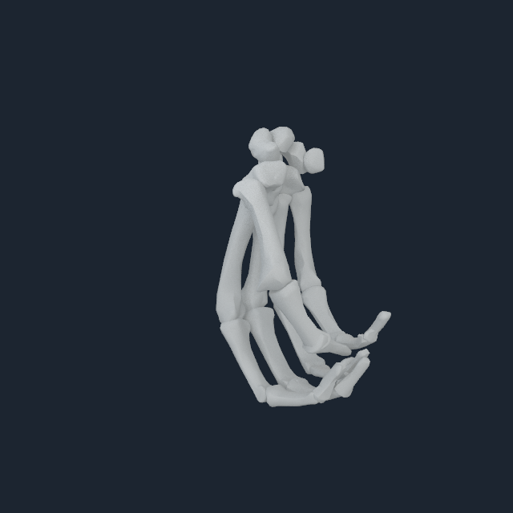

# Upper-joint mechanics-anchor inspection v1

## Outcome

The native Human renderer can now frame a posed mechanics joint directly with
`--focus-joint-child-body-index`, rather than centering the camera on the full
extent of one long bone. The renderer finds the unique owning joint, transforms
both its parent and child anchors through the current Metal body pose, rejects
an anchor disagreement above 0.2 mm, and targets their midpoint. An optional
`--focus-distance-m` is bounded to 0.08--0.80 m and is valid only with joint
focus. Body focus and joint focus are mutually exclusive.

This matters because the earlier shoulder, elbow, and wrist frames were broad
whole-bone views. Torso and pelvis occlusion made them poor evidence for a
small articular interface even when the selected Core body index was correct.
The new captures render only the adjacent BodyParts3D bones and hold the camera
on the exact posed MyoSim mechanics anchor.

| Inspection | Posed joint child body | Rendered bones | Anchor residual | Bone pixels across four views |
| --- | ---: | ---: | ---: | ---: |
| shoulder elevation | 41, humerus | 3 | 0.000121 mm | 65,026--112,092 |
| elbow flexion | 42, ulna | 3 | 0.000119 mm | 54,468--112,223 |
| wrist deviation/flexion | 45, lunate | 15 | 0.000021 mm | 42,114--104,929 |
| neutral hand | 62, third metacarpal | 27 | 0.000060 mm | 29,421--47,482 |
| functional fist | 62, third metacarpal | 27 | 0.000060 mm | 25,717--43,577 |

All five runs used the Apple M4 Pro, exact NHEQ1 dependent-coordinate
projection, the current 185-surface NHBONES1 payload, four fixed cameras, and
the native 640 px sensor-reference profile. The full packs, visual manifests,
frames, and transcripts are retained in
[`numi-human-upper-joint-focus-v1`](media/numi-human-upper-joint-focus-v1/).

## Direct review

The close views show the humeral head at the glenoid, the proximal radius and
ulna at the distal humerus, the distal forearm opposed to the carpal block, and
all five hand rays in both neutral and flexed states. No 180-degree bone flip,
left/right swap, detached long-bone shaft, missing digit ray, or isolated
per-bone visual correction is present in these inspected states.

### Shoulder

  
  

### Elbow

  
  

### Wrist

  
  

### Neutral hand and functional fist

  
  

## Evidence boundary

Joint-anchor focus fixes validation framing; it does not alter the registered
bone transforms. Passing proves that the camera targets the coincident posed
mechanics anchors and that the selected source-owned surfaces are visible from
four angles. The companion robust interface-patch audit supplies the numerical
placement gate. Neither result is cartilage contact, TFCC, ligament restraint,
loaded joint stability, deformable tendon mechanics, or clinical validation.
