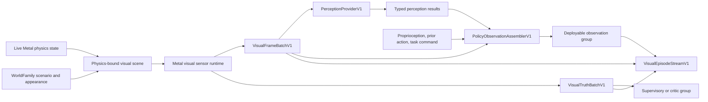

# MetalRobo visual simulation and perception platform

MetalRobo now turns one authoritative live physics state into synchronized
camera observations, dense supervisory truth, replaceable perception inputs,
policy observations, and deterministic visual episode streams.

The platform defines the data plane. A policy or perception model remains an
interchangeable consumer.

## Implemented architecture

### Physics-bound scene

`VisualSceneManifestV1` compiles the immutable `WorldTemplate` into:

- Deterministically triangulated primitive and cooked collision geometry.
- Material records and stable semantic, instance, link, and primitive IDs.
- Global-body bindings for every rigid body and articulated robot link.
- Fixed, rigid-body-mounted, and articulated-link-mounted camera bindings.
- Source URI, content hash, license, and preprocessing provenance for each
  visual asset.

`attachGaussianField` adds a captured Gaussian appearance layer to an asset.
The Gaussian layer and physics-bound triangle geometry render into the same
depth, identity, normal, and motion buffers. This supports captured static
rooms while retaining mesh geometry for robots, manipulated objects, contact
surfaces, and occlusion.

`composeVisualBodyStates` evaluates articulated bodies with MetalRobo's
authoritative FP64 kinematics and combines them with sampled scene bodies in
global `EngineModel` body order. The renderer therefore consumes the same
poses used by collision and contact.

### Visual sensor runtime

`MetalHybridRenderer` consumes live body/link buffers and sampled world-family
buffers directly on Metal. It produces:

- Linear RGBA.
- Metric depth and depth validity.
- Semantic, instance, link, and primitive identities.
- Camera-space surface normals.
- Previous-to-current pixel motion.
- Frame validity and versioned frame metadata.

The runtime applies calibrated intrinsics and radial/tangential distortion,
sampled exposure and appearance response, direct material lighting,
deterministic color/depth noise, range limits, depth quantization, dropout,
and a motion-vector-based shutter blur approximation. Sensor effects are
keyed by scenario, sensor sequence, frame identity, and pixel, so the same
episode rerenders deterministically.

`renderLive` accepts host-visible state for inspection and export.
`encode` accepts borrowed Metal body-state buffers and a caller-owned active
compute encoder. It commits no command buffer and performs no readback. RGB,
depth, identity, normal, motion, and validity buffers stay device-resident and
are exposed through `nativeBuffer` for MLX, Core ML, or another Metal stage.

Fixed and wrist cameras in `FrankaPickPlaceWorldFamily` are the reference
integration. The fixed camera is calibrated toward the manipulation
workspace; the wrist camera is bound to the final articulated link.

### Deployable observations and supervisory truth

`VisualFrameBatchV1` is accepted for simulation, physical capture, and replay.
It contains:

- Linear RGB, metric depth, and depth validity.
- Intrinsics, distortion, and camera-to-base transforms.
- Capture time, frame age, exposure, shutter readout, frame index, sensor
  sequence, sensor identity, and source.
- Immutable fingerprints for the episode twin, scenario, renderer, sensor
  profile, and calibration.
- Host arrays or typed device-buffer views.

`VisualTruthBatchV1` is separate. It contains dense semantic/instance/link
masks, normals, motion, visibility, occlusion, object and link poses,
keypoints, and contact annotations in a declared coordinate frame.

`assembleVisualBatches` converts synchronized renderer readbacks into both
contracts. A physical RGB-D adapter constructs the same `VisualFrameBatchV1`
and simply has no simulation-only truth.

### Replaceable perception providers

`PerceptionProviderV1` advertises a content hash, required modalities,
temporal window, device-buffer support, and typed capabilities:

- Dense depth or semantic output.
- Instance masks and tracking.
- Object hypotheses and 6D poses.
- Keypoints.
- Dense features or compact embeddings.

The provider interface is the correct integration point for an Ultralytics
YOLO/Core ML package, an MLX encoder, or a future foundation model. Model
choice does not alter the simulator, episode format, or policy contract.

The Python `CallablePerceptionProviderV1` adapter wraps any callable that
honors this provenance and result contract.

### Policy observations

`PolicyObservationAssemblerV1` supports:

- Raw RGB-D.
- RGB with metric base-frame XYZ.
- Object-centric perception results.
- Dense feature maps.
- Compact latent representations.

Proprioception, prior actions, and task commands join the deployable actor
observation. Privileged physics state remains a separate supervisory or
critic group.

### Visual episode stream

The Python `VisualEpisodeWriterV1` writes deterministic, content-addressed
NPZ chunks plus a canonical manifest. Each step can carry:

- Multi-view frames and camera calibration.
- Proprioception, actions, task commands, rewards, and events.
- Privileged state and dense visual truth.
- Compact named physics state such as `q`, `v`, and scene-body state for
  deterministic rerendering.
- Scenario identity and immutable renderer, asset, calibration, sensor, and
  physics provenance.

`VisualEpisodeReaderV1` verifies the manifest and every chunk hash.
Simulation and captured episodes share this format. The optional
`export_lerobot_v3` adapter uses LeRobot's native writer when LeRobot is
installed, mapping each parallel environment to an episode with multi-camera
RGB, metric depth, state, and actions.

## State-of-the-art alignment

| Signal | MetalRobo implementation |
| --- | --- |
| [ManiSkill3](https://arxiv.org/abs/2410.00425), [Isaac Sim Replicator](https://docs.isaacsim.omniverse.nvidia.com/5.0.0/replicator_tutorials/index.html), and [Genesis](https://genesis-world.readthedocs.io/en/latest/user_guide/rendering/index.html) place batched sensors beside GPU physics. | Live transforms, rendering, dense outputs, and the active-encoder handoff remain on Metal. |
| [SplatSim](https://arxiv.org/abs/2409.10161), [RoboGSim](https://arxiv.org/abs/2411.11839), and [GSWorld](https://arxiv.org/abs/2510.20813) combine captured appearance with physics-backed geometry. | Captured Gaussian layers and body-bound meshes share the same renderer and identity/depth buffers. |
| [DP3](https://arxiv.org/abs/2403.03954) and [AnchorDP3](https://arxiv.org/abs/2506.19269) use calibrated 3D geometry. | Metric depth, calibration, base-frame XYZ, object/link poses, keypoints, visibility, and identities are first-class contracts. |
| [ACGD](https://research.nvidia.com/publication/2025-10_acgd-visual-multitask-policy-learning-asymmetric-critic-guided-distillation) and [Isaac Lab observation groups](https://isaac-sim.github.io/IsaacLab/develop/source/api/lab/isaaclab.envs.html) separate actor input from privileged information. | Deployable frames and policy observations remain distinct from truth and critic/supervisory groups. |
| [DINOv3](https://ai.meta.com/research/dinov3/) and [V-JEPA 2](https://ai.meta.com/research/publications/v-jepa-2-self-supervised-video-models-enable-understanding-prediction-and-planning/) keep changing the useful representation layer. | Providers advertise capabilities and provenance while the simulator stays encoder-agnostic. |
| [SIMPLER](https://arxiv.org/abs/2405.05941) and [RialTo](https://arxiv.org/abs/2403.03949) depend on matched scenes and calibration. | Simulation, capture, and replay use one frame contract and one immutable episode provenance model. |

## Public surfaces

- C++ contracts: `include/metalrobo/VisualPlatform.hpp`
- Shared Metal ABI: `include/metalrobo/visual_platform_types.h`
- Metal runtime: `include/metalrobo/MetalHybridRenderer.hpp`
- Python contracts and episode stream: `python/metalrobo/visual.py`
- JSON schemas: `schemas/visual_*` and
  `schemas/perception_provider.schema.json`
- Reference integration:
  `apps/visual_platform_probe.cpp`
