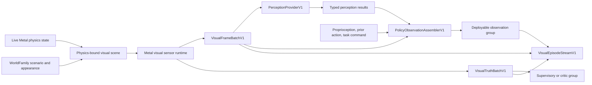

# MetalRobo visual simulation and perception platform

MetalRobo now turns one authoritative live physics state into synchronized
camera observations, dense supervisory truth, replaceable perception inputs,
policy observations, and deterministic visual episode streams.

The platform defines the data plane. A policy or perception model remains an
interchangeable consumer.

## Implemented architecture

### Physics-bound scene

`VisualSceneManifestV3` binds immutable `VisualAssetPackV2` files to the
authoritative `WorldTemplate`. A live scene contains only pack references,
body/link instances, camera bindings, the selected light rig, and an optional
`VisualEnvironmentPackV2`; it never flattens authored geometry into a host
scene arena.

`metalrobo_visual_cook` accepts GLB, glTF, USD, USDA, USDC, and USDZ. The USD
path uses Model I/O with `MTKMeshBufferAllocator`, applies stage units and
up-axis conversion, preserves material subsets and symbolic link bindings,
and writes a sectioned, content-addressed `.mrvpack`. Geometry, material
records, texture descriptors, texture payloads, and symbolic bindings occupy
independently hashed sections. USDZ package resolution remains inside Model
I/O; a reusable `MTKTextureLoader` converts one material texture at a time
without color-transforming linear normal, roughness, metallic, occlusion, or
mask data. Separate Model I/O roughness, metallic, opacity, and clearcoat-gloss
maps retain scalar-channel semantics instead of being interpreted as glTF's
packed material channels. Vertices, indices, and texture subresources are
aligned for direct Metal I/O loading. Authored minification, magnification,
mipmap, and U/V wrap modes are encoded independently; renderer compilation
deduplicates only the sampler states actually used by the scene.

`metalrobo_environment_cook` converts HDR or EXR equirectangular images into a
diffuse irradiance cube, a full prefiltered GGX mip chain, and the shared DFG
BRDF LUT. The resulting `.mrenv` is immutable and records color conversion,
sample schedules, exact IBL-kernel hash, and source provenance. GPU
convolution runs in one ordered command stream; derived texture readback uses
an actual two-slot pipeline with exact final-capacity reservation, avoiding
per-subresource synchronization and vector-growth memory spikes.

Captured Gaussians remain an optional pre-lit appearance layer in
`VisualRenderSceneV3`. They share metric depth, identity, normal, and motion
outputs with authored PBR geometry.

`writeVisualSceneManifestV3` publishes immutable pack hashes and lightweight
runtime bindings against `visual_scene_manifest_v3.schema.json`.

`composeVisualBodyStates` evaluates articulated bodies with MetalRobo's
authoritative FP64 kinematics and combines them with sampled scene bodies in
global `EngineModel` body order. The renderer therefore consumes the same
poses used by collision and contact.

### Visual sensor runtime

`MetalHybridRenderer` streams cooked sections into private placement heaps
with Metal I/O, binds native textures and samplers once through a tier-2
argument buffer, and consumes live body/link buffers directly on Metal. It
produces:

- Linear RGBA.
- Metric depth and depth validity.
- Semantic, instance, link, and primitive identities.
- Camera-space surface normals.
- Previous-to-current pixel motion.
- Frame validity and versioned frame metadata.

Both renderer profiles use the same metallic-roughness PBR, visible HDR
environment, and image-based lighting implementation. A compact
environment-major state pass resolves current and previous camera plus authored
instance transforms once, removing repeated body binding and quaternion work
from triangle visibility, shadows, and composition. `sensor_fast` packs depth
and triangle identity into one Apple9 64-bit atomic visibility key. Streamed
indexed geometry is partitioned into 64-triangle clusters, and tight cluster
bounds are built once on Metal after the Metal I/O load. Each camera pass
culls environment-major clusters in parallel against the calibrated frustum
and active rolling-shutter band. The flat triangle pass then performs one
coalesced triangle-to-cluster and cached-visibility lookup before touching
vertices, so high-poly work scales with visible geometry without a
compact-list scan or an encoder transition. Shadow clusters use a cooperative
light-frustum path.

Within visible clusters, projected triangles with a bounded microtriangle box
use the direct atomic lane, while larger triangles append their
already-projected screen-space record to 16×16 tiles. One 256-thread group
then resolves each tile in 128-record shared-memory batches. This keeps
subpixel robot meshes inexpensive, eliminates a second world/camera transform
for tiled geometry, and prevents large triangles from serially walking their
complete pixel bounding box. Tile-list order is irrelevant because the packed
winner is an exact minimum; capacity overflow takes the bounded atomic lane
without dropping geometry. Near-plane work launches indirectly only when
clipped geometry exists; winner clearing and sensor response are fused into
passes that already touch the pixels. World buffers are resolved once per
physical frame, resource residency is declared once per active encoder, and
fixed buffer tables are bound as ranges rather than as individual Objective-C
calls.

`sensor_fast` uses environment-major shadow atlases and stratified space-time
samples during physical exposure. Near-plane scratch storage scales with the
compiled triangle count up to a fixed GPU-local ceiling rather than reserving
the ceiling for every scene. `sensor_reference` uses
one compacted BLAS per unique authored mesh and GPU-authored component-motion
instances. TLASes cover groups of at most 32 environments; a one-hot Metal
instance mask isolates every environment without shifting world coordinates
or sacrificing metric precision. Group builds and refits share one encoder
with disjoint scratch ranges, and periodic rebuilds restore traversal quality
after accumulated motion. Primary visibility, all-scene shadows, and
dynamic-only Gaussian receiver shadows use the same structures with explicit
role filtering. The renderer then applies stratified subpixel and shutter-time
samples, direct shadow rays, and exact per-row exposure timing. Deployable RGB
is integrated over those samples while depth, identities, normals, and truth
remain exact center-exposure observations. Sensor effects are keyed by
scenario, camera, sensor sequence, frame identity, pixel, and sample, so
rerenders remain deterministic. Sensor depth validity is separate from
geometric validity:
range failure or dropout masks deployable depth without erasing
simulation-only identities, normals, motion, or visibility.
Disabled color noise, depth noise, and dropout execute no random hash work.
Reference subpixel rotation is generated once per pixel and reused across its
exposure samples.

`renderLive` accepts host-visible state for inspection and export.
`encode` accepts borrowed Metal body-state buffers and a caller-owned active
compute encoder. It commits no command buffer and performs no readback. RGB,
depth, identity, normal, motion, and validity buffers stay device-resident and
are exposed through `nativeBuffer` for MLX, Core ML, or another Metal stage.
`MetalHybridObjectTracker` is the native closed-loop adapter: it renders on a
borrowed `MetalWorld` command buffer, reduces metric depth and instance
identity into compact root-local object position and velocity tracks, and
overwrites compiled TaskPack observation slots before policy inference. Live
camera and root poses come from device buffers rather than a static camera
approximation. One cooperative threadgroup reduces each environment/object
track and temporal track state remains on the GPU.
The same adapter can publish a TaskPack-authored ball-only masked-depth
contract. Exact authored instance identities select pixels, invalid and
non-selected pixels become calibrated far depth, and a device-resident ring
publishes sparse temporal offsets directly into actor slots. The bundled G1
dodge task uses a 16x9 plane normalized over 0.1--5.0 m at offsets 0, 3, 8,
and 18 control steps. Object tracks remain critic-only for this task. Reset
fills the complete depth ring from the first accepted post-reset frame, so no
visual belief crosses episode boundaries.
`MetalRoboTaskRolloutContext.attachVisualObservation` compiles authored pack
references, a body-bound camera, the matching `WorldFamily`, and this tracker
before resident initialization. Explicit rigid-body pack bindings keep moving
scene objects on the accepted physics timeline; articulated bindings keep
robot presentation on link states. Reset clears temporal tracks atomically
with simulator reset, and rollout chunk size does not alter the published
observation artifact.
`encodeGraph` additionally accepts an active-compute callback surface and a
complete set of caller-owned observation buffers. The Python
`visual_observation` custom primitive uses that surface to write linear RGB,
metric depth, segmentation, identities, normals, motion, and validity directly
into MLX allocations. Its `graph_only=True` renderer keeps no duplicate
capacity-sized observation planes, while retaining the bounded raster,
visibility, and temporal scratch required to produce those outputs. The
policy default is RGB, metric depth, and validity; dense segmentation,
identities, normals, and motion are explicitly selected static truth channels
and otherwise have zero spatial extent. The
primitive rejects a sampled world whose authored pack hash differs from the
compiled physics world. It registers its array dependencies with MLX,
adds no command buffer, and attaches the renderer's private heap through a
Metal residency set compiled and committed once with the immutable scene, then
reused on MLX's current command buffer. This follows MLX's
[custom-extension contract](https://ml-explore.github.io/mlx/build/html/dev/extensions.html)
while retaining native heap and argument-buffer residency.
Explicit inspection/export readback coalesces every plane into one transient
aligned shared buffer and reuses caller-owned host capacity. This avoids
per-modality Metal allocations without retaining a resolution-sized staging
buffer after the readback completes.

Fixed and wrist cameras in `FrankaPickPlaceWorldFamily` are the reference
integration. The fixed camera is calibrated toward the manipulation
workspace; the wrist camera is bound to the final articulated link.

### Deployable observations and supervisory truth

`VisualFrameBatchV1` is accepted for simulation, physical capture, and replay.
It contains:

- Linear RGB, metric depth, and depth validity.
- Intrinsics, distortion, and camera-to-base transforms.
- Capture time, frame age, exposure, shutter readout, frame index, sensor
  sequence, sensor identity, and source.
- Immutable fingerprints for the episode twin, scenario, renderer, sensor
  profile, and calibration.
- Host arrays or typed device-buffer views.

Host-visible invalid depth is canonicalized to zero and interpreted only
through the depth-validity mask.

`VisualTruthBatchV1` is separate. It contains dense semantic/instance/link
masks, normals, motion, visibility, occlusion, object and link poses,
keypoints, and contact annotations in a declared coordinate frame. Dense IDs
remain typed `uint32`; sparse pose/keypoint/contact records use exact
`float64` packing so `uint32` identities and invalid sentinels are not rounded.
Dense visibility is surface coverage in `[0, 1]`; occlusion is its quantized
inverse, with `255` representing an absent or fully occluded truth surface.

`assembleVisualBatches` converts synchronized renderer readbacks into both
contracts and rejects stale or mismatched view metadata. A physical RGB-D
adapter constructs the same `VisualFrameBatchV1` and simply has no
simulation-only truth. Camera timestamps remain per-view so independently
clocked sensors can be aligned under one batch frame index.

### Replaceable perception providers

`PerceptionProviderV1` advertises a content hash, required modalities,
temporal window, device-buffer support, and typed capabilities:

- Dense depth or semantic output.
- Instance masks and tracking.
- Object hypotheses and 6D poses.
- Keypoints.
- Dense features or compact embeddings.

The provider interface is the correct integration point for an Ultralytics
YOLO/Core ML package, an MLX encoder, or a future foundation model. Model
choice does not alter the simulator, episode format, or policy contract.

The Python `CallablePerceptionProviderV1` adapter wraps any callable that
honors this provenance and result contract. Provider results and every tensor
are bound to the originating frame index and timestamp before they can enter a
policy observation; zero detections are represented by valid zero-length
tensors rather than a malformed result.

### Policy observations

`PolicyObservationAssemblerV1` supports:

- Raw RGB-D.
- RGB with metric base-frame XYZ.
- Object-centric perception results.
- Dense feature maps.
- Compact latent representations.

Proprioception, prior actions, and task commands join the deployable actor
observation. Privileged physics state remains a separate supervisory or
critic group. RGB-XYZ backprojection inverts the same radial/tangential lens
model used by rendering, so base-frame points remain calibrated away from the
optical center.

### Visual episode stream

The Python `VisualEpisodeWriterV1` writes deterministic, content-addressed
NPZ chunks plus a canonical manifest. Each step can carry:

- Multi-view frames and camera calibration.
- Proprioception, actions, task commands, rewards, and events.
- Privileged state and dense visual truth.
- Compact named physics state such as `q`, `v`, and scene-body state for
  deterministic rerendering.
- Scenario identity and immutable renderer, asset, calibration, sensor, and
  physics provenance.

Camera exposure, shutter timing, sensor sequence, and the scenario fingerprint
are retained in every chunk. Independently clocked views may carry different
capture timestamps while sharing one policy-step frame index. Sensor identities
remain stable and each camera timeline remains monotonic.
`VisualEpisodeReaderV1` verifies the manifest, contiguous chunk layout, hashes,
array dtypes/shapes, calibration, frame ordering, depth validity, and scenario
provenance before yielding data.
Simulation and captured episodes share this format. The optional
`export_lerobot_v3` adapter uses LeRobot's native writer when LeRobot is
installed, mapping each parallel environment to an episode with streaming
multi-camera RGB, validity-masked metric depth, state, and actions.

## State-of-the-art alignment

| Signal | MetalRobo implementation |
| --- | --- |
| [ManiSkill3](https://arxiv.org/abs/2410.00425), [Isaac Sim Replicator](https://docs.isaacsim.omniverse.nvidia.com/5.0.0/replicator_tutorials/index.html), and [Genesis](https://genesis-world.readthedocs.io/en/latest/user_guide/rendering/index.html) place batched sensors beside GPU physics. | Live transforms, rendering, dense outputs, and the active-encoder handoff remain on Metal. |
| [SplatSim](https://arxiv.org/abs/2409.10161), [RoboGSim](https://arxiv.org/abs/2411.11839), and [GSWorld](https://arxiv.org/abs/2510.20813) combine captured appearance with physics-backed geometry. | Captured Gaussian layers and body-bound meshes share the same renderer and identity/depth buffers. |
| [DP3](https://arxiv.org/abs/2403.03954) and [AnchorDP3](https://arxiv.org/abs/2506.19269) use calibrated 3D geometry. | Metric depth, calibration, base-frame XYZ, object/link poses, keypoints, visibility, and identities are first-class contracts. |
| [ACGD](https://research.nvidia.com/publication/2025-10_acgd-visual-multitask-policy-learning-asymmetric-critic-guided-distillation) and [Isaac Lab observation groups](https://isaac-sim.github.io/IsaacLab/develop/source/api/lab/isaaclab.envs.html) separate actor input from privileged information. | Deployable frames and policy observations remain distinct from truth and critic/supervisory groups. |
| [DINOv3](https://ai.meta.com/research/dinov3/) and [V-JEPA 2](https://ai.meta.com/research/publications/v-jepa-2-self-supervised-video-models-enable-understanding-prediction-and-planning/) keep changing the useful representation layer. | Providers advertise capabilities and provenance while the simulator stays encoder-agnostic. |
| [SIMPLER](https://arxiv.org/abs/2405.05941) and [RialTo](https://arxiv.org/abs/2403.03949) depend on matched scenes and calibration. | Simulation, capture, and replay use one frame contract and one immutable episode provenance model. |

## Public surfaces

- C++ contracts: `include/metalrobo/VisualPlatform.hpp`
- Shared Metal ABI: `include/metalrobo/visual_platform_types.h`
- Metal runtime: `include/metalrobo/MetalHybridRenderer.hpp`
- Python contracts and episode stream: `python/metalrobo/visual.py`
- JSON schemas: `schemas/visual_*` and
  `schemas/perception_provider.schema.json`
- Reference integration:
  `apps/visual_platform_probe.cpp`
