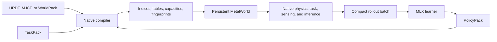
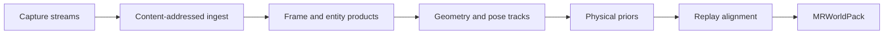

# MetalRobo world engine

MetalRobo treats robot simulation as compilation. Authored mechanics, scenes,
tasks, sensors, and policies are resolved once into immutable indices and
fixed-capacity GPU tables. Native Metal then executes those tables without
string lookup, robot-specific shader branches, or a host-side environment
loop.



There is one runtime architecture:

- mechanics and scene composition come from an `EngineModel`, imported robot,
  or `MRWorldPack`;
- robot-independent task semantics come from a `TaskPack`;
- actor/critic weights and normalization come from a `PolicyPack`;
- `MetalWorldContext` owns persistent simulator state and native submission;
- Swift owns rollout length, chunking, completion, timeouts, and policy
  revisions;
- MLX owns only batch learning and publishes the next PolicyPack.

## World authoring and artifacts

`EpisodeTwinCompiler` is the capture-to-world entry point. Its capture manifest
accepts synchronized RGB-D, robot telemetry and commands, ARKit/LiDAR, ROS
bags, CAD/URDF assets, and ordinary video. Streams retain timestamp domains,
calibration, and provenance.

The compiler uses a content-addressed artifact graph:



Provider outputs enter as typed products before world compilation. A geometry,
pose, calibration, or physical-prior product must alter the compiled world; it
cannot merely accompany an unchanged seed. Visual Presentation V3 is the only
authored presentation path. Collision geometry never becomes a fallback
visual scene.

`WorldTemplate` owns immutable topology. Each asset binds semantic identity,
render representation, collision representation, dynamics kind, and initial
state. `WorldProgram` declares reset-time distributions for appearance, object
configuration, clutter, physics, controller state, and sensors.

`WorldFamily` combines a template and program under one content fingerprint.
Its CPU sampler is for authoring and inspection. Production reset sampling
uses the same counter-based key structure in native Metal.

`MRWorldPack` is the persisted world boundary. It contains mechanics, scene
composition, authored presentation, sensors, task anchors, provenance, and
compiled variation data. Loading is transactional and rejects incompatible
format, ABI, payload length, content hash, or family fingerprint.

Compile a capture directly:

```sh
build/bin/metalrobo_episode_compile \
  capture.json worlds/cell-a.mrworld \
  --store worlds/cell-a.artifacts
```

Python may author or inspect artifacts, but it does not execute physics:

```python
from metalrobo.episode import compile_episode_manifest

pack = compile_episode_manifest(
    "capture.json",
    "worlds/cell-a.mrworld",
    artifact_store_path="worlds/cell-a.artifacts",
)
```

## TaskPack

`TaskPack` is the robot-independent closed-loop task description. It contains:

- action-to-joint bindings and action scales;
- temporal actor and asymmetric-critic observation operators plus direct
  device-observation suffixes, each with its own history contract;
- named semantic contact and joint groups;
- reward operators and continuous-time weights;
- termination priorities and reasons;
- reset and domain-randomization operators;
- command curriculum, pushes, terrain samples, and corruption parameters;
- the requested native capacity profile.

Names such as `left_ankle_pitch`, `foot_contact`, or `left_index_tip` exist
only at authoring time. `compileTaskProgram` resolves them against the selected
world and emits stable indices, compact tables, exact counts, validated
capacities, and a fingerprint. The GPU loop consumes no strings and has no
per-robot branch.

Projectile avoidance is authored through the same operators. A clearance
barrier resolves one dynamic scene body and one semantic protected-body group,
then evaluates the most-binding per-link constraint before contact. A dense
projectile-evasion operator supplies gross root clearance and stillness, while
event-scoped contact termination, clean-miss reward, ball-free standing
anchors, launch timing, and speed curriculum remain TaskPack data rather than
a robot-specific runtime path.

The bundled G1 task is one preset expressed through this same format. Imported
URDF robots and WorldPacks use the same compiler and executor:

```text
makeUnitreeG1LocomotionWorld
mr_create_urdf_locomotion_rollout
mr_create_world_pack_locomotion_rollout
              |
              v
      compileLocomotionWorld
              |
              v
      generic Metal task executor
```

A custom `.metal` kernel is justified only by a new physics primitive, sensor
modality, or task operator. A different joint layout is data, not shader code.

## PolicyPack

`PolicyPack` is the immutable learner/deployment boundary. It stores:

- actor normalization, dense layers, activations, and action transform;
- optional asymmetric critic normalization and layers;
- optional diagonal Gaussian exploration distribution;
- observation/action clips, policy identity, and revision.

`compilePolicyProgram` verifies actor/action dimensions against the compiled
TaskPack and fingerprints the complete program. Installation is transactional:
an incompatible or corrupt pack leaves the active policy unchanged.

The Metal hot loop evaluates the actor between native observation construction
and action application. A final critic-only evaluation can be appended to the
last rollout submission without advancing physics. Training PolicyPacks may be
stochastic; deployment PolicyPacks contain the same actor revision without an
exploration distribution.

## Persistent native execution

`MetalWorldContext` owns:

- the command queue, cached pipelines, and submission tickets;
- immutable topology and program tables;
- private q/v and scene state;
- manifold headers, points, pair caches, witnesses, and warm starts;
- actuator delay/backlash and sensor history;
- episode counters, curriculum state, and counter-based RNG streams;
- private placement heaps and bounded transient arenas.

Every control transition is one native transaction:


A reset atomically replaces articulation and scene state, manifolds, warm
starts, actuator state, tactile/sensor history, counters, curriculum command,
and RNG episode identity. A physics failure restores the environment's
control-step checkpoint and publishes a typed status; unrelated environments
continue.

Random values are keyed by environment, episode, control step, and operator.
Changing rollout chunk size or Swift scheduling therefore does not change the
physical sequence.

## Capacity contract

Capacity is compiled topology, not a best-effort allocation. Count, scan, and
scatter stages share canonical offsets. Record scatter consumes the finalized
canonical manifold count; it never rereads an unvalidated narrowphase count.
Constraint endpoint and articulation query capacities are derived exactly as
twice the compiled constraint-block capacity. An explicit mismatch fails
before allocation or dispatch.

The bundled G1 operational profile is measured rather than arbitrarily capped:
128 candidate/raw pairs, 32 manifolds, 64 constraint blocks, 192 rows, 1,024
mesh candidates, and matching derived tables. Higher-water workloads must
publish a new measured profile or fail transactionally; silent clipping is not
allowed.

## Native sensing

Geometry, contact, visual, and tactile stages use accepted body/contact buffers
from the same native timeline. Range and terrain queries reuse immutable
compiled geometry. Visual Presentation V3 resources remain independent from
collision geometry. Tactile sensors consume authored sensor geometry and
solver contact evidence; packs without tactile sensors allocate no tactile
state.

Task observation operators currently publish proprioception, commands,
terrain, contact metrics, and physical/controller parameters. Adding native
tactile summaries or learned tactile features to a TaskPack requires an
explicit observation operator and a composed native tactile stage. Dataset
training alone does not claim that runtime integration.

## Learning and rollout boundary

`metalrobo_task_rollout` and `metalrobo_task_train` are Swift executables.
Swift retains one native world, preallocates one rollout arena, submits bounded
chunks, handles completion/error reporting, and attaches a policy revision to
every batch.

The learner process receives a memory-mapped `PolicyRolloutPack` containing
only actor/critic observations, actions/latents, old log probabilities, values,
rewards, terminations, and compact diagnostics. MLX performs PPO updates and
writes the next native PolicyPack through the canonical C++ writer. It never
receives simulator caches or schedules a physics transition.

Timeout transitions include one native critic scalar evaluated from the
accepted post-transition history before reset. GAE uses that scalar while
still cutting recurrence at the episode boundary.

The command curriculum is task-wide rather than environment-local. One native
reduction adapts it only at an authored window boundary and publishes its level
in every transition. The MLX worker accepts bounded one-level advances and
retreats, rejects larger jumps or cross-environment disagreement, and
atomically stores the level plus same-difficulty reference with model and
optimizer state. Resume restores that reference before the first resident
submission. Partial-window counters and the global clock restart because the
new simulator context has fresh environment episodes; accumulated progress is
not silently re-anchored.

The former Python/MLX physics extension, MLX world state, task-specific PPO
collectors, and Python rollout/benchmark entry points have been removed.

Ball-dodge learning uses a training-only prospective clearance reward derived
from the native whole-body threat query. It is the urgency-weighted signed
minimum predicted link/projectile clearance, so moving a threatened link away
from the collision course produces dense progress before the sparse physical
miss event. The deployment actor receives no privileged geometry: its
shape-compatible masked-depth history expands an exact segmented winner by
one pixel at 16x9 so small projectiles remain observable without adding a
host readback, tracker feature, or larger policy input.

Held-out dodge reporting keeps strict champion promotion separate from
directional progress. Progress requires a better physical task outcome and
allows at most a two-percent companion balance-incidence regression, while
publishing every exact delta. This prevents a few finite-sample balance events
from erasing a measured contact or clean-miss improvement; champion promotion
still requires strictly better hit outcomes with no balance regression.

## R2S2R boundary

World alignment and feedback remain artifact/data operations. Scenario keys,
outcomes, telemetry references, posterior populations, and learned failure
regions retain exact world/task/policy fingerprints. MLX may fit a posterior
or ensemble from compact records. Physical replay itself must execute through
the native world and publish a compact evidence artifact; a learner-side array
graph is not a second simulator.

## Focused validation

Use the smallest owner for a change:

```sh
cmake --build build --target metalrobo_task_program_check
./build/bin/metalrobo_task_program_check

./build/bin/metalrobo_task_rollout \
  --metallib build/shaders/MetalRobo.metallib \
  --envs 32 --steps 48 --repeats 20 --chunk 8 \
  --scene terrain --native-policy

cd python
python3 probes/mlx_policy_learning_check.py \
  --library ../build/lib/libmetalrobo.dylib
```

The task-program check owns semantic resolution, capacity invariants, artifact
round trips, and TaskPack/PolicyPack compatibility. The Swift rollout owns
resident state, submission chunking, reset transactionality, inference, and
compact publication. The learner check performs a real PPO update without
importing or scheduling simulator state.

## Main implementation files

- `include/metalrobo/LocomotionWorld.hpp`
- `include/metalrobo/TaskProgram.hpp`
- `include/metalrobo/PolicyProgram.hpp`
- `include/metalrobo/MetalWorld.hpp`
- `include/metalrobo/MetalWorldFamily.hpp`
- `include/metalrobo/WorldPack.hpp`
- `src/core/LocomotionWorld.cpp`
- `src/core/TaskProgram.cpp`
- `src/core/PolicyProgram.cpp`
- `src/core/WorldPack.cpp`
- `src/metal/MetalWorld.mm`
- `src/metal/LocomotionTask.metal`
- `src/metal/PolicyInference.metal`
- `bindings/swift/MetalRoboTaskRollout.swift`
- `apps/task_rollout.swift`
- `apps/task_train.swift`
- `python/metalrobo/mlx_policy_learning.py`
- `python/metalrobo/mlx_policy_worker.py`
