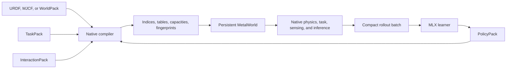
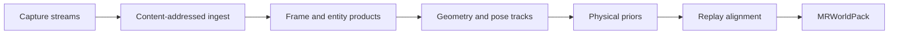
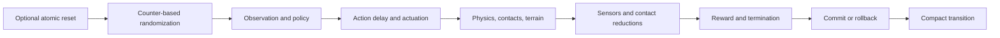

# MetalRobo world engine

MetalRobo treats robot simulation as compilation. Authored mechanics, scenes,
tasks, sensors, and policies are resolved once into immutable indices and
fixed-capacity GPU tables. Native Metal then executes those tables without
string lookup, robot-specific shader branches, or a host-side environment
loop.



There is one runtime architecture:

- mechanics and scene composition come from an `EngineModel`, imported robot,
  or `MRWorldPack`;
- robot-independent task semantics come from a `TaskPack`;
- optional generated motion/contact intent comes from an `InteractionPack`;
- actor/critic weights and normalization come from a `PolicyPack`;
- `MetalWorldContext` owns persistent simulator state and native submission;
- Swift owns rollout length, chunking, completion, timeouts, and policy
  revisions;
- MLX owns only batch learning and publishes the next PolicyPack.

## World authoring and artifacts

`EpisodeTwinCompiler` is the capture-to-world entry point. Its capture manifest
accepts synchronized RGB-D, robot telemetry and commands, ARKit/LiDAR, ROS
bags, CAD/URDF assets, and ordinary video. Streams retain timestamp domains,
calibration, and provenance.

The compiler uses a content-addressed artifact graph:



Provider outputs enter as typed products before world compilation. A geometry,
pose, calibration, or physical-prior product must alter the compiled world; it
cannot merely accompany an unchanged seed. Visual Presentation V3 is the only
authored presentation path. Collision geometry never becomes a fallback
visual scene.

`WorldTemplate` owns immutable topology. Each asset binds semantic identity,
render representation, collision representation, dynamics kind, and initial
state. `WorldProgram` declares reset-time distributions for appearance, object
configuration, clutter, physics, controller state, and sensors.

`WorldFamily` combines a template and program under one content fingerprint.
Its CPU sampler is for authoring and inspection. Production reset sampling
uses the same counter-based key structure in native Metal.

`MRWorldPack` is the persisted world boundary. It contains mechanics, scene
composition, authored presentation, sensors, task anchors, provenance, and
compiled variation data. Loading is transactional and rejects incompatible
format, ABI, payload length, content hash, or family fingerprint.

Compile a capture directly:

```sh
build/bin/metalrobo_episode_compile \
  capture.json worlds/cell-a.mrworld \
  --store worlds/cell-a.artifacts
```

Python may author or inspect artifacts, but it does not execute physics:

```python
from metalrobo.episode import compile_episode_manifest

pack = compile_episode_manifest(
    "capture.json",
    "worlds/cell-a.mrworld",
    artifact_store_path="worlds/cell-a.artifacts",
)
```

## TaskPack

`TaskPack` is the robot-independent closed-loop task description. It contains:

- action-to-joint bindings and action scales;
- temporal actor and asymmetric-critic observation operators plus direct
  device-observation suffixes, each with its own history contract;
- named semantic contact and joint groups;
- reward operators and continuous-time weights;
- termination priorities and reasons;
- reset and domain-randomization operators;
- sampled difficulty bands, pushes, terrain samples, and corruption parameters;
- the requested native capacity profile.

Names such as `left_ankle_pitch`, `foot_contact`, or `left_index_tip` exist
only at authoring time. `compileTaskProgram` resolves them against the selected
world and emits stable indices, compact tables, exact counts, validated
capacities, and a fingerprint. The GPU loop consumes no strings and has no
per-robot branch.

Projectile avoidance is authored through the same operators. A clearance
barrier resolves one dynamic scene body and one semantic protected-body group,
then evaluates the most-binding per-link constraint before contact. A dense
projectile-evasion operator supplies gross root clearance and stillness, while
event-scoped contact termination, clean-miss reward, ball-free standing
anchors, launch timing, and speed bands remain TaskPack data rather than
a robot-specific runtime path.

The bundled G1 task is one preset expressed through this same format. Imported
URDF robots and WorldPacks use the same compiler and executor:

```text
makeUnitreeG1LocomotionWorld
mr_create_urdf_locomotion_rollout
mr_create_world_pack_locomotion_rollout
              |
              v
      compileLocomotionWorld
              |
              v
      generic Metal task executor
```

A custom `.metal` kernel is justified only by a new physics primitive, sensor
modality, or task operator. A different joint layout is data, not shader code.

## InteractionPack: generated intent, solved outcome

`InteractionPack` v1 is the immutable bridge from a desired outcome or
generative motion/contact model into the native task compiler. A pack stores:

- source repository, exact revision, license, and the canonical
  `metalrobo_z_up_x_forward_xyzw` coordinate contract;
- named joints plus frame-rate-stamped root and joint targets;
- named contact tracks bound to TaskPack contact groups and one support
  counterpart;
- per-frame contact mode, confidence, provenance flags, and validity masks;
- a 13-value compact target field per contact: force 3 (N), torque 3 (N m),
  CoP 2 (m), occupied area 1 (m2), and row-major 2x2 pressure 4 (Pa), with
  matching tolerances in the same units.

`compileTaskProgram(task, interactions, clip, world, output)` retargets the
pack's named joints into the TaskPack action order and resolves every contact
track into stable native indices. Compilation is transactional. It rejects
missing or ambiguous names, a counterpart that is not the TaskPack terrain
body, joint positions outside the compiled mechanism limits, finite-difference
velocities above the compiled limits, or a contact track without the current
2x2 support-field contract. V1 also requires that terrain be the world's only
external scene body; this prevents a foot/object collision from being counted
as the requested foot/support-surface contact before counterpart-filtered
reductions exist. The selected provenance, intent, masks, targets, and
tolerances participate in the task fingerprint.

The Metal task executor advances the reference from episode time. Native
observation operators publish phase, live-minus-reference joint error,
expected contact/confidence, target fields, and their per-feature validity.
Native rewards
track joints and compare expected contact against the solver-resolved support
field. The implicit-position controller adds an authored fraction of the
student's normalized balance/control residual to the generated
mechanism-space motion target. Zero follows the generated guide; autonomous
evaluation disables the guide rather than misusing residual authority. The
reference can never write contact state or replace NumiSolver's force, CoP,
area, or pressure outcome. Non-looping clips set the bundled G1 interaction
task horizon from clip duration and control cadence.

Distillation follows the same coordinate contract. At zero student authority,
the label is ARDY's absolute normalized action for later autonomous use. With
nonzero authority, ARDY is already the motion base and the teacher label is a
zero residual; encoding the composed pose as a residual would apply the motion
twice. PPO may still learn a nonzero balance or recovery correction from the
solver-realized outcome. Each transition records whether the sampled policy
action was actually executed as a residual: those samples retain PPO weight
and receive no absolute-pose imitation weight. Pure zero-authority teacher
samples do the inverse.

TaskPack authors may set interaction student authority to zero for pure
shadow-mode distillation. The reference then executes without student
perturbation while the exact mechanism-scale target is still published as the
teacher action. G1 get-up uses this mode until the autonomous student is
qualified; ordinary interaction tracking retains bounded blended control.

The bundled C/Swift route
`mr_create_unitree_g1_interaction_rollout` / `MetalRoboTaskRolloutContext`
authors a reference-relative G1 realization task, then uses the unchanged
native rollout and MLX PPO path. Both actor and critic receive the reference
suffix. Root pose and velocity, joint motion, and confidence-weighted contact
intent are soft trajectory objectives; joint limits, energy, support slip, and
forbidden contacts remain solver-grounded costs. No absolute standing height,
world-upright, tilt, or root-velocity term is injected, because those would
contradict crouching, get-up, jumping, and rotation. Rollout `tracking_score`
is the confidence-normalized mean of the selected interaction tracking
operators, not the dormant locomotion-command metric.

ARDY conversion is deliberately narrower than the format. Its G1 CSV supplies
root plus 29 joint coordinates and its NPZ supplies four binary heel/toe
channels. The converter reorders root quaternions from wxyz to xyzw, validates
joint position and velocity envelopes, combines heel/toe into left/right
predicted contact modes, and leaves every physical-field validity mask empty.
It does not invent pressure from a boolean contact prediction:

```sh
metalrobo-ardy-interaction \
  --motion-npz /path/to/ardy-motion.npz \
  --qpos-csv /path/to/ardy-g1-qpos.csv \
  --output /path/to/motion.interactionpack \
  --id desired-outcome-001 \
  --clip-id ardy-g1 \
  --source-revision <ardy-git-revision> \
  --counterpart locomotion_ground
```

The smallest executable example deliberately asks for only one outcome:
`raise left hand`. It authors a smooth 61-frame left-shoulder reference,
retains both feet as predicted support contacts, converts the result through
the same InteractionPack boundary, and executes 50 control steps through the
native implicit drives and NumiSolver:

```sh
python3 examples/interaction/raise_left_hand.py \
  --output-directory build/raise-left-hand
```

On Apple M4, the retained proof completed `50 / 50` standing steps with zero
physics failures and zero terminations. The physical shoulder moved from
`0.350 rad` to `-0.811 rad`, mean interaction tracking was `0.9478`, and peak
tilt was `0.3257 rad`. An FP64 forward-kinematics inspection of accepted
states measured the left wrist COM rising by `0.190 m` relative to the pelvis
and `0.142 m` in world height by step 40. Negative shoulder pitch is important
for this model: it raises the hand forward; positive pitch sweeps it backward.
These are simulator measurements from this generated fixture, not human-motion
data or real-robot evidence.

The root trajectory is retained as auditable generative intent in v1, while
the native tracking objective uses joint and contact targets so the simulated
root remains a physical outcome. A calibrated contact generator can populate
pressure/wrench masks directly. Dense tactile maps, a learned contact-world
model, and a trained champion are not implied by this first executable slice.

### Physically realized imagination teacher

An InteractionPack may also compose with the bundled ball-dodge task. In that
case the generated clip supplies joint-space intent only: predicted generated
contacts are not accepted as projectile or support truth. Native closest
approach aligns the clip, the whole-body link CBF may correct its residual
action, and the implicit drive publishes the action that was actually sent to
NumiSolver in canonical deployment coordinates.

`PolicyRolloutPack` v6 carries that optional teacher-action stream. The MLX
learner back-labels an imagined window only after NumiSolver reports a clean
physical miss with no task termination or physics error. Every active imagined
threat window is excluded from the PPO actor ratio because its CBF-corrected
executed action may differ from the sampled action whose log probability was
recorded. Qualified samples receive a Huber action-distillation loss; the
critic still learns realized returns from both successes and failures. A
contact, fall, incomplete sequence, or rejected physics step leaves teacher
weight at zero.
Thus imagination proposes behavior, physics decides whether it becomes a
teacher, and an unsuccessful generated dodge is ordinary negative evidence.

Get-up distillation can run with zero student authority so collection
follows the physics-executed guide without an untrained policy perturbing it.
The actor receives only an elapsed recovery phase encoding alongside its
deployable proprioception; imagined joint errors and contact intent remain
critic-only. A recovery-mode controller can generate the same phase clock
after a fall without retaining the imagined trajectory.
Autonomous qualification uses `task_rollout --interaction-reset-only`: the
first interaction frame initializes the exact demonstrated fallen state, then
the reference is disconnected from control and teacher output. A policy only
passes when it generates the recovery itself under NumiSolver.
The same mode in `task_train` leaves the PPO actor enabled, making it the
closed-loop recovery path when an authored joint sequence is not itself a
successful physical teacher. Teacher usefulness is transition-local and
continuous. Accepted height progress, tilt recovery, stability, standing, and
restoration increase an action label's weight. A later collapse reduces its
own unstable labels but does not erase earlier physically useful actions.

Recovery sampling must not treat an interpolated animation frame as a
contact-valid physical state. `examples/interaction/get_up.py` can author a
reset pack from an accepted native state trace using
`--solver-state-trace`, `--solver-state-step`, and `--episode-frames`. The
trace payload hash is retained as source revision, all future contact modes
remain free, and the short episode horizon can be aligned with the learning
boundary. This supports a measured backward frontier over states that
NumiSolver actually reached; geometric `--start-frame` slices remain useful
for intent inspection but are not physical qualification evidence.

#### Get-up teacher use and staged pipeline

Use the ARDY interaction teacher when the desired motion is known more clearly
than the autonomous action policy: recovery, standing stabilization, a
supported transition, or another short contact-rich skill. Do not use it to
declare generated motion physically correct. ARDY proposes root, joint, and
contact intent; the native controller converts the joint target actually sent
to the mechanism into normalized teacher actions; NumiSolver remains the sole
authority for contact, support, state acceptance, termination, and outcome.

Get-up is trained as overlapping regions instead of one all-or-nothing
curriculum:

1. quiet stance and near-fall correction;
2. supported squat to quiet stance;
3. fallen state to supported squat;
4. one autonomous policy over the union, followed by full supine evaluation.

The get-up TaskPack uses reset bands `0...1` for supine states, `2` for a low
squat, `3` for a high squat, and `4...7` for standing. Invocation-level
`--minimum-difficulty-band` and `--maximum-difficulty-band` select a region
without cloning or changing the TaskPack. Height and tilt terminations apply
only to standing bands `4...7`: after an unrecoverable standing fall, the next
sample begins promptly instead of filling the remainder of the rollout with a
motionless body. Floor and squat regions retain low and tilted states as valid
learning states. These are sample-allocation boundaries, not policy-promotion
gates; continuous per-band phase metrics still report partial progress.

Author a solver-trace-backed teacher rather than resetting from an arbitrary
interpolated animation frame:

```sh
python3 examples/interaction/get_up.py \
  --output-directory runs/get-up-teacher \
  --solver-state-trace runs/accepted/state.tsv \
  --solver-state-step 1 \
  --solver-state-target stand \
  --episode-frames 258 \
  --generate-only
```

`--solver-state-target hold` repeats the accepted state for a support test;
`stand` interpolates an action-level squat-to-stand proposal toward the
physics-calibrated standing endpoint. A failed hold or guided rise rejects the
authored state as a teacher source, but it remains useful diagnostic evidence.

Collect and distill the teacher with no student authority:

```sh
numi train \
  --task supine-get-up --scene ground \
  --minimum-difficulty-band 4 --maximum-difficulty-band 4 \
  --interaction-pack runs/get-up-teacher/stand.interactionpack \
  --interaction-clip stand --interaction-student-authority 0 \
  --envs 1024 --steps 256 --updates 8 --chunk 8 \
  --imagination-distillation-coefficient 10 \
  --materialize-articulated-contact-responses
```

The behavior actor does not perturb this collection. Executed teacher actions
are excluded from the PPO actor ratio. Stable solver-realized transitions
receive continuous teacher weight and a Huber distillation loss; failed or
collapsed transitions do not become positive teacher labels. The critic still
learns their realized returns.

Disconnect the teacher for autonomous evaluation while preserving only its
first accepted reset state:

```sh
numi evaluate \
  --task supine-get-up --scene ground \
  --minimum-difficulty-band 4 --maximum-difficulty-band 4 \
  --interaction-pack runs/get-up-teacher/stand.interactionpack \
  --interaction-clip stand --interaction-reset-only \
  --policy-pack runs/get-up-student/deployment.policypack \
  --envs 256 --steps 256 --repeats 1 --chunk 8 \
  --materialize-articulated-contact-responses
```

The retained standing experiment used a native ankle calibration before
authoring: symmetric normalized ankle pitch `+0.22` mapped to a
`-0.040808 rad` target in the full-range get-up action contract. Its best
static sweep reached `0.9182` restored-state and `0.9426` quiet-stand
incidence. In a matched autonomous comparison, the ARDY-distilled student
reduced height/tilt terminations from `833` to `456`, raised restored-state
incidence from `0.7160` to `0.8389`, and reduced mean tilt from `0.2235 rad`
to `0.1096 rad`, with zero failed physics steps. The former authored high
squat did not remain dynamically supported and is intentionally not a teacher;
a solver-reached balanced squat is still required before extending this
pipeline toward the floor.

The raise-left-hand example validates generated joint intent through native
physics and accepted-state kinematics. It does not establish a successful
dodge teacher, a trained dodge policy, or sim-to-real transfer.

## PolicyPack

`PolicyPack` is the immutable learner/deployment boundary. It stores:

- actor normalization, dense layers, activations, and action transform;
- optional asymmetric critic normalization and layers;
- optional diagonal Gaussian exploration distribution;
- observation/action clips, policy identity, and revision.

`compilePolicyProgram` verifies actor/action dimensions against the compiled
TaskPack and fingerprints the complete program. Installation is transactional:
an incompatible or corrupt pack leaves the active policy unchanged.

The Metal hot loop evaluates the actor between native observation construction
and action application. A final critic-only evaluation can be appended to the
last rollout submission without advancing physics. Training PolicyPacks may be
stochastic; deployment PolicyPacks contain the same actor revision without an
exploration distribution.

`numi train` gives those artifacts distinct roles. The learner writes
`candidate.policypack` and `candidate.deployment.policypack`; it cannot write
the protected `deployment.policypack`. At learner startup it also publishes an
immutable deterministic `incumbent.deployment.policypack`. After training,
Numi evaluates incumbent and candidate with the same held-out seed, task,
horizon, authored packs, and solver mode. The candidate is always retained,
including when it demonstrates only partial progress or a useful failure.
Only the protected deployment artifact is selected: an atomic copy advances
to the candidate when task-specific physical outcomes improve without a
safety or physical-outcome regression; otherwise it remains byte-identical to
the incumbent. Both rollout records and `selection.json` are part of the run.
If matched evaluation fails or is interrupted, deployment is already restored
to the incumbent and the command reports failure rather than publishing an
unevaluated actor.

For zero-student-authority interaction collection, selection retains the
accepted interaction reset state but removes teacher actions. This prevents an
ARDY trajectory from satisfying the held-out comparison on behalf of the
student. Supine get-up selection measures per-environment termination,
bilateral support, knee excursion, pelvis descent, and return to the initial
pose; pelvis height or mean tilt alone is not treated as task completion.

## Persistent native execution

`MetalWorldContext` owns:

- the command queue, cached pipelines, and submission tickets;
- immutable topology and program tables;
- private q/v and scene state;
- manifold headers, points, pair caches, witnesses, and warm starts;
- actuator delay/backlash and sensor history;
- episode counters, physical-evidence state, and counter-based RNG streams;
- private placement heaps and bounded transient arenas.

Every control transition is one native transaction:



A reset atomically replaces articulation and scene state, manifolds, warm
starts, actuator state, tactile/sensor history, counters, sampled difficulty,
and RNG episode identity. A physics failure restores the environment's
control-step checkpoint and publishes a typed status; unrelated environments
continue.

Random values are keyed by environment, episode, control step, and operator.
Changing rollout chunk size or Swift scheduling therefore does not change the
physical sequence.

## Capacity contract

Capacity is compiled topology, not a best-effort allocation. Count, scan, and
scatter stages share canonical offsets. Record scatter consumes the finalized
canonical manifold count; it never rereads an unvalidated narrowphase count.
Constraint endpoint and articulation query capacities are derived exactly as
twice the compiled constraint-block capacity. An explicit mismatch fails
before allocation or dispatch.

The bundled G1 operational profile is measured rather than arbitrarily capped:
128 candidate/raw pairs, 32 manifolds, 64 constraint blocks, 192 rows, 1,024
mesh candidates, and matching derived tables. Higher-water workloads must
publish a new measured profile or fail transactionally; silent clipping is not
allowed.

## Native sensing

Geometry, contact, visual, and tactile stages use accepted body/contact buffers
from the same native timeline. Range and terrain queries reuse immutable
compiled geometry. Visual Presentation V3 resources remain independent from
collision geometry. Tactile sensors consume authored sensor geometry and
solver contact evidence; packs without tactile sensors allocate no tactile
state.

Task observation operators currently publish proprioception, commands,
terrain, contact metrics, compact support fields, interaction references, and
physical/controller parameters. Interaction pressure targets are intent;
their achieved values come from the same solver-resolved support field used by
the ordinary TaskPack operators. Adding dense native tactile summaries or
learned tactile features to a TaskPack still requires an explicit observation
operator and a composed native tactile stage. Dataset training alone does not
claim that runtime integration.

## Learning and rollout boundary

`metalrobo_task_rollout` and `metalrobo_task_train` are Swift executables.
Swift retains one native world, preallocates one rollout arena, submits bounded
chunks, handles completion/error reporting, and attaches a policy revision to
every batch.

The learner process receives a memory-mapped `PolicyRolloutPack` containing
only actor/critic observations, actions/latents, old log probabilities, values,
rewards, terminations, and compact diagnostics. MLX performs PPO updates and
writes the next native PolicyPack through the canonical C++ writer. It never
receives simulator caches or schedules a physics transition.

Timeout transitions include one native critic scalar evaluated from the
accepted post-transition history before reset. GAE uses that scalar while
still cutting recurrence at the episode boundary.

Every episode deterministically samples from all authored difficulty bands.
An authored exponent may bias sampling toward easier regions without excluding
hard evidence. The native task-wide reduction publishes exposure-normalized
physical outcomes only; it cannot hold, advance, or retreat learning. MLX
checkpoints therefore contain learner state, not simulator difficulty policy.

The former Python/MLX physics extension, MLX world state, task-specific PPO
collectors, and Python rollout/benchmark entry points have been removed.

Foundation policies remain on the same side of this boundary as any other
policy: they propose intent, never simulator state. `numi foundation infer`
emits a content-addressed action chunk plus execution evidence. A native
rollout or teacher compiler must map that named chunk into the robot's authored
action space and then measure it through the ordinary Metal physics path.
Keeping the adapter staged and provider-neutral allows slow-but-correct Apple
execution now without freezing the architecture around current latency or one
vendor runtime.

Ball-dodge learning uses a training-only prospective clearance reward derived
from the native whole-body threat query. It is the urgency-weighted signed
minimum predicted link/projectile clearance, so moving a threatened link away
from the collision course produces dense progress before the sparse physical
miss event. The deployment actor receives no privileged geometry: its
shape-compatible masked-depth history expands an exact segmented winner by
one pixel at 16x9 so small projectiles remain observable without adding a
host readback, tracker feature, or larger policy input.

Held-out dodge reporting publishes the complete physical outcome vector:
contacts, clean misses, balance failures, support behavior, throughput, and
uncertainty. No scalar verdict discards a valid candidate. The protected
deployment selection compares the immutable incumbent and candidate artifacts;
the candidate remains available whether or not it advances deployment.

## R2S2R boundary

World alignment and feedback remain artifact/data operations. Scenario keys,
outcomes, telemetry references, posterior populations, and learned failure
regions retain exact world/task/policy fingerprints. MLX may fit a posterior
or ensemble from compact records. Physical replay itself must execute through
the native world and publish a compact evidence artifact; a learner-side array
graph is not a second simulator.

## Focused validation

Use the smallest owner for a change:

```sh
cmake --build build --target metalrobo_task_program_check
./build/bin/metalrobo_task_program_check
# Supplying a real generated pack additionally executes the interaction
# operators on Metal and checks the C/Swift rollout boundary.
./build/bin/metalrobo_task_program_check /path/to/reference.interactionpack

./build/bin/metalrobo_task_rollout \
  --metallib build/shaders/MetalRobo.metallib \
  --envs 32 --steps 48 --repeats 20 --chunk 8 \
  --scene terrain --native-policy

cd python
python3 probes/mlx_policy_learning_check.py \
  --library ../build/lib/libmetalrobo.dylib
```

The task-program check owns semantic resolution, capacity invariants, artifact
round trips, and TaskPack/PolicyPack compatibility. The Swift rollout owns
resident state, submission chunking, reset transactionality, inference, and
compact publication. The learner check performs a real PPO update without
importing or scheduling simulator state.

## Main implementation files

- `include/metalrobo/LocomotionWorld.hpp`
- `include/metalrobo/InteractionPack.hpp`
- `include/metalrobo/TaskProgram.hpp`
- `include/metalrobo/PolicyProgram.hpp`
- `include/metalrobo/MetalWorld.hpp`
- `include/metalrobo/MetalWorldFamily.hpp`
- `include/metalrobo/WorldPack.hpp`
- `src/core/LocomotionWorld.cpp`
- `src/core/TaskProgram.cpp`
- `src/core/PolicyProgram.cpp`
- `src/core/WorldPack.cpp`
- `src/metal/MetalWorld.mm`
- `src/metal/LocomotionTask.metal`
- `src/metal/PolicyInference.metal`
- `bindings/swift/MetalRoboTaskRollout.swift`
- `apps/task_rollout.swift`
- `apps/task_train.swift`
- `python/metalrobo/mlx_policy_learning.py`
- `python/metalrobo/mlx_policy_worker.py`
- `python/metalrobo/ardy_interaction_convert.py`
