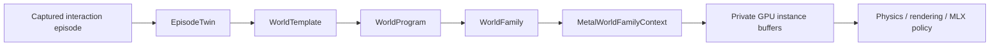
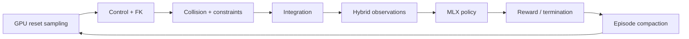

# MetalRobo world engine

MetalRobo treats real-to-sim as compilation. An interaction episode becomes a
typed world template; a declarative program expands that template into a
family; the family is sampled into persistent Metal buffers that physics,
rendering, sensors, policies, and learning can consume without a host-side
environment loop.



The representation split follows the useful principle demonstrated by
[SceniX](https://real2sim-eval.github.io/) and
[World Labs](https://www.worldlabs.ai/blog/real-to-sim-to-real): visual and
physical representations are selected independently for each task-relevant
part of a world. MetalRobo does not force a Gaussian background, articulated
robot, rigid object, and future deformable object into one geometry type.

## Episode capture and artifact graph

`EpisodeTwinCompiler` is the executable real-to-sim entry point. Its versioned
capture manifest accepts ARKit/LiDAR, synchronized RGB-D and robot telemetry,
ROS bags, libfranka logs, CAD/URDF bundles, or ordinary video. Each stream
retains its timestamp domain and may carry camera intrinsics, distortion, and
the measured sensor pose.

The compiler runs the same artifact graph for every adapter:

```mermaid
flowchart LR
    A["Capture streams"] --> B["Content-addressed ingest"]
    B --> C["Frame selection"]
    C --> D["Entity discovery"]
    D --> E["Segmentation"]
    E --> F["Geometry + pose tracks"]
    F --> G["Physical priors"]
    G --> H["Replay assembly"]
    H --> I["Replay alignment"]
    I --> J["MRWorldPack"]
```



Files and directory assets are SHA-256 addressed under
`objects/sha256`. A stage receipt is keyed by the seed world, engine model,
all upstream content hashes, declared products, and the IDs and versions of
supporting providers. Compatible work resumes without recomputing earlier
stages. Provider outputs are imported before they enter `EpisodeTwin`, so a
bounded VLM decision, deterministic segmentation, reconstruction, calibration,
or batched fitting tool has the same provenance and invalidation semantics.

The initial registered assembler is `franka_pick_place`; the C++ provider and
manifest APIs are not tied to that robot. The JSON contract lives in
`schemas/capture_manifest.schema.json`. A minimal synchronized capture is:

```json
{
  "schema_version": 1,
  "id": "cell_a_pick_place",
  "adapter": "rgbd_robot_telemetry",
  "engine_model": "franka_pick_place",
  "world_program": "franka_pick_place",
  "seed_world": "franka_pick_place",
  "streams": [
    {
      "id": "fixed_rgbd",
      "kind": "rgbd",
      "sensor_id": "fixed_rgbd",
      "path": "fixed-camera.capture",
      "rate_hz": 30,
      "calibration": {
        "width": 1280,
        "height": 720,
        "intrinsics": [915.2, 914.8, 640.0, 360.0]
      }
    },
    {
      "id": "franka_state",
      "kind": "robot_telemetry",
      "path": "robot-state.parquet",
      "rate_hz": 1000
    }
  ]
}
```

Compile it directly:

```bash
build/bin/metalrobo_episode_compile \
  capture.json worlds/cell-a.mrworld \
  --store worlds/cell-a.artifacts
```

or from Python:

```python
from metalrobo import compile_episode_manifest, PackedWorldFamily

pack = compile_episode_manifest(
    "capture.json",
    "worlds/cell-a.mrworld",
    artifact_store_path="worlds/cell-a.artifacts",
)
worlds = PackedWorldFamily(pack, capacity=4096)
```

## Implemented compiler spine

`EpisodeTwin` is the persistent artifact graph for one physical task. It owns
assets, sensors, task anchors, measured or derived artifacts, timing, and the
canonical `EngineModel`. Artifact records distinguish measured inputs,
deterministic tool outputs, bounded agent decisions, and authored inputs.

`WorldTemplate` is the immutable compiled topology. Each `WorldAsset` binds:

- semantic identity, role, anchors, and topology cohort;
- Gaussian, PBR mesh, neural residual, procedural, or absent rendering;
- primitive, convex, triangle, SDF, or deformable collision;
- static, kinematic, rigid, articulated, rod, shell, or soft-volume dynamics;
- initial physical, controller, appearance, and sensor state.

`WorldProgram` declares independent distributions along the six initial
variation axes:

- appearance;
- object configuration;
- clutter;
- physics;
- robot/controller state;
- camera and sensor state.

Compilation resolves string identities to compact indices and emits
pointer-free `MRWorldVariationGPU` records. Topology remains outside sampled
state, so one runtime batch contains only compatible worlds. Asset alternatives
are indices, while continuous values are sampled at reset.

`WorldFamily` combines one template with one compiled program and a stable
content fingerprint. Its CPU sampler is useful for authoring and offline pack
construction. Runtime sampling uses the same Philox4x32-10 key structure in a
native Metal kernel.

## Persistent Metal family runtime

`MetalWorldFamilyContext::compile` performs the expensive work once:

1. validates and snapshots the family;
2. resolves each asset to immutable body, shape, material, and articulation
   index ranges;
3. materializes base asset, sensor, appearance, robot-coordinate, and
   scene-body records;
4. uploads base records, variation descriptors, categorical tables, and
   binding arenas to private Metal storage;
5. allocates private instance and physics-reset arenas at the requested
   capacity;
6. retains the sampling and physics-materialization pipelines.

`sample(instanceCount, seed)` updates one 48-byte shared uniform record and
dispatches one thread per environment. Each thread:

1. derives its independent Philox counter;
2. copies shared immutable records into its compact instance range;
3. applies authored variations directly to structure-of-arrays-compatible
   records;
4. publishes its scenario key, range table, flags, and ABI version.

A second dispatch in the same command buffer resolves those assets into the
exact environment-major reset layout used by the physics graph. No CPU loop
walks assets or environments.

| Buffer | Record | Downstream consumers |
| --- | --- | --- |
| instance headers | `MRWorldInstanceHeaderGPU` | reset, compaction, cohort dispatch |
| asset instances | `MRWorldAssetInstanceGPU` | physics, collision, rendering |
| sensor instances | `MRWorldSensorInstanceGPU` | RGB-D/state sensor kernels |
| appearances | `MRWorldAppearanceInstanceGPU` | Gaussian/PBR camera pipeline |
| reset q / v | `float` | selected articulation state |
| reset scene bodies | `MRBodyStateGPU` | dynamic, static, and kinematic scene state |
| body parameters | `MRWorldBodyParametersGPU` | mass, friction, restitution, damping overrides |
| controller parameters | `MRWorldControllerParametersGPU` | gain, damping, latency, payload overrides |

`nativeBuffer()` exposes borrowed `id<MTLBuffer>` handles to Objective-C++ and
MLX extensions. `readback()` and `readbackPhysics()` are explicit inspection
operations and are not part of the training loop.

## Runnable anchor world and portable packs

The first executable topology is the FER Panda plus official Franka Hand, one
dynamic pick cube, a support plane, a target plate, and dynamic clutter. The
hand contributes an explicit fixed palm joint and two prismatic finger
coordinates, producing 11 articulated bodies, 9 generalized coordinates, and
32 robot collision shapes. Robot self-collision is disabled as one group in
this first profile; robot/object and free-object/support contact remain
enabled.

`MRWorldPack` format v1 serializes the complete rich `WorldFamily`: engine
topology, semantic assets and anchors, sensors, task, provenance artifacts,
cohorts, compiled variations, and binding arenas. The file has explicit format,
engine ABI, compiler ABI, payload length, content hash, and family fingerprints.
Loading is transactional. `metalrobo_world_pack` creates or inspects packs, and
`mr_load_world_family_pack` / `PackedWorldFamily` compile them directly into
the persistent Metal runtime.

## C++ use

```cpp
auto episode = metalrobo::makeFrankaPickPlaceEpisodeTwin();

metalrobo::WorldTemplate worldTemplate;
metalrobo::compileEpisodeTwin(
    episode,
    metalrobo::makeFrankaPickPlaceEngineModel(),
    worldTemplate
);

metalrobo::WorldFamily family;
metalrobo::compileWorldFamily(
    worldTemplate,
    metalrobo::makeFrankaPickPlaceWorldProgram(),
    family
);

metalrobo::MetalWorldFamilyContext worlds;
worlds.compile(family, 4096);
worlds.sample(4096, 1);

void* assetBuffer = worlds.nativeBuffer(
    metalrobo::MetalWorldFamilyBuffer::assetInstances
);
```

The native C ABI provides the same canonical Franka family and borrowed Metal
buffer handles. The Python wrapper performs no per-environment work:

```python
from metalrobo.worlds import FrankaPickPlaceWorldFamily

with FrankaPickPlaceWorldFamily(capacity=4096) as worlds:
    worlds.sample(4096, seed=1)
    buffers = worlds.device_buffers  # borrowed native Metal buffers
```

Call `worlds.snapshot()` only when a stable NumPy copy is needed for inspection
or export.

The MLX bridge imports the private reset buffers on MLX's active Metal command
encoder:

```python
import mlx.core as mx
from metalrobo import (
    FrankaPickPlaceWorldFamily,
    compile_world,
    initial_state_from_world_family,
    step,
)

count = 4096
with FrankaPickPlaceWorldFamily(count) as family:
    family.sample(count, seed=1)
    world = compile_world(
        "franka",
        scene="pick_place",
        environment_capacity=count,
        solver_mode="throughput_tgs",
        actuation_mode="implicit_position",
    )
    state = initial_state_from_world_family(world, family)
    actions = mx.broadcast_to(
        mx.array(world.default_q, dtype=mx.float32),
        (count, world.nv),
    )
    output = step(world, state, actions)
```

The import is lazy, retains the borrowed Metal buffers through evaluation, and
does not use NumPy or a CPU state copy.

## Runtime integration sequence

The family buffers are the reset/configuration input to the existing
`MetalWorldContext` and MLX active-encoder graph. The intended persistent step
is:



The current code establishes the resumable episodic artifact graph, Apple
capture-manifest loader, content-addressed store, compiler provider boundary,
portable pack, runnable hand scene, resident family sampling, physics-reset
materialization, and a zero-copy MLX state bridge. Asset pose variation already
changes the executed scene state. Per-body physical and per-articulation
controller override streams are materialized and exposed; consuming those
override streams inside every contact/drive kernel is the next solver slice.
Native segmentation/reconstruction providers, hybrid Gaussian/mesh RGB-D,
replay fitting, rods, shells, and soft volumes remain separate modules behind
the provider and representation interfaces already present in the ABI.

## Main implementation files

- `include/metalrobo/WorldCompiler.hpp`
- `include/metalrobo/world_compiler_types.h`
- `src/core/WorldCompiler.cpp`
- `include/metalrobo/WorldPack.hpp`
- `src/core/WorldPack.cpp`
- `include/metalrobo/EpisodeTwinCompiler.hpp`
- `src/core/EpisodeTwinCompiler.cpp`
- `src/apple/CaptureManifestJSON.mm`
- `schemas/capture_manifest.schema.json`
- `include/metalrobo/MetalWorldFamily.hpp`
- `src/metal/MetalWorldFamily.mm`
- `src/metal/WorldCompiler.metal`
- `include/metalrobo/FrankaWorld.hpp`
- `src/core/FrankaWorld.cpp`
- `src/core/FrankaHand.cpp`
- `python/metalrobo/worlds.py`
- `python/metalrobo/mlx_world.py`
- `python/mlx_ext/metalrobo_mlx.cpp`
