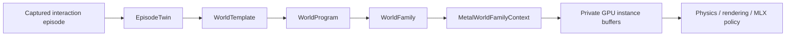
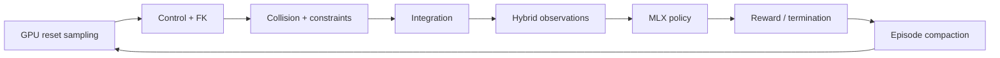

# MetalRobo world engine

MetalRobo treats real-to-sim as compilation. An interaction episode becomes a
typed world template; a declarative program expands that template into a
family; the family is sampled into persistent Metal buffers that physics,
rendering, sensors, policies, and learning can consume without a host-side
environment loop.



The representation split follows the useful principle demonstrated by
[SceniX](https://real2sim-eval.github.io/) and
[World Labs](https://www.worldlabs.ai/blog/real-to-sim-to-real): visual and
physical representations are selected independently for each task-relevant
part of a world. MetalRobo does not force a Gaussian background, articulated
robot, rigid object, and future deformable object into one geometry type.

## Episode capture and artifact graph

`EpisodeTwinCompiler` is the executable real-to-sim entry point. Its versioned
capture manifest accepts ARKit/LiDAR, synchronized RGB-D and robot telemetry,
ROS bags, libfranka logs, CAD/URDF bundles, or ordinary video. Each stream
retains its timestamp domain and may carry camera intrinsics, distortion, and
the measured sensor pose.

The compiler runs the same artifact graph for every adapter:

```mermaid
flowchart LR
    A["Capture streams"] --> B["Content-addressed ingest"]
    B --> C["Frame selection"]
    C --> D["Entity discovery"]
    D --> E["Segmentation"]
    E --> F["Geometry + pose tracks"]
    F --> G["Physical priors"]
    G --> H["Replay assembly"]
    H --> I["Replay alignment"]
    I --> J["MRWorldPack"]
```



Files and directory assets are SHA-256 addressed under
`objects/sha256`. A stage receipt is keyed by the seed world, engine model,
all upstream content hashes, declared products, and the IDs and versions of
supporting providers. Compatible work resumes without recomputing earlier
stages. Provider outputs are imported before they enter `EpisodeTwin`, so a
bounded VLM decision, deterministic segmentation, reconstruction, calibration,
or batched fitting tool has the same provenance and invalidation semantics.

The initial registered assembler is `franka_pick_place`; the C++ provider and
manifest APIs are not tied to that robot. Schema 2 is the fail-closed physical
path. Imported files become typed `EpisodeTwinProduct` records, and the
assembler uses them to change sensor calibration, object pose, render binding,
the actual cooked collision shape, and physical priors before compiling the
world. A product cannot merely accompany an unchanged seed world.

The JSON contract lives in `schemas/capture_manifest.schema.json`. A minimal
Franka/fixed-RGB-D capture is:

```json
{
  "schema_version": 2,
  "id": "cell_a_pick_place",
  "adapter": "rgbd_robot_telemetry",
  "capture_profile": "franka_fixed_rgbd",
  "engine_model": "franka_pick_place",
  "world_program": "franka_pick_place",
  "seed_world": "franka_pick_place",
  "streams": [
    {
      "id": "fixed_rgbd",
      "kind": "rgbd",
      "sensor_id": "fixed_rgbd",
      "path": "fixed-camera.capture",
      "rate_hz": 30,
      "calibration": {
        "width": 1280,
        "height": 720,
        "intrinsics": [915.2, 914.8, 640.0, 360.0],
        "position": [0.8, -0.6, 0.8],
        "orientation": [0, 0, 0, 1]
      }
    },
    {
      "id": "franka_state",
      "kind": "robot_telemetry",
      "path": "robot-state.parquet",
      "rate_hz": 1000
    },
    {
      "id": "franka_commands",
      "kind": "robot_commands",
      "asset_id": "franka",
      "path": "robot-commands.parquet",
      "rate_hz": 1000
    }
  ],
  "products": [
    {
      "id": "entity_support_graph",
      "stage": "discover_entities",
      "kind": "entity_graph",
      "producer": "agent_decision",
      "product_kind": "semantic_graph",
      "path": "entity-support-graph.json"
    },
    {
      "id": "pick_object_render",
      "stage": "reconstruct_geometry",
      "kind": "geometry",
      "producer": "deterministic_tool",
      "product_kind": "render_geometry",
      "target_id": "pick_object",
      "render_representation": "gaussian_field",
      "path": "pick-object.splat"
    },
    {
      "id": "pick_object_collision",
      "stage": "reconstruct_geometry",
      "kind": "geometry",
      "producer": "deterministic_tool",
      "product_kind": "collision_geometry",
      "target_id": "pick_object",
      "collision_representation": "primitives",
      "collision_box_half_extents": [0.031, 0.022, 0.041],
      "path": "pick-object-collision.json"
    },
    {
      "id": "pick_object_pose",
      "stage": "track_poses",
      "kind": "pose_track",
      "producer": "deterministic_tool",
      "product_kind": "object_pose_track",
      "target_id": "pick_object",
      "world_pose": {
        "position": [0.57, -0.04, 0.031],
        "orientation": [0, 0, 0, 1]
      },
      "path": "pick-object-pose.parquet"
    }
  ]
}
```

The `franka_fixed_rgbd` profile refuses publication if calibrated RGB-D,
robot state, robot commands, the semantic graph, manipulated-object pose,
render geometry, or collision geometry is missing. Schema 1 remains only as
the authored-seed compatibility path.

Compile it directly:

```bash
build/bin/metalrobo_episode_compile \
  capture.json worlds/cell-a.mrworld \
  --store worlds/cell-a.artifacts
```

or from Python:

```python
from metalrobo import compile_episode_manifest, PackedWorldFamily

pack = compile_episode_manifest(
    "capture.json",
    "worlds/cell-a.mrworld",
    artifact_store_path="worlds/cell-a.artifacts",
)
worlds = PackedWorldFamily(pack, capacity=4096)
```

## Implemented compiler spine

`EpisodeTwin` is the persistent artifact graph for one physical task. It owns
assets, sensors, task anchors, measured or derived artifacts, timing, and the
canonical `EngineModel`. Artifact records distinguish measured inputs,
deterministic tool outputs, bounded agent decisions, and authored inputs.

`WorldTemplate` is the immutable compiled topology. Each `WorldAsset` binds:

- semantic identity, role, anchors, and topology cohort;
- Gaussian, PBR mesh, neural residual, procedural, or absent rendering;
- primitive, convex, triangle, SDF, or deformable collision;
- static, kinematic, rigid, articulated, rod, shell, or soft-volume dynamics;
- initial physical, controller, appearance, and sensor state.

`WorldProgram` declares independent distributions along the six initial
variation axes:

- appearance;
- object configuration;
- clutter;
- physics;
- robot/controller state;
- camera and sensor state.

Compilation resolves string identities to compact indices and emits
pointer-free `MRWorldVariationGPU` records. Topology remains outside sampled
state, so one runtime batch contains only compatible worlds. Asset alternatives
are indices, while continuous values are sampled at reset.

`WorldFamily` combines one template with one compiled program and a stable
content fingerprint. Its CPU sampler is useful for authoring and offline pack
construction. Runtime sampling uses the same Philox4x32-10 key structure in a
native Metal kernel.

## Persistent Metal family runtime

`MetalWorldFamilyContext::compile` performs the expensive work once:

1. validates and snapshots the family;
2. resolves each asset to immutable body, shape, material, and articulation
   index ranges;
3. materializes base asset, sensor, appearance, robot-coordinate, and
   scene-body records;
4. uploads base records, variation descriptors, categorical tables, and
   binding arenas to private Metal storage;
5. allocates private instance and physics-reset arenas at the requested
   capacity;
6. retains the sampling and physics-materialization pipelines.

`sample(instanceCount, seed)` updates one 48-byte shared uniform record and
dispatches one thread per environment. Each thread:

1. derives its independent Philox counter;
2. copies shared immutable records into its compact instance range;
3. applies authored variations directly to structure-of-arrays-compatible
   records;
4. publishes its scenario key, range table, flags, and ABI version.

A second dispatch in the same command buffer resolves those assets into the
exact environment-major reset layout used by the physics graph. No CPU loop
walks assets or environments.

| Buffer | Record | Downstream consumers |
| --- | --- | --- |
| instance headers | `MRWorldInstanceHeaderGPU` | reset, compaction, cohort dispatch |
| asset instances | `MRWorldAssetInstanceGPU` | physics, collision, rendering |
| sensor instances | `MRWorldSensorInstanceGPU` | RGB-D/state sensor kernels |
| appearances | `MRWorldAppearanceInstanceGPU` | Gaussian/PBR camera pipeline |
| reset q / v | `float` | selected articulation state |
| reset scene bodies | `MRBodyStateGPU` | dynamic, static, and kinematic scene state |
| body parameters | `MRWorldBodyParametersGPU` | mass, friction, restitution, damping overrides |
| controller parameters | `MRWorldControllerParametersGPU` | gain, damping, latency, payload overrides |

`nativeBuffer()` exposes borrowed `id<MTLBuffer>` handles to Objective-C++ and
MLX extensions. `readback()` and `readbackPhysics()` are explicit inspection
operations and are not part of the training loop.

## Native hybrid observation renderer

`MetalHybridRenderer` is the first executable observation backend. It consumes
sampled `MRWorldInstanceHeaderGPU`, asset, sensor, and appearance buffers
directly from `MetalWorldFamilyContext`; no environment state is repacked on
the CPU. Gaussian fields are uploaded once and remain in private storage.

The Metal 4 path currently:

1. transforms asset-local or world-space Gaussians into each sampled world;
2. composes the parent asset and sensor pose into a world camera;
3. projects oriented anisotropic 3D covariance into a screen-space conic with
   sampled focal scale and radial/tangential distortion;
4. bins splats into 16×16 tiles with bounded atomic append;
5. bitonic-sorts each tile front-to-back in threadgroup memory;
6. accumulates Gaussian transmittance and writes RGB, metric depth, and
   semantic segmentation;
7. applies sampled exposure, white balance, saturation, contrast, RGB noise,
   depth noise, and depth dropout.

RGB, depth, segmentation, projected-splat, and per-world tile-overflow buffers
stay private and are available as borrowed `id<MTLBuffer>` handles for MLX
graph composition. Readback is an explicit diagnostic boundary. A tile that
exceeds its compiled splat capacity increments a device-resident counter
instead of silently hiding the condition.

```python
from metalrobo import (
    FrankaPickPlaceWorldFamily,
    HybridObservationRenderer,
    make_asset_gaussians,
)

splats = make_asset_gaussians(
    means, scales, colors, asset_indices, semantic_labels
)
with FrankaPickPlaceWorldFamily(256) as worlds:
    worlds.sample(256, seed=1)
    with HybridObservationRenderer(
        splats,
        asset_count=5,
        capacity=256,
    ) as renderer:
        renderer.render(worlds, camera_index=0)
        device_buffers = renderer.device_buffers
```

This first backend establishes the batch/tile/camera/output ABI and rigid asset
motion. Body-local Gaussian bindings are reserved in the shared ABI; consuming
articulated link poses, deformable four-node skinning, mesh depth/normals and
shadow compositing are the next renderer layers.

## Runnable anchor world and portable packs

The first executable topology is the FER Panda plus official Franka Hand, one
dynamic pick cube, a support plane, a target plate, and dynamic clutter. The
hand contributes an explicit fixed palm joint and two prismatic finger
coordinates, producing 11 articulated bodies, 9 generalized coordinates, and
32 robot collision shapes. Robot self-collision is disabled as one group in
this first profile; robot/object and free-object/support contact remain
enabled.

`MRWorldPack` format v4 serializes the complete rich `WorldFamily`: engine
topology, semantic assets and anchors, sensors, task, provenance artifacts,
cohorts, semantic variation/target identities, compiled variations, and binding
arenas. The file has explicit format, engine ABI, compiler ABI, payload length,
content hash, and family fingerprints. Loading is transactional.
`metalrobo_world_pack` creates or inspects packs, and
`mr_load_world_family_pack` / `PackedWorldFamily` compile them directly into
the persistent Metal runtime.

## C++ use

```cpp
auto episode = metalrobo::makeFrankaPickPlaceEpisodeTwin();

metalrobo::WorldTemplate worldTemplate;
metalrobo::compileEpisodeTwin(
    episode,
    metalrobo::makeFrankaPickPlaceEngineModel(),
    worldTemplate
);

metalrobo::WorldFamily family;
metalrobo::compileWorldFamily(
    worldTemplate,
    metalrobo::makeFrankaPickPlaceWorldProgram(),
    family
);

metalrobo::MetalWorldFamilyContext worlds;
worlds.compile(family, 4096);
worlds.sample(4096, 1);

void* assetBuffer = worlds.nativeBuffer(
    metalrobo::MetalWorldFamilyBuffer::assetInstances
);
```

The native C ABI provides the same canonical Franka family and borrowed Metal
buffer handles. The Python wrapper performs no per-environment work:

```python
from metalrobo.worlds import FrankaPickPlaceWorldFamily

with FrankaPickPlaceWorldFamily(capacity=4096) as worlds:
    worlds.sample(4096, seed=1)
    buffers = worlds.device_buffers  # borrowed native Metal buffers
```

Call `worlds.snapshot()` only when a stable NumPy copy is needed for inspection
or export.

The MLX bridge imports the private reset buffers on MLX's active Metal command
encoder:

```python
import mlx.core as mx
from metalrobo import (
    FrankaPickPlaceWorldFamily,
    compile_world,
    initial_controller_delay_state,
    sampled_state_from_world_family,
    step_sampled_world_family,
)

count = 4096
with FrankaPickPlaceWorldFamily(count) as family:
    family.sample(count, seed=1)
    world = compile_world(
        "franka",
        scene="pick_place",
        environment_capacity=count,
        solver_mode="throughput_tgs",
        actuation_mode="implicit_position",
    )
    state = sampled_state_from_world_family(world, family)
    actions = mx.broadcast_to(
        mx.array(world.default_q, dtype=mx.float32),
        (count, world.nv),
    )
    delay = initial_controller_delay_state(
        count,
        world.nv,
        maximum_delay_steps=4,
    )
    output = step_sampled_world_family(
        world,
        state,
        actions,
        delay,
        control_period_seconds=world.control_timestep,
    )
```

The import is lazy, retains the borrowed Metal buffers through evaluation, and
does not use NumPy or a CPU state copy.

## Franka manipulation and explicit world-step contract

The first policy port emits either normalized joint targets or a Cartesian
delta pose plus gripper command. `FrankaActionAdapter` also produces bounded
operational-space impedance feedforward with analytic Jacobians, damped
least-squares null-space control, joint/torque/rate limits, and payload
compensation. Controller delay and sampled gains remain explicit world state.

`FrankaPickPlaceTaskState` advances through approach, pre-grasp, bilateral
contact, stable grasp, lift, transport, place, release, and settle. Success
requires finger-contact evidence, lift, target containment, release,
object/support contact, low object velocity, and a sustained settling window.
Physics-invalid transitions receive no reward or success.

The policy-independent `WorldStepRequest` / `WorldStepResult` contract carries
the sampled scenario, episode counter, observations, privileged evidence,
termination reason, physics validity, and compact completed record. A
privileged MLX teacher retargets these same phases per sampled scene and adds a
deterministic clearance waypoint when clutter blocks approach or transport.
Only trajectories that complete the task through physics are suitable for the
demonstration set.

## Executable R2S2R learning loop

Every compiled `WorldProgram` now publishes a stable `ScenarioSchema`. Each
device-resident scenario carries its key, independent episode counter, raw
value, base-distribution quantile, categorical choice, sampling source, and
alignment/feedback fingerprints. This state follows the world through reset,
physics, policy execution, outcome compaction, and later hardware association.

`WorldAlignmentPopulation` preserves as many as 4,096 weighted quantile-space
particles. The native and MLX fitters run four-round robust sequential Monte
Carlo with effective-sample resampling and local jitter. A replay evaluator is
a bounded callback over the complete candidate tensor, so trajectory, depth,
mask, contact-time, controller-latency, and terminal-state residual kernels can
be composed without changing the immutable anchor world. Multiple contact
explanations remain separate particles. Replay validity is a separate channel:
a non-finite/failed replay row receives zero posterior mass, and alignment
fails if no physically valid candidate remains. Transactional rollback can
therefore never look like a low-residual twin.

The family sampler has three explicit modes:

- `coverage` samples the aligned posterior without feedback bias;
- `curriculum` samples 50% broad aligned coverage, 30% policy failure regions,
  and 20% policy uncertainty regions.
- `replay` maps alignment particle *i* to environment *i* exactly, disables
  quantile jitter, and assigns a distinct episode counter to every candidate.
  It is the deterministic simulator-in-the-loop fitting boundary rather than a
  training distribution.

Mass/inertia, friction, restitution, damping, controller gains, and controller
damping affect the active Metal/MLX physics path. Controller latency is an
explicit MLX command-history state. Render and collision alternatives are
stable resource indices; topology-changing alternatives stay in separate
cohorts. Camera, appearance, clutter, object, physics, and robot variations all
remain visible in the same scenario tensor.

Completed episodes are accumulated and sorted into a dense fixed-record prefix
on MLX. The host reads only that prefix at a rollout-chunk boundary. Each record
retains return, success, termination, failure tags, task/safety margins,
visibility/contact summaries, physics status, and exact scenario provenance.

`R2S2RCoordinator` stores searchable metadata and outcomes in SQLite/WAL. Array
populations, ensemble parameters, outcome batches, telemetry references, and
feedback programs are immutable SHA-256 artifacts. A five-member MLX ensemble
learns a simulation success/margin head and, only when real outcomes exist, a
sparse hardware-residual head. It scores 65,536 deterministic candidate
scenarios on the Apple GPU and compiles at most 64 failure/uncertainty boxes
back into the Metal sampler. With no real outcomes, the artifact says
`unavailable_sim_only`; it does not manufacture a hardware prediction.

The coordinator CLI is:

```bash
metalrobo align \
  --replay-manifest physical-replay.json \
  --root runs/pick-place-r2s2r

metalrobo record-sim \
  --manifest simulation-outcomes.json \
  --root runs/pick-place-r2s2r

metalrobo ingest-real \
  --manifest hardware-outcome.json \
  --root runs/pick-place-r2s2r

metalrobo fit-feedback \
  --policy-fingerprint 0123456789abcdef \
  --task-fingerprint 1111111111111111 \
  --embodiment-fingerprint 2222222222222222 \
  --root runs/pick-place-r2s2r

metalrobo train \
  --backend mlx \
  --task franka-family-pick-place \
  --alignment-hash ALIGNMENT_SHA256 \
  --feedback-hash FEEDBACK_SHA256 \
  --sampling-mode curriculum \
  --r2s2r-root runs/pick-place-r2s2r

metalrobo evaluate \
  --task-fingerprint 1111111111111111 \
  --policy-fingerprints 0123456789abcdef fedcba9876543210 \
  --root runs/pick-place-r2s2r
```

`schemas/hardware_outcome.schema.json` is the versioned real-outcome boundary.
It accepts policy, robot, and task identity; named scenario measurements and
explicit missing masks; outcome/margin/failure evidence; and content-hashed
telemetry or video references. Hardware outcomes without an exact simulation
key still enter the residual head through normalized scenario features.

`PolicyEvaluationReport` v2 compares checkpoints on the intersection of exact
coverage scenario keys. It publishes paired success and task-margin deltas with
deterministic bootstrap intervals, Mean Maximum Rank Violation, rank
correlation, calibration error, failure-tag overlap, central-ID/tail-OOD axis
slices, hardware evidence count, and ensemble predictive variance. Hardware
ranking metrics remain unavailable until at least two policies have real
evidence; a single result is reported as sparse evidence rather than an
unqualified prediction.

The version-2 replay manifest executes the physical command stream through the
contact-capable Franka world rather than fitting a residual surrogate:

```json
{
  "schema_version": 2,
  "scenario_schema": "systematic_pick_place_family_v1.scenarios",
  "episode_twin_hash": "EPISODE_TWIN_SHA256",
  "trace_npz": "aligned-physical-episode.npz",
  "command_semantics": "joint_position_target",
  "control_period_seconds": 0.0166666667,
  "solver_mode": "quality_newton",
  "residual_scales": {
    "robot_q": 0.05,
    "robot_v": 0.2,
    "object_position": 0.02,
    "rod_position": 0.01
  }
}
```

The NPZ contains `commands[T,nv]` and `robot_q[T+1,nq]`. Optional measured
arrays are `robot_v[T+1,nv]`, `object_positions[T+1,K,3]`,
`scene_body_indices[K]`, `contact_active[T]`, `rod_positions[T+1,R,3]`, and
`rod_node_indices[R]`. Missing data uses `robot_q_mask`, `robot_v_mask`,
`object_position_mask`, `contact_mask`, and `rod_position_mask`; object and rod
masks may omit the final xyz dimension. Capture providers resample all streams
to the declared control period and transform positions into the anchor-world
frame before publication.

`MLXPhysicalReplayEvaluator` uploads candidate quantiles only at the four SMC
round boundaries. Private Metal buffers then materialize one exact world per
candidate. The complete command replay, controller delay, contact physics,
robot/object trajectories, terminal state, contact timing, physics status, and
residual reductions stay in MLX on the Apple GPU. Rod-marker arrays already
share the trace and residual contract; they become executable when a nonzero
rod family is connected to the persistent MLX world graph. The coordinator
copies the source NPZ into its SHA-256 store and records only its content hash
in the alignment manifest.
The runtime fingerprint covers the native engine library, Metal shader
library, MLX extension, solver mode, substep count, and control period, so a
population cannot silently lose the executable that produced its likelihoods.

Schema version 1 remains an explicit compatibility adapter for affine residual
fields produced by an external replay provider. Image/depth/mask residuals
remain a provider or future MLX-renderer input; the coordinator does not claim
visual alignment when those observations are absent.

## Runtime integration sequence

The family buffers are the reset/configuration input to the existing
`MetalWorldContext` and MLX active-encoder graph. The intended persistent step
is:



The current code establishes the resumable episodic artifact graph, Apple
capture-manifest loader, portable pack, aligned particle population, exact
GPU physical replay, adaptive Metal family sampler, causal
physical/controller parameter path, zero-copy MLX state bridge, GPU episode
compaction, outcome store, policy feedback ensemble, and paired evaluation
report. Native segmentation/reconstruction providers, visual replay residuals,
articulated/deformable splat motion, mesh depth/normals/shadow compositing,
shells, and soft volumes remain separate modules behind the provider and
representation interfaces already present in the ABI.

## Main implementation files

- `include/metalrobo/WorldCompiler.hpp`
- `include/metalrobo/world_compiler_types.h`
- `src/core/WorldCompiler.cpp`
- `include/metalrobo/WorldPack.hpp`
- `src/core/WorldPack.cpp`
- `include/metalrobo/EpisodeTwinCompiler.hpp`
- `src/core/EpisodeTwinCompiler.cpp`
- `src/apple/CaptureManifestJSON.mm`
- `schemas/capture_manifest.schema.json`
- `include/metalrobo/MetalHybridRenderer.hpp`
- `include/metalrobo/hybrid_renderer_types.h`
- `src/metal/MetalHybridRenderer.mm`
- `src/metal/HybridRenderer.metal`
- `python/metalrobo/hybrid_renderer.py`
- `include/metalrobo/MetalWorldFamily.hpp`
- `src/metal/MetalWorldFamily.mm`
- `src/metal/WorldCompiler.metal`
- `include/metalrobo/FrankaWorld.hpp`
- `src/core/FrankaWorld.cpp`
- `src/core/FrankaHand.cpp`
- `python/metalrobo/worlds.py`
- `python/metalrobo/mlx_world.py`
- `include/metalrobo/R2S2R.hpp`
- `include/metalrobo/r2s2r_types.h`
- `src/core/R2S2R.cpp`
- `src/apple/HardwareOutcomeJSON.mm`
- `schemas/hardware_outcome.schema.json`
- `schemas/replay_alignment.schema.json`
- `python/metalrobo/mlx_r2s2r.py`
- `python/metalrobo/mlx_replay.py`
- `python/metalrobo/mlx_family_ppo.py`
- `python/metalrobo/r2s2r.py`
- `python/mlx_ext/metalrobo_mlx.cpp`
