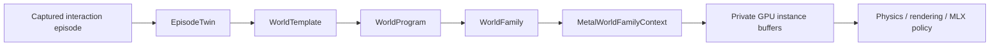
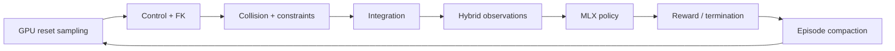

# MetalRobo world engine

MetalRobo treats real-to-sim as compilation. An interaction episode becomes a
typed world template; a declarative program expands that template into a
family; the family is sampled into persistent Metal buffers that physics,
rendering, sensors, policies, and learning can consume without a host-side
environment loop.



The representation split follows the useful principle demonstrated by
[SceniX](https://real2sim-eval.github.io/) and
[World Labs](https://www.worldlabs.ai/blog/real-to-sim-to-real): visual and
physical representations are selected independently for each task-relevant
part of a world. MetalRobo does not force a Gaussian background, articulated
robot, rigid object, and future deformable object into one geometry type.

## Implemented compiler spine

`EpisodeTwin` is the persistent artifact graph for one physical task. It owns
assets, sensors, task anchors, measured or derived artifacts, timing, and the
canonical `EngineModel`. Artifact records distinguish measured inputs,
deterministic tool outputs, bounded agent decisions, and authored inputs.

`WorldTemplate` is the immutable compiled topology. Each `WorldAsset` binds:

- semantic identity, role, anchors, and topology cohort;
- Gaussian, PBR mesh, neural residual, procedural, or absent rendering;
- primitive, convex, triangle, SDF, or deformable collision;
- static, kinematic, rigid, articulated, rod, shell, or soft-volume dynamics;
- initial physical, controller, appearance, and sensor state.

`WorldProgram` declares independent distributions along the six initial
variation axes:

- appearance;
- object configuration;
- clutter;
- physics;
- robot/controller state;
- camera and sensor state.

Compilation resolves string identities to compact indices and emits
pointer-free `MRWorldVariationGPU` records. Topology remains outside sampled
state, so one runtime batch contains only compatible worlds. Asset alternatives
are indices, while continuous values are sampled at reset.

`WorldFamily` combines one template with one compiled program and a stable
content fingerprint. Its CPU sampler is useful for authoring and offline pack
construction. Runtime sampling uses the same Philox4x32-10 key structure in a
native Metal kernel.

## Persistent Metal family runtime

`MetalWorldFamilyContext::compile` performs the expensive work once:

1. validates and snapshots the family;
2. materializes immutable base asset, sensor, and appearance records;
3. uploads base records, variation descriptors, and categorical tables to
   private Metal storage;
4. allocates private instance output arenas at the requested capacity;
5. retains the command queue and `mr_world_family_sample` pipeline.

`sample(instanceCount, seed)` updates one 48-byte shared uniform record and
dispatches one thread per environment. Each thread:

1. derives its independent Philox counter;
2. copies shared immutable records into its compact instance range;
3. applies authored variations directly to structure-of-arrays-compatible
   records;
4. publishes its scenario key, range table, flags, and ABI version.

The four output buffers remain private and resident:

| Buffer | Record | Downstream consumers |
| --- | --- | --- |
| instance headers | `MRWorldInstanceHeaderGPU` | reset, compaction, cohort dispatch |
| asset instances | `MRWorldAssetInstanceGPU` | physics, collision, rendering |
| sensor instances | `MRWorldSensorInstanceGPU` | RGB-D/state sensor kernels |
| appearances | `MRWorldAppearanceInstanceGPU` | Gaussian/PBR camera pipeline |

`nativeBuffer()` exposes borrowed `id<MTLBuffer>` handles to Objective-C++ and
MLX extensions. `readback()` is an explicit inspection/export operation and is
not part of the training loop.

## C++ use

```cpp
auto episode = metalrobo::makeFrankaPickPlaceEpisodeTwin();

metalrobo::WorldTemplate worldTemplate;
metalrobo::compileEpisodeTwin(
    episode,
    metalrobo::makeFrankaPandaEngineModel(),
    worldTemplate
);

metalrobo::WorldFamily family;
metalrobo::compileWorldFamily(
    worldTemplate,
    metalrobo::makeFrankaPickPlaceWorldProgram(),
    family
);

metalrobo::MetalWorldFamilyContext worlds;
worlds.compile(family, 4096);
worlds.sample(4096, 1);

void* assetBuffer = worlds.nativeBuffer(
    metalrobo::MetalWorldFamilyBuffer::assetInstances
);
```

The native C ABI provides the same canonical Franka family and borrowed Metal
buffer handles. The Python wrapper performs no per-environment work:

```python
from metalrobo.worlds import FrankaPickPlaceWorldFamily

with FrankaPickPlaceWorldFamily(capacity=4096) as worlds:
    worlds.sample(4096, seed=1)
    buffers = worlds.device_buffers  # borrowed native Metal buffers
```

Call `worlds.snapshot()` only when a stable NumPy copy is needed for inspection
or export.

## Runtime integration sequence

The family buffers are the reset/configuration input to the existing
`MetalWorldContext` and MLX active-encoder graph. The intended persistent step
is:



The current code establishes the compiler, ABI, resident family state, native
buffer boundary, and canonical six-axis Franka scenario. The next runtime
slice is to bind asset physical/controller fields into selective environment
resets in `MetalWorldContext`, followed by state observations and then the
hybrid Gaussian/mesh RGB-D renderer. Capture reconstruction, replay fitting,
rods, shells, and soft volumes remain separate compiler/runtime modules behind
the representation enums already present in the ABI.

## Main implementation files

- `include/metalrobo/WorldCompiler.hpp`
- `include/metalrobo/world_compiler_types.h`
- `src/core/WorldCompiler.cpp`
- `include/metalrobo/MetalWorldFamily.hpp`
- `src/metal/MetalWorldFamily.mm`
- `src/metal/WorldCompiler.metal`
- `include/metalrobo/FrankaWorld.hpp`
- `src/core/FrankaWorld.cpp`
- `python/metalrobo/worlds.py`
