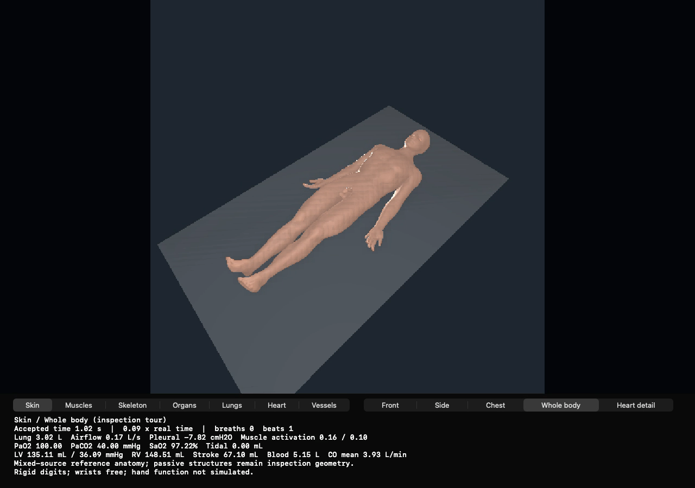

# Native resting measurement panel

The seven-line resting display could wrap the anatomy/rigid-hand disclosure past the 100-point label. The native panel is now 174 points high with a 124-point text label, and the rigid-hand disclosure starts a separate line. The movie composites the same enlarged AppKit panel; its total 1280 × 900 dimensions remain fixed.

Built and run on the SSH Mac mini, Apple M4 Pro, macOS 26.6. Build source begins at Lab a3a824915e1d45e93a83090e554abdcd11c3dbf5 with only the two recorded header changes. The focused executable links the retained 1196 Metal runtime; full commands and immutable input hashes are retained here. Binary SHA-256: 7fe4fc898094a84e609f63d8efefc4ba15117f099a64c6d5377a1b40b75902f2.

Validation: native exit 0, 512 accepted steps (1.024 simulated seconds), unchanged launch inputs and matching declared argv. All eight shared CSV traces and both retained MRV packs are byte-identical to the prior force-enabled smoke. The 16.379-second wrapper time includes initialization/export and is not a performance result. The movie decodes completely: 19 samples, strictly increasing PTS, final sample 11.54 wall seconds. The retained final frame was visually inspected: every measurement/disclosure line is legible, the full human and flat support remain visible, and anatomy/camera controls remain accessible.

Launch with: python3 /Users/n/numi-human-retained-delivery-20261009/viewer-footer-1256/native-smoke-001/launch_arm.py window. The guarded launcher intentionally refuses reuse of an existing output. Exact expanded native arguments are in the run declaration. The first launch request was refused before execution by the 1 GiB storage guard; after byte-preserving APFS deduplication the same prepared invocation ran successfully.

This is a presentation repair and short state-parity check. It does not qualify the remaining skin/tissue intersections, late postural drift, or the final matched five-minute respiratory-intervention experiment. The separate 310-second baseline and its limitations remain retained.

